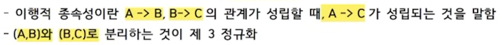
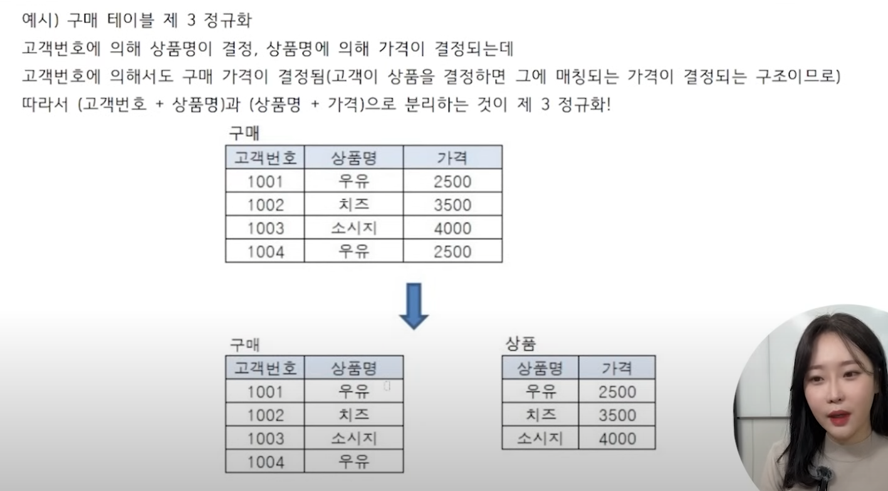
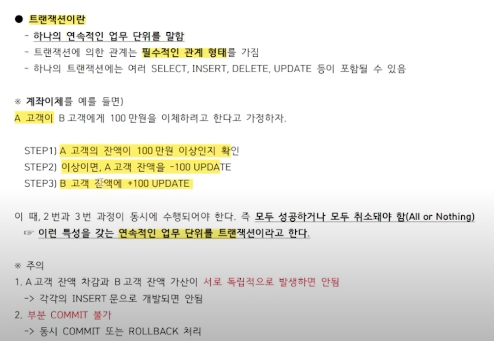
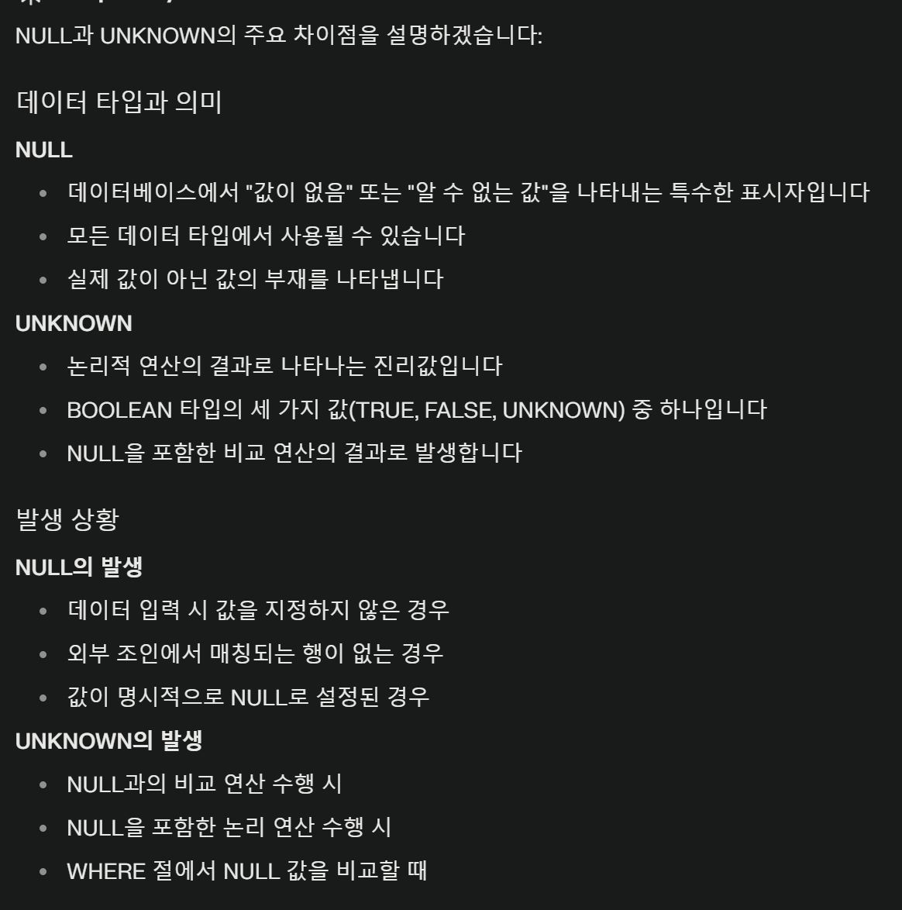
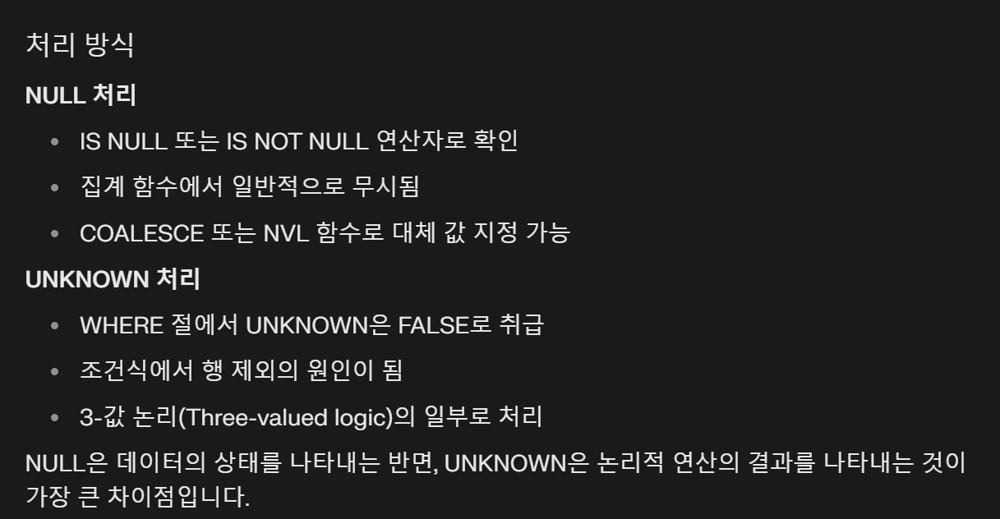

# 챕터1. 모델링의 이해

데이터베이스의 모델링은 `현실 세계를 단순화`하여 표현하는 기법이다. 
  - 모델링의 3가지 특징
    - 추상화 / 단순화 / 명확화
  - 모델링의 세 가지 관점
    - 데이터 관점: `어떤 데이터가 업무와 연결되어 있는지`, 그리고 그 데이터 간에는 어떤 관계가 있는지에 대해 모델링하는 관점
    - 프로세스 관점: `해당 업무가 처리하고 있는 일은 무엇인지`, 앞으로 처리해야 하는 일은 무엇인지를 모델링하는 관점
    - 데이터와 프로세스의 상관 관점: 업무와 데이터의 `관계`를 위주로 모델링하는 관점. 프로세스의 흐름에 따라 데이터가 어떤 영향을 받는지 모델링한다. 
  - 모델링의 세 가지 단계
    - 개념적 데이터 모델링: 전사적 데이터 모델링 / `추상화 레벨 가장 높음` / 포괄적 모델링
      - 핵심 엔터티를 추출하는 단계
      - ERD 작성
    - 논리적 데이터 모델링: `재사용성`이 가장 높은 모델링
      - 개념젹 모델링의 결과를 토대로 `세부속성`, 식별자, 관계 등을 표현하는 단계
      - 데이터 `정규화(Nrmalization)` 수행o
    - 물리적 데이터 모델링: `실제 구현`이 가능하도록 성능이나 가용성 등의 물리적인 성격을 고려
      - 추상화 수준은 가장 낮다. 

데이터의 독립성
  - ANSI-SPARC 아키텍처
    - 데이터베이스 관리 시스템(DBMS)의 추상적인 설계 표준
    - 데이터베이스에 대한 사용자들의 관점과 데이터베이스가 실제로 표현되는 물리적인 방식을 분리하기 위함
    - 사용자 입장에서는 필요한 데이터만 보면 됨!
  - 3단계 스키마 구조
    - 스키마? 데이터베이스 구조와 제약 조건에 대한 전반적인 명세를 기술한 메타데이터의 집합.
    - 외부 스키마: `사용자(또는 응용 프로그래머)`가 보는 데이터베이스의 스키마 정의
      - 사용자가 접근하는 대상: `VIEW`
    - 개념 스키마: `모든 사용자`가 보는 데이터베이스의 스키마를 통합하여 전체 데이터베이스를 나타내는 것. 데이터들 간의 `관계`를 나타냄
      - 데이터베이스마다 하나의 개념 스키마만 존재
      - 물리적 저장 구조와는 독립적
      - 제약 조건을 명시
      - 데이터베이스 전체 `논리적 구조`를 정의함
    - 내부 스키마: `물리적인 저장 구조`를 나타냄. 실질적인 데이터의 저장 구조나 컬럼 정의, 인덱스 등이 포함된다.
  - 3단계 스키마 구조가 보장하는 독립성
    - `논리적 독립성`: 개념 스키마가 변경되어도 `외부 스키마는 영향받지 않는다`.
    - 물리적 독립성: 내부 스키마가 변경되어도 외부/개념 스키마는 영향받지 않는다.
      - 물리적인 구조와는 별개로 개념 구조를 변경할 수 있고 개념 구조와는 별도로 물리적인 구조의 변경이 가능하다. 

ERD(Entity Relationship Diagram)
  - 시스템에 어떤 엔터티들이 존재하며 그들 간에 `어떤 관계`가 있는지를 나타내는 `시각적 다이어그램`이다.
  - 표기법
    - `IE/Crow's Foot`: 까마귀발 표기법이라고 불리며 가장 많이 사용된다.
  - 6단계 작성 절차
    - 엔터티를 도출한 후 그린다
    - 엔터티 배치
    - 엔터티 간의 관계를 설정
    - 관계명을 서술
    - 관계의 참여도 기술
    - 관계의 필수 여부를 확인

## Entity
`식별`이 가능한 객체(업무에서 쓰이는 데이터를 용도별로 분류한 그룹이라고 쉽게 이해하자)
엔터티: Table
속성: Column(열)
인스턴스: Row(행, 실제 데이터)

엔터티의 특징
  - 유니크함을 보장할 수 있는 `식별자`가 있어야 한다.
  - `2개 이상`의 인스턴스(Row)를 가지고 있어야 한다.
  - `2개 이상`의 속성(Column)을 가지고 있어야 한다.
  - 1개 이상 다른 인스턴스와 관계를 가지고 있어야 한다.
  - 다른 엔터티와 최소 1개 이상의 관계를 가져야 한다. 

엔터티의 분류
  - `형태`에 따른 분류
    - 유형 엔터티: 물리적인 형태 존재 / 안정적 / 지속적 / 상품, 회원 등
    - `개념` 엔터티: 개념적(`무형`) / 부서, 학과 등
    - 사건 엔터티: 유형과 개념 엔터티의 `파생`적 성격 / 행위를 함으로써 `발생` / 주문 등
  - `발생시점`에 따른 분류
    - 기본 엔터티: `독립적`으로 생성 / 자식 엔터티를 가질 수 있음 / 상품, 회원 등
    - 중심 엔터티: 기본 엔터티로부터 파생, 행위 엔터티 생성 / 주문 등
    - 행위 엔터티: `2개 이상의 엔터티`로부터 파생 / 주문내역 등

## Attribute(속성 / Column)
사물이나 개념의 특징을 설명해줄 수 있는 의미상 더 쪼개어지지 않는 항목들
  - 속성값: 각각의 속성은 속성값을 가짐. 엔터티에 속한 하나의 인스턴스를 구체적으로 나타내주는 데이터.
    - `하나의 속성은 한 개의 속성값만 가질 수 있다.` 만약 하나의 속성이 여러개의 속성값을 가지는 경우 별도의 엔터티로 분리하는 것이 바람직하다. 

엔터티에 인스턴스가 포함되고 인스턴스에 속성이 포함되며 속성에 속성값이 포함된다.

엔터티 / 인스턴스 / 속성 / 속성값의 관계
  - 정해진 주식별자에 `함수적 종속성`을 가져야 한다.
    - 함수적 종속성?
      - 완전 함수적 종속성: 특정 컬럼이 기본키(2개 이상의 컬림일 수 있다)에 대해 완전히 종속될 때
      
      - 부분 함수적 종속성: 특정 컬럼이 일부 기본키에 대해 종속될 때
      
  - 한 개의 엔터티는 두 개 이상의 속성과 인스턴스를 갖는다.
    - 하나의 인스턴스만 있다면 엔터티를 구성할 이유가 없기 때문.
    - 시험목적으로는 엄격하게 하나냐 두개냐를 따지지 않아도 된다. 더 명확한 답이 나올것임.
  - 한 개의 인스턴스는 두 개 이상의 속성을 갖는다.
    - 한 개의 인스턴스가 반드시 두 개 이상의 속성을 가져야 하는 것은 아닙니다. 하나의 속성만 가져도 괜찮습니다. 다만 일반적으로는 여러 속성을 갖는 것이 더 일반적이고 유용합니다.
  - `한 개의 속성은 하나의 속성값`만을 갖는다. === `원자성`

속성의 다양한 분류
  - 특성에 따른 분류
    - 기본속성: `업무` 프로세스 분석을 통해 바로 정의 가능한 속성
    - 설계속성: 업무상 존재하지는 않지만 `설계 과정에서` 다른 인스턴스의 속성값과 중복될 수 있는 경우 `각 인스턴스의 유니크함을 보장하기 위한` 속성
      - 주민등록번호는 존재하는 속성이므로 기본속성에 해당.
      - 학번과 주민등록번호의 차이: 주민등록번호는 실제 정부에서 부여하는 공식적인 식별 번호입니다. 이는 업무 프로세스 외부에서 생성되어 시스템에 입력됩니다.학번은 교육 기관에서 내부적으로 생성하는 번호로, 데이터 모델링 과정에서 만들어집니다. 주민등록번호는 개인의 고유한 특성(생년월일, 성별 등)을 포함하고 있어 기본적인 개인 정보로 간주됩니다. 학번은 순차적으로 부여되는 경우가 많아 개인의 특성을 직접 반영하지 않습니다.
    - 파생속성: 다른 속성들을 이용해 계산되거나 도출되는 속성 / 직접 저장되지 않고 다른 속성들로부터 유도되는 값
      - 파생속성은 데이터베이스 설계 시 성능과 관리의 균형을 고려하여 신중하게 사용해야 합니다. 적절히 사용하면 시스템 성능을 향상시킬 수 있지만, 과도한 사용은 데이터 관리를 복잡하게 만들 수 있습니다.
  - `구성방식`에 따른 분류
    - Primary Key 속성
    - Foreign Key 속성
    - 일반 속성
  - 분해 여부에 따른 속성
    - 단일 속성
    - 복합 속성
    - 다중값 속성

도메인
  - 속성이 가질 수 있는 속성값의 범위
    - 예를 들어 학점이라는 속성은 보통 0.1~4.5의 속성값을 가질 수 있는데 이때의 범위를 도메인이라고 한다. 

## 관계

관계의 종류
1. 존재적 관계
  - 한 엔터티의 존재가 다른 엔터티의 존재에 영향을 미치는 관계
2. 행위적 관계
  - 엔터티 간의 어떤 행위가 있는 것
  - EX) 고객 엔터티의 행동에 의해 주문 엔터티가 발생

관계의 구성
1. 관계명
2. 차수(Cardinality)
  - 한 엔터티의 레코드가 다른 엔터티의 레코드와 어떻게 연결되는지를 나타내는 표현.
  - 1:1 or 1:N or M:N으로 표현
  - M:N의 경우 조인 시 `카테시안 곱`이 발생하므로 연결 엔터티의 추가로 1:N 관계로 해소할 필요가 있다.
  - 관계의 차수는 하나의 엔터티와 다른 엔터티 간의 `레코드 연결 방식`을 나타내는 반면, 페어링은 두 엔터티 간의 `특정 연결을 설명`하고 추가 정보를 제공하는 용도로 사용하는 것. 
3. 선택성

조인의 의미
  - 데이터의 중복을 위해 정규화에 의해 분리된 엔터티들 간에는 서로 관계를 가지게 되는데 다시 이 두 테이블의 데이터를 동시에 출력하거나 관계가 있는 테이블을 참조하기 위해 사용하는 기법. 
  - 동일한 키를 이용해 접착시키는 것이라고 생각하면 됨

## 주식별자 특징
1. 유일성
2. 최소성
3. 불변성
4. 존재성

## 식별자 표기법
어떤 엔터티이고 어떤 비즈니스 상황이냐에 따라 식별자의 정의가 달라질 수 있다. 

## 식별관계와 비식별관계

식별관계: 하나의 엔터티의 기본키를 다른 엔터티가 기본키의 하나로 공유하는 관계
  - ERD에서 `실선`으로 표시

비식별관계: 강한 개체의 기본키를 다른 엔터티의 기본키가 아닌 일반 속성으로 관계를 가지는 것.
  - ERD에서 `점선`으로 표시

# 챕터2. 데이터모델과 SQL

## 정규화(Nomalization)
  - 정의: 데이터의 정확성과 일관성을 유지 및 보장하기 위해 `엔터티를 작은 단위로 분리`하는 과정
    - `이상현상`을 줄이기 위한 엔터티 설계 방식
      - 정규화를 하지 않아 발생하는 현상

  제1 정규형
    - 모든 `속성`은 반드시 `하나의 값만` 가져야 한다. === 테이블의 컬럼이 `원자성`을 갖도록 테이블을 분해해야 한다. 
      - 하나의 속성이 다중값을 가지는 경우 데이터를 꺼낼 때 불필요하게 split을 사용해야 하는 식의 번거로움이 생길 수 있다.
      - 정규화를 하면 엔터티가 계속 증가하므로 JOIN으로 인한 조회 성능 저하가 발생할 수 있다. 
  
  제2 정규형
    - 엔터티의 모든 `일반속성`은 반드시 모든 `주식별자에 종속`되어야 한다. === 제 1 정규화를 진행한 테이블에 `완전 함수 종속`을 충족하도록 테이블을 분해.
    - 즉, 부분 함수 종속일 경우 완전 함수 종속으로 만들기 위해 정규화를 진행하는 것.
 
  제3 정규형
    - 주식별자가 아닌 모든 속성 간에는 서로 종속될 수 없다.
    - 제 2 정규화를 진행한 테이블에 `이행적 종속`을 없애도록 테이블을 분리.
      - 이행적 종속?
      
      

## 반정규화
- 데이터의 `조회` 성능을 향상시키기 위해 데이터의 `중복을 허용`하거나 `데이터를 그룹핑`하는 과정. 조회(R) 성능은 향상될 수 있으나 `CUD 성능은 감소`할 수 있다. 데이터의 `정합성 이슈`도 발생함.
  - 데이터의 정합성과 무결성의 차이
    - 정합성은 데이터 간의 일치성을, 무결성은 데이터의 정확성과 완전성을 의미함.
    - 어떤 데이터는 정합성에는 이상이 없으나 무결성은 훼손된 상태일 수 있다. 
- 반정규화 과정은 정규화가 끝난 후 진행함.

반정규화의 종류

  테이블 병합
    - 1:N 관계에서의 테이블 병합은 중복 데이터를 발생시킬 수 있으므로 주의가 필요함. 
    - 테이블의 관계가 강결합이어서 같이 조회되는 경우가 대부분일 경우 비정규화를 고려한다.
      - 강결합 관계는 데이터의 정합성과 일관성을 유지하는 데 도움이 될 수 있지만, 시스템의 유연성을 떨어뜨릴 수 있으므로 설계 시 신중한 고려가 필요.
    - 지나친 JOIN으로 인한 성능의 문제가 있을 경우 수행.
    
  테이블 분할
    - 수직 분할: 엔터티의 일부 속성을 별도의 엔터티로 분할
      - 수직 분할의 경우 1:1 관계의 테이블이 두 개 생성된다.

    - 수평 분할: 엔터티의 인스턴스를 특정 기준으로 별도의 엔터티로 분할(파티셔닝)
      - 주문 엔터티에서 주문일자 컬럼의 값에 따라 2023년 주문 엔터티와 2024년 주문 엔터티로 구분하는 경우
      - 테이블 수평 분할을 할 경우 관계가 없는 다수의 테이블이 생성된다.
  
  테이블 추가
    - 통계 테이블 추가: 기존의 엔터티 데이터를 활용하여 통계치를 미리 계산하여 엔터티 추가
    - 이력 테이블 추가: 과거의 인스턴스와 비교하기 위해 엔터티 추가
    - 부분 테이블 추가: 회원의 경우 이메일 컬럼이 있지만 메일 발송과 관련된 정보만 필요한 경우 회원이메일 엔터티를 추가하여 별도 관리

## 트랜잭션
데이터를 조작하기 위한 하나의 `연속적이고 논리적인 작업 단위.`
트랜잭션에 의한 관계는 필수적인 관계 형태를 가짐

## NULL
값이 없음.
`NULL과의 비교연산 결과는 항상 NULL임!`

`집계함수는 NULL을 제외하고 연산한 결과를 리턴함`
모델 설계 시 각 컬럼별로 NULL을 허용할 것인지에 대해 판단해야 함. 

## 식별자에 대한 정리

본질식별자
  - 업무에 의해 만들어지는 `반드시 필요한 식별자`

인조식별자
  - 인위적으로 만들어지는 식별자
  - 꼭 필요하지는 않지만 관리의 편의성 등의 이유로 인위적으로 만들어지는 식별자
  - 중복 데이터 발생의 가능성이 있다.
  - 불필요한 인덱스를 생성하여 성능이 저하될 수 있다. 