# SQL 기본

## 관계형 데이터베이스(RDB)

데이터베이스에는 용도와 목적에 맞는 데이터들끼리 모아서 저장한다.
꼭 `형식을 갖추지 않더라도` 엑셀 파일을 모아 둔다면 그것 또한 데이터베이스임. 

테이블은 관계형 데이터베이스의 기본 단위이고 일반적으로 데이터베이스는 여러 개의 테이블로 구성된다. 

SQL: RDB에서 데이터를 다루기 위해 사용하는 언어.

데이터베이스와 DBMS는 다른 개념이다. DBMS는 데이터를 효과적으로 관리하기 위한 `시스템(소프트웨어)`임!

하나의 테이블은 반드시 `하나의 유저(계정)의 소유`여야 함.

테이블명은 중복될 수 없지만, 소유자가 다른 경우 같은 이름으로 생성 가능.

테이블은 `행 단위`로 데이터가 입력되고 삭제된다. `수정`의 경우 `값` 단위로 가능 

## SQL

관계형 데이터베이스에서 데이터 조회 및 조작, DBMS 시스템 관리 기능을 명령하는 언어

다른 컬럼끼리의 연산(가로 연산)에서 NULL이 포함되어 있으면 결과값은 항상 NULL이다. 

문자끼리 합성할 때는 `||`를 사용한다.

SQL 문법은 대소문자를 구분하지 않는다. 

단점: 기존에 작성된 스키마를 수정하기 어려움. 데이터베이스 부하를 분석하기 어려움(복잡성 때문)

데이터의 무결성: 정확성과 일관성 유지, 결손과 부정합이 없음을 보증하는 것.
  - DBMS의 중요한 기능이다. 
  - 개체 무결성: 테이블의 기본키를 구성하는 컬럼(속성)은 NULL 값이나 중복값을 가질 수 없음
  - 참조 무결성: 외래키 값은 `NULL` 이거나 참조 테이블의 기본키 값과 동일해야 함.
    - NULL은 NULLABLE한 경우에만 가능하다.
  - 키 무결성: 하나의 관계에는 적어도 하나의 조인키를 가져야 함.

### 함수

문자열 함수

1. LTRIM(`문자열`,특정문자열)
  - 특정문자열을 따로 명시한 경우 문자열을 왼쪽부터 한 글자씩 문자열과 비교하여 특정문자열에 포함되어 있으면 제거하고 그렇지 않다면 해당 작업을 멈춘다.
    - LTRIM('블랙핑크','블랙')의 결과값은 '핑크'
  - 특정문자열을 따로 명시하지 않은 경우 문자열의 왼쪽 공백을 제거한다. 

2. TRIM(위치, 특정문자열, FROM, `문자열`)
  - LTRIM, RTRIM과 달리 특정문자열에 한 글자만 지정할 수 있다. 

3. SUBSTR(`문자열`,`시작점`,길이)
  - 문자열의 원하는 부분만 잘라서 반환하는 함수.
  - 인덱스 생각하지 말것!
  - 길이 인자를 명시하지 않을 경우 시작점부터 문자열 끝까지 추출
  - 시작점이 음수인 경우 반대로 생각하면 됨

4. REPLACE(`문자열`, `변경 전 문자열`, 변경 후 문자열)
  - 변경 후 문자열을 명시해주지 않으면 문자열에서 변경 전 문자열을 `제거`한다.

5. SIGN(`수`)
  - 수의 부호를 반환하는 함수. 양수면 1, 음수면 -1, 0이면 0을 반환

6. ROUND(`수`, 자릿수)
  - 수를 지정된 소수점 자릿수`까지` 반올림하여 반환해주는 함수. 자릿수 인자를 명시하지 않았을 경우 기본값은 0이 적용되어 정수를 반환한다.
  - 자릿수 인자의 값이 음수일 경우 소수점 이하 모든 수를 신경쓰지 않고 정수 부분만을 반올림하여 반환한다. 이 때 지정된 자릿수`에서` 반올림한다. ROUND(123.456,-2) 라면 소수점 이하는 생각하지 않고 123 중 3이 -1, 2가 -2이므로 2에서 반올림한 값 100을 반환한다. 

7. TRUNC(`수`, 자릿수)  
  - 수를 지정된 소수점 자릿수까지 버림하여 반환하는 함수.

8. CEIL(`수`)
  - 소수점 이하의 수를 올림한 정수를 반환하는 함수.

9. FLOOR(`수`)
  - 소수점 이하의 수를 버림한 정수를 반환하는 함수.

10. MOD(`수1`,`수2`)
  - 수1을 수2로 나눈 `나머지`를 반환하는 함수
  - 만약 수2가 0이라면 수1을 반환한다.
  - 두 인자 값이 모두 음수라면 반환값도 그대로 음수

11. SYSDATE
  - 현재의 연/월/일/시/분/초를 반환.

12. EXTRACT(특정 단위 FROM 날짜 데이터)
  - 날짜 데이터에서 특정 단위만을 출력해서 반환
  - ex) EXTRACT(YEAR FROM SYSDATE)

13. INSTR(대상,찾을문자열,시작위치,N번째 일 때 반환)
  - 만약 시작위치가 음수인 경우 탐색의 방향이 기존과 달리 계속해서 반대방향임. 유일하니 기억하자

### 변환 함수

명시적 형변환과 암시적 형변환
  - VARCHAR이 뭐야?
    - VARCHAR은 데이터의 길이가 가변적이고 최대 길이가 8,000바이트 이하인 경우에 적합한 데이터 타입
    - 고정 길이 타입인 CHAR에 비해 저장 공간을 효율적으로 사용
  - 가능하면 명시적 형변환을 하는 것이 좋다.

### 명시적 형변환 함수

1. TO_NUMBER(`문자열`)
  - 문자열을 숫자형으로 변환해주는 함수
  - 숫자형으로 변환이 불가능한 인자를 작성하는 경우 에러 발생

2. TO_CHAR(`수 또는 날짜`, 포맷)
  - 수 또는 날짜형의 데이터를 포맷 형식의 `문자형`으로 변환하여 반환

3. TO_DATE(`문자열`, `포맷`)
  - 포맷 표현 방식
    - YYYY: 년
    - MM: 월
    - DD: 일
    - HH: 시(12)
    - MI: 분
    - SS: 초

4. NVL(`인자1`, `인자2`)
  - 인자1이 NULL일 경우 인자2를 반환, 인자1이 NULL이 아닐 경우 인자1을 반환하는 함수
  
5. NULLIF(`인자1`, `인자2`)
  - 인자1 === 인자2 이면 `NULL`을 반환, 인자1 !== 인자2 이면 인자1을 반환

6. COALESCE(`...인자`)
  - NULL이 `아닌` 최초의 인자를 반환

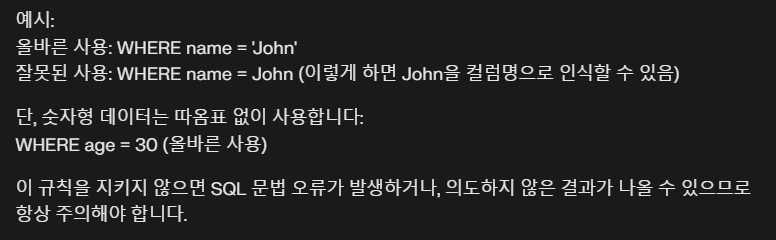

### 부정 비교 연산자
아래의 모든 비교 연산자는 동일하게 `같지않다`는 의미임
!=
^=
<>
not 컬럼명 = 

### 레벨업 문제
조건식에서 컬럼명은 항상 우측에 위치해야 정상적으로 동작한다.(X)

### SQL 연산자
  1. BETWEEN A AND B: A와 B를 포함
  2. IN(LIST): LIST 중 하나와 일치하는지
  3. IS NULL: NULL 값이 맞는지
  4. LIKE '비교 문자열': 비교 문자열을 포함하는지
    - LIKE 'M&s' == M으로 시작하고 s로 끝나는 문자열이 포함된 행을 조회한다.

### 논리 연산자
처리순서: SQL에 명시된 순서와는 `관계없이` () -> `NOT` -> AND -> OR

### 레벨업 문제
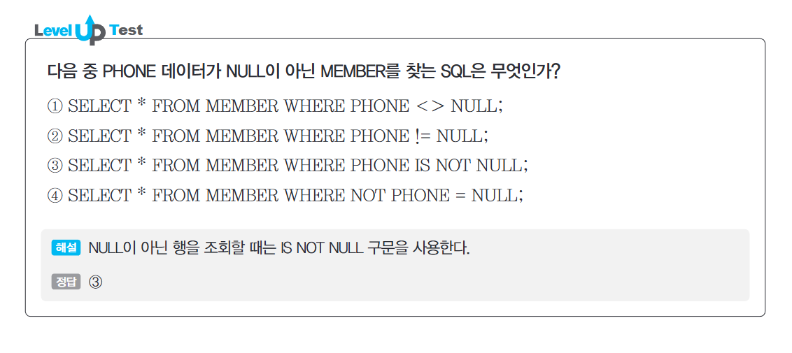

이 문제에서 아래의 세 가지 쿼리문은 다른 의미를 가진다.
 `SELECT * FROM MEMBER WHERE PHONE <> NULL;`
 `SELECT * FROM MEMBER WHERE PHONE != NULL;`
 `SELECT * FROM MEMBER WHERE PHONE IS NOT NULL;`

 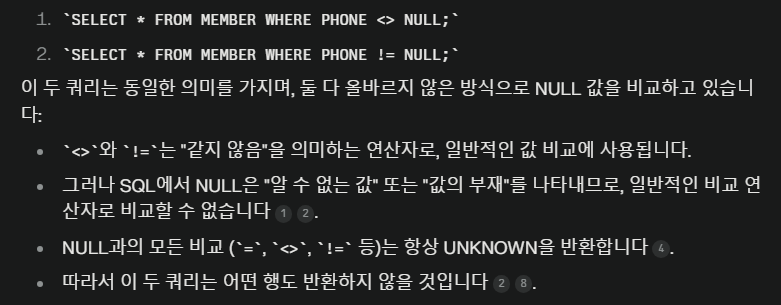
 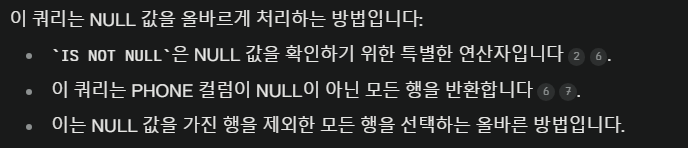
 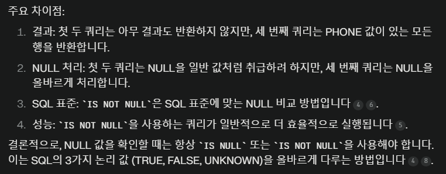
 
 결론! 일반 비교연산 시 NULL 과 비교하면 모든 값은 NULL이 아닌 UNKNOWN이 됨.
 NULL을 위한 특별한 연산자인 IS , IS NOT 연산자를 활용해야 한다. 
 

### 그룹핑(GROUP BY와 HAVING)

유용한 집계함수

COUNT(*)
  - 전체 ROW를 COUNT한 값을 반환
  - COUNT(COL): COL의 ROW 중 NULL이 아닌 값을 COUNT한 값을 반환
  - COUNT(DISTINCT COL): COL의 ROW 중 중복을 제거하고 NULL이 아닌 값을 COUNT한 값을 반환

HAVING
  - GROUP BY를 통해 그룹핑 된 그룹에 대해 특정한 조건을 만족하는 그룹을 찾는 조건절.
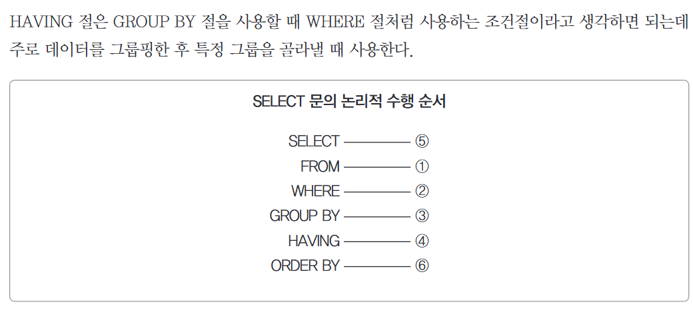
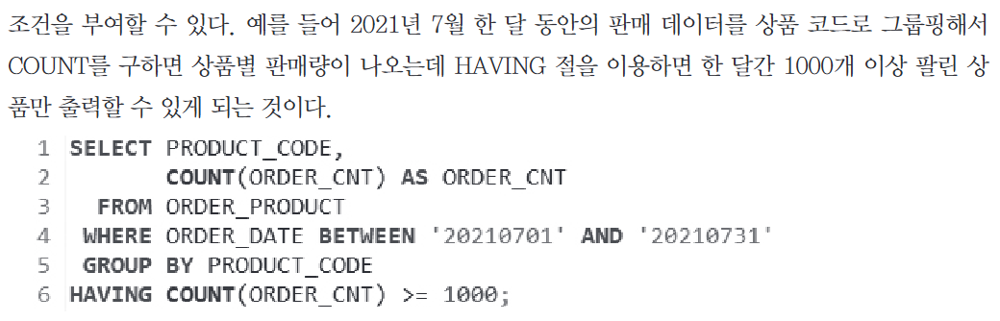
  - 7월 한 달간 1000개 이상 팔린 상품(PRODUCT_CODE)만 출력하는 쿼리문
  - 주의! HAVING은 논리 순서 상 SELECT보다 먼저 실행되기 때문에 SELECT에서 정의한 AS를 활용할 수 없다.

### ORDER BY
SELECT 쿼리문에서 논리 순서 상 가장 마지막에 실행된다.
ORDER BY 절의 옵션(ASC,DESC)은 각 컬럼 뒤에 하나씩 작성한다.

## SQL JOIN
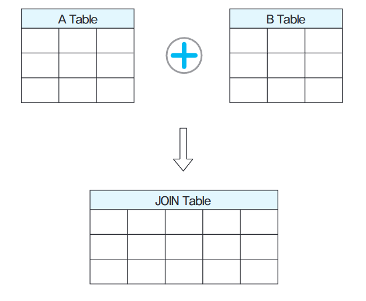
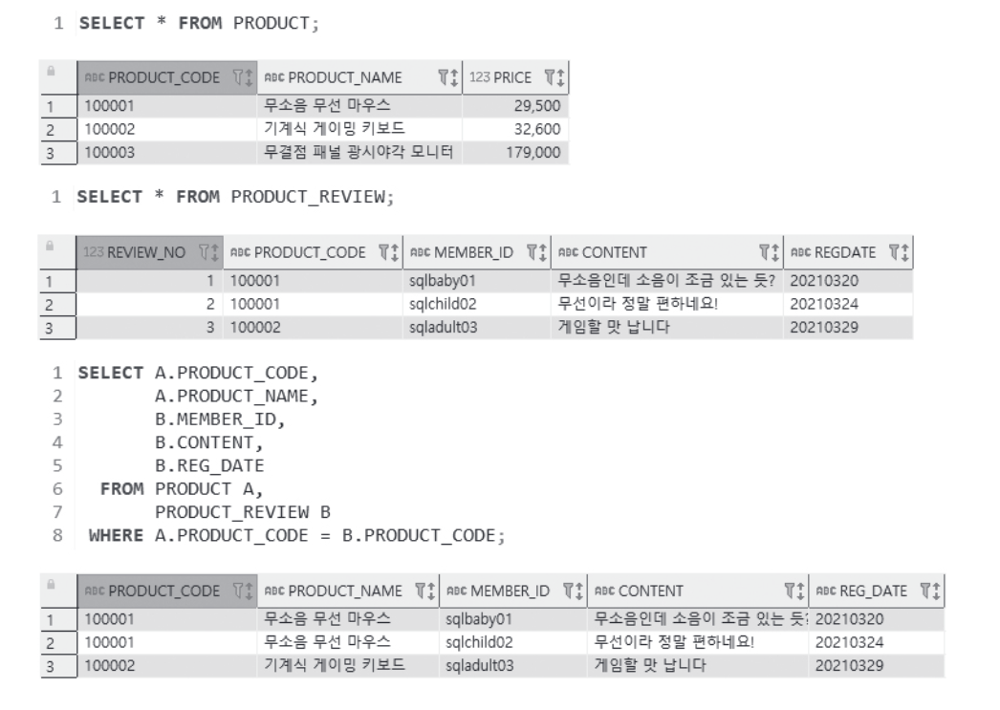
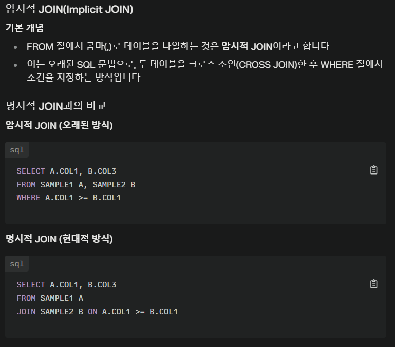

주의!
  - 하나의 쿼리에서 EQUI JOIN과 NON EQUI JOIN을 함께 사용할 수 있다.
  - JOIN되는 두 테이블에 모두 존재하는 컬럼의 경우 컬럼명 앞에 반드시 테이블명이나 AS를 명시해주어야 한다.  
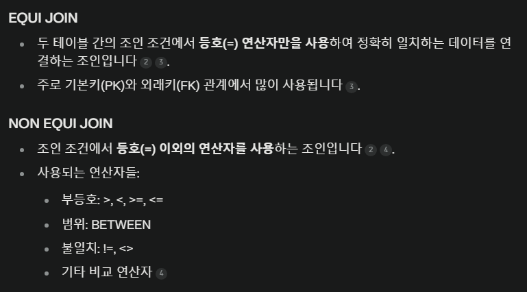

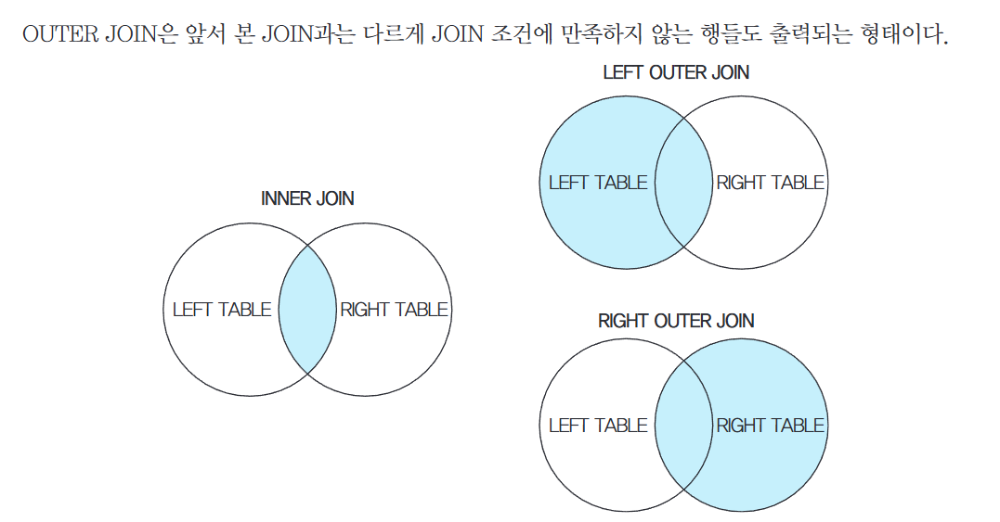

## 표준 JOIN(ANSI JOIN)

INNER JOIN: JOIN 조건을 충족하는 데이터만 반환
SQL JOIN과 달리 조건을 작성할 때 `ON`절을 사용하여 기입하고 FROM 절에 INNER JOIN을 명시한다.  

OUTER JOIN
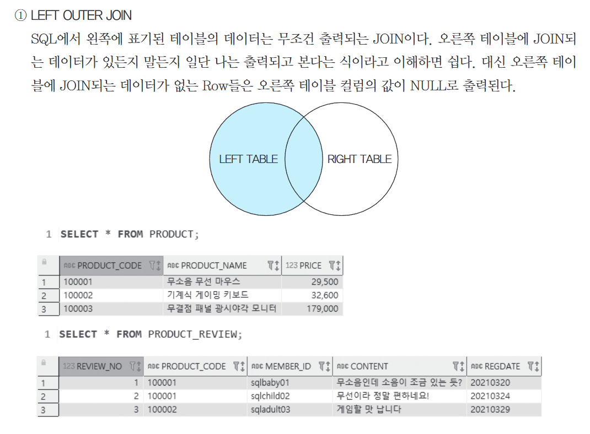
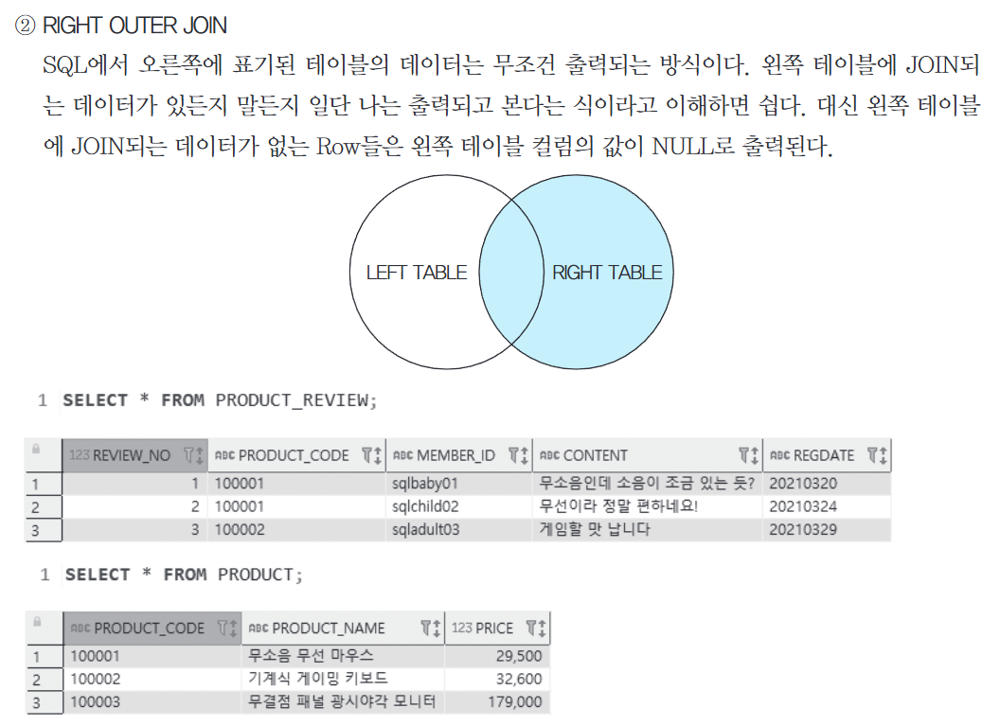

