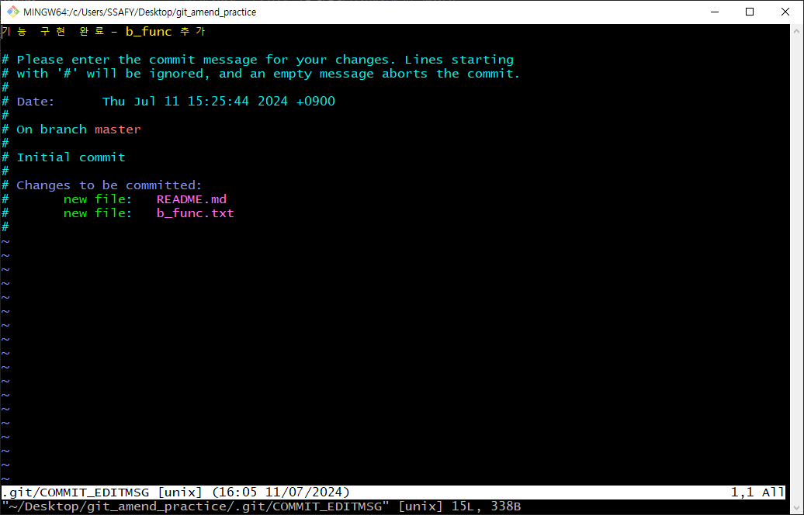
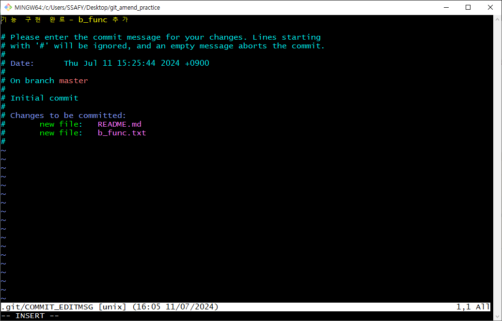
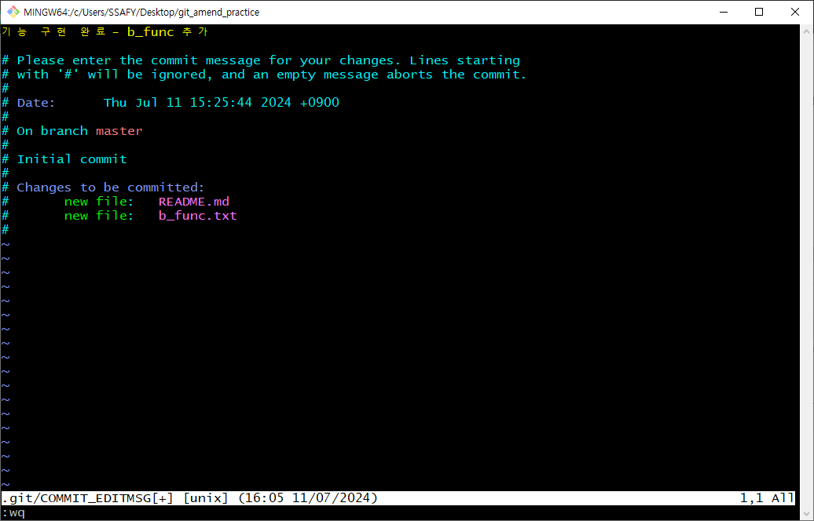

# Markdown 문법을 배우다!
1. 제목 1~6
2. 나열하는 다양한 방식
3. [링크](https://naver.com)와 
4. `코드` 삽입 
```python
print("Hi~")
def makeHotItem() 
    a = hot
    b = item
    return a+b
```
1. **문자열**에 적용하는 *다양한* 문법 ~~아싸~~
2. 추가적인 마크다운 문법 [마크다운Docs](https://www.markdownguide.org/basic-syntax/)
<br>
> 이것은 인용문?!  

아아 이것은 수평선 이라는 것이다.  

---
# CLI(Command Line Interface)
`cmd` 또는 `bash`를 통해 폴더와 파일을 만들고 접근하는 방법을 배움(**GUI와 비교**하며)  
간단하지만 강력한 명령어 모음  
   1. cd: change_directory, 폴더(디렉토리)를 이동할 때 쓰인다. GUI에서의 폴더 더블**클릭**과 동일한 기능을 함.
   `cd <디렉토리 명>` 또는 `cd ..` 의 형식으로 이동한다. 
   2. ls: list, 디렉토리의 파일 리스트를 모두 볼 때 쓰인다.
   `ls -a` 또는 `ls` 의 형식으로 쓰이며 `ls -a` 할 경우 .git 디렉토리도 식별할 수 있다.
   3. touch: 파일을 생성하는 명령어.
   `touch a.txt` 의 형식으로 쓰이며, 확장자를 꼭 명시해주어야 한다.
   4. mkdir: 디렉토리를 생성하는 명령어.
   `mkdir test_directory` 의 형식으로 사용됨. 디렉토리 생성은 반드시 `mkdir` 명령어를 사용해야 한다.  
   5. rm: 파일 또는 디렉토리를 삭제하는 명령어
   디렉토리의 경우 반드시 `rm -r <디렉토리 명>` 의 형식으로 지정해주어야 정상적으로 삭제가 진행된다.   
<br>

# git을 활용한 분산버전관리를 배우다!

   3가지 단계를 통한 **버전관리**
   - **Working Directory** -> *Staging Area* -> ~~Repository~~
   - `git add`: Staging Area(임시 저장소)로 이동
   - `git commit`: Staging Area에서 Local Repository(영구저장소)로 이동

        첫번째 커밋을 위해선 **Auth 정보**를 등록해야함!
   - `git status`:  .git 파일의 상태를 보여줌
   - `git commit --amend`: 갓! 찍은 커밋의 커밋 **메세지**만 수정할 때 필요한 커맨드. 수정하고 싶은 커밋 이후에 계속 *커밋이 쌓인 경우 수정하고 싶었던 커밋의 메세지는 수정이 불가능하다*.  
    VIM 에디터 진입 후
     
    I를 눌러 Insert Mode 진입
     
    이후 commit 메세지를 수정하고 esc를 눌러 에디터 모드에서 나간 후 `:wq` 로 터미널 복귀.
    

<br>
