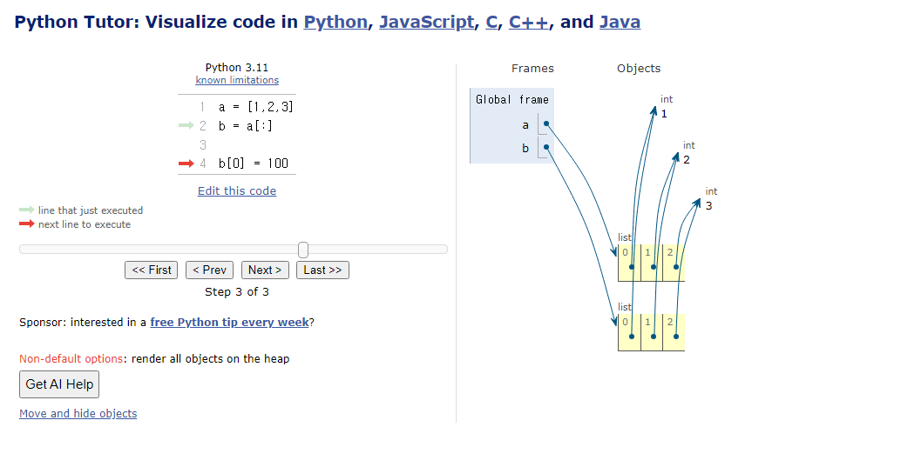

# data structure 및 메서드

## data_structure
- 각 데이터의 효율적인 저장과 관리를 위한 구조체
- 데이터 구조의 활용: 데이터 타입별 메서드를 활용
  - 메서드: **객체**에 속한 *함수*, 여기서 객체는 **클래스(class)**라고도 부른다. 
  - 클래스: 타입을 표현하는 방법 **(청사진)**
  - 객체: 청사진으로 만들어진 실체 **(인스턴스)**
```py
class str(object)
 |  str(object='') -> str
 |  str(bytes_or_buffer[, encoding[, errors]]) -> str
 |
 |  Create a new string object from the given object. If encoding or
 |  errors is specified, then the object must expose a data buffer
 |  that will be decoded using the given encoding and error handler.
-- More  --
```
  - 데이터 타입 객체.메서드()의 형태로 호출한다.

## 데이터구조의 다양한 메서드
- 다양한 메서드는 체이닝이 가능하다. 즉, 이어서 사용이 가능함.

## 데이터 타입과 복사
- 할당: 아래 코드를 참고. a와b는 동일한 메모리 주소를 가지는 것!
```py
a = [1,2,3,4]
b = a
b[0] = 100

print(a) # [100,2,3,4]  
print(b) # [100,2,3,4]
``` 
```py
a = 20
b = a
b = 10
print(a) # 20
print(b) # 10 -> int형은 불변데이터형이기 때문에 b는 a를 변화시키지 못하고 10을 재할당 받는다. 
```
- 얕은 복사
```py
a = [1,2,3]
b = a[:]
c = a.copy()

b[0] = 100
c[0] = 999
print(a) # [1,2,3]
print(b) # [100,2,3]
print(c) # [999,2,3]
```

- 얕은 복사의 한계
```py
a = [1,2,[3,4,5]] # 2단계로 중첩된 리스트 할당
b = a[:]
b[2][1] = 100

print(a) # [1,2,[3,100,5]]
print(b) # [1,2,[3,100,5]]
``` 
- deepcopy
```py
import copy

a = [1,2,[3,4,5]]
b = copy.deepcopy(a)

b[2][1] = 100

print(a)
print(b)
```