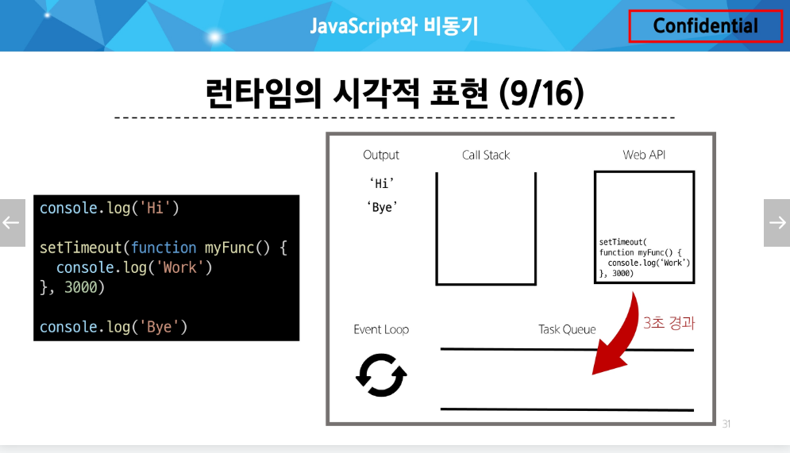

# Day_7 동기와 비동기

## 동기(Synchronous)
이전의 작업이 완료될 때까지 기다렸다가 다음 작업이 진행됨 

## 비동기(Asynchronous)
이전의 작업이 진행되는 동안 다른 작업을 처리할 수 있음

## 2번 비동기 관련 설명
  `setTimeout()` 함수가 비동기 처리를 담당하고 있습니다. 이 함수의 동작 방식과 역할을 자세히 설명해 드리겠습니다:

  1. **비동기 처리**: `setTimeout()`은 Web API에 속하는 비동기 함수입니다. 이 함수는 지정된 시간(여기서는 3000밀리초, 즉 3초) 후에 콜백 함수를 실행하도록 예약합니다[1][3].

  2. **비차단 실행**: `setTimeout()`은 자바스크립트의 메인 실행 스레드를 차단하지 않습니다. 즉, 타이머가 실행되는 동안 다른 코드가 계속 실행될 수 있습니다[1][3].

  3. **콜백 함수 사용**: `setTimeout()`은 콜백 함수를 인자로 받아, 지정된 시간이 지난 후 이 콜백 함수를 실행합니다. 여기서는 화살표 함수 `() => { callBack('작업 완료') }`가 콜백 함수로 사용되고 있습니다[1][2].

  4. **이벤트 루프 활용**: `setTimeout()`은 브라우저나 Node.js의 이벤트 루프를 활용합니다. 타이머가 완료되면 콜백 함수는 태스크 큐에 추가되고, 이벤트 루프에 의해 콜 스택이 비었을 때 실행됩니다[2][3].

  5. **비동기 작업 시뮬레이션**: 이 코드에서 `setTimeout()`은 3초 동안 지연되는 비동기 작업을 시뮬레이션하고 있습니다. 실제 애플리케이션에서는 이 자리에 API 호출이나 파일 읽기 등의 실제 비동기 작업이 올 수 있습니다[4].

  따라서, `setTimeout()` 함수는 이 코드에서 비동기 처리의 핵심 역할을 담당하고 있으며, 이를 통해 `asyncTask` 함수가 비동기적으로 동작할 수 있게 됩니다

## 자바스크립트에서 비동기 작업의 시각화

  - Wep API에 이동 후 3초 동안 대기하고 Task Queue로 이동한다.
## 자바스크립트에서 비동기 작업을 처리하기 위한 동작 요소
  1. Call Stack
  2. Web API
  3. Task Queue
  4. Event Loop
    - Call Stack과 Task Queue를 계속해서 모니터링 

## Ajax
  - Asynchronous JavaScript and XML
  - 비동기적인 웹프로그래밍을 위한 기술
  - `x`는 `XML`이라는 데이터 타입을 의미하지만 요즘은 `JSON`을 더 활용 많이함! 
  - `XMLHttpRequest` 객체 사용
    - 모든 페이지를 새로고침 하는 것이 아니라 필요한 부분에 대한 데이터만 요청 및 응답할 수 있다.
  - `이벤트 핸들러`는 비동기 프로그래밍의 한 형태임.

## Axios 라이브러리
  - XMLHttpRequest를 간단하게 처리할 수 있도록 도와주는 라이브러리
    - 비동기 통신에 대한 모든것을 클라이언트 측에서 도와주는 클라이언트 라이브러리
    - 객체 생성과 요청 / 응답 모두 할 수 있다.
  - Vue에서도 활용함! 프론트엔드에서 굉장히 중요
  - 비동기적으로 서버와 통신할 때 주로 사용한다.
  - XHR 객체 생성 및 요청 -> (서버)응답 데이터 생성 -> (서버)JSON 데이터 응답 -> Promise 객체 데이터를 활용해 DOM 조작

## Promise
  - 자바스크립트에서 비동기 작업의 결과를 나타내는 객체
  - 비동기 작업의 성공 또는 실패와 관련된 결과나 값을 나타냄
  - 콜백지옥 문제를 해결하기 위해 등장
  - `작업이 끝나면 실행시켜 줄게~` 라는 약속
  - `비동기 & 순차실행` 가능
  - `then & catch`는 항상 promise 객체를 반환함 -> 계속 chaning이 가능함