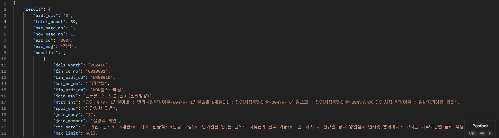
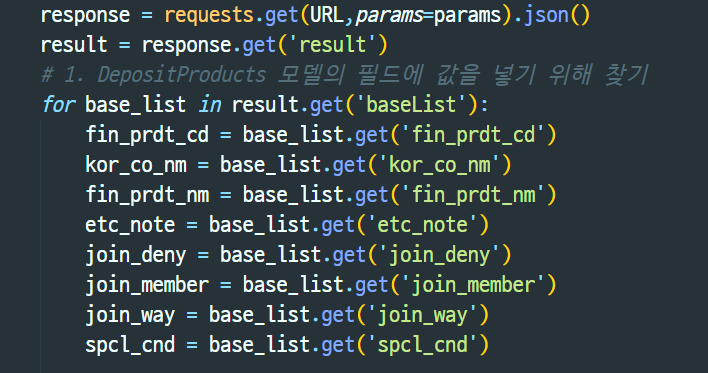

# PJT-07 금융 상품 데이터를 활용한 REST API 서버 구축

## 새롭게 배운 점
  - API_KEY에 대한 환경변수 설정(KEY 숨기기)
```
import os
import environ

env = environ.Env(DEBUG=(bool,True))
environ.Env.read_env(env_file=os.path.join(BASE_DIR,'.env'))
API_KEY = env('API_KEY')
```
  - JSON 응답 값 중 필요한 데이터에만 접근하는 방법
  
    - 응답으로 받아온 JOSN 데이터에 for문으로 내부 요소에 대해 접근할 수 있다.
    
  - db 저장 시 `intr_rate`와 `intr_rate2` 필드에 `Null` 값이 저장되어 데이터 무결성이 깨어지는 상황 발생.
  ```
  if option_list.get('intr_rate'):
            intr_rate = option_list.get('intr_rate')    
  else:
      intr_rate = -1
  if option_list.get('intr_rate2'):
      intr_rate2 = option_list.get('intr_rate2')    
  else:
      intr_rate2 = -1
  ```
  - IF 분기 처리를 통해 이자율로 불가능 한 값을 설정. 데이터무결성을 보장하고 이후 -1 값 식별 시 적절한 행동을 할 수 있도록 처리함.

  - filter().exists() 메서드를 통해 db 중복 저장 방지
  ```
  if DepositProducts.objects.filter(
    fin_prdt_cd=fin_prdt_cd,
    kor_co_nm=kor_co_nm,
    fin_prdt_nm=fin_prdt_nm,
    etc_note=etc_note,
    join_deny=join_deny,
    join_member=join_member,
    join_way=join_way,
    spcl_cnd=spcl_cnd,
  ).exists():
    continue
  ```

## 느낀점
  - 경민: DB 진짜 큰일났다 ㅜㅜ 최종 프로젝트를 위해 DB 공부를 해야겠다고 느꼈습니다. API 호출 부분은 특히 중요해 보여서 집중해서 코드를 작성했습니다. 
  - 진문: 각각의 API에 대해 호출하는 방법이 약간씩 다른 부분이 있어서 어려움을 겪었습니다. API에서 제공하는 DOCS를 호출과 테스트를 진행하기 전에 꼭! 정독해서 읽어봐야 겠다고 생각했습니다. 마지막으로 Serializer 관련 복습이 중요하다고 느꼈습니다. 얼마전에 한 것 같은데 Article이랑 Comment 아니니까 적용이 힘든걸 보고 응용이 참 안되는구나 슬펐습니다 ㅠ