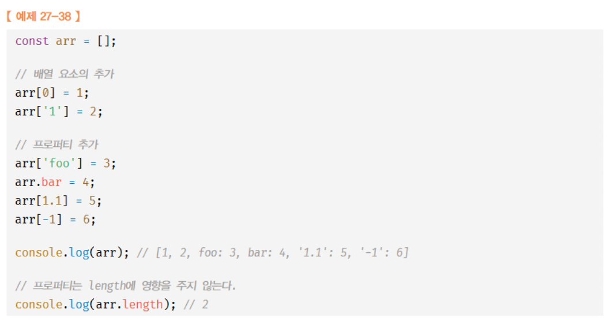

# Rest 파라미터
- Rest 파라미터는 반드시 마지막 파라미터이어야 한다.
- Rest 파라미터는 단 하나만 선언할 수 있다.
- ES6부터 적용된 개념으로 가변 인자 함수의 인수 목록을 배열로 직접 전달받을 수 있다.
```js
function sum(...args) {
  // Rest 파라미터 args에는 배열 [1,2,3,4,5]가 할당된다.
  return args.reduce((pre,cur) => pre + cur, 0)
}
console.log(sum(1,2,3,4,5))
```
- 화살표 함수는 함수 자체의 arguments 객체를 갖지 않으므로 화살표 함수에서 가변 인자 함수를 구현해야 할 때는 `반드시` Rest 파라미터를 사용해야 한다.
- 매개변수 기본값을 사용하면 함수 내에서 수행하던 인수 체크 및 초기화를 간소화할 수 있다. 
```js
function sum(x=0, y=0) {
  return x + y
}
console.log(sum(1,2)) // 3
console.log(sum(1)) // 1
```
- Rest 파라미터에는 기본값을 설정할 수 없다. 

# 배열
- js의 모든 `값`은 배열의 요소가 될 수 있다.
- 배열의 생성자 함수는 `Array`이다.  
- 일반 객체와 배열을 구분하는 가장 명확한 차이는 `값의 순서`와 `length 프로퍼티`다. 이 차이 덕분에 배열은 순서대로 조회가 가능하다. (순회 가능)

## 일반적인 배열과 js의 배열
- 일반적인 배열: 동일한 크기의 메모리 공간이 빈틈없이 연속적으로 나열된 자료구조. 즉, 배열의 요소는 하나의 데이터 타입으로 통일되어 있으며 서로 연속적으로 인접해 있다. === `밀집 배열`
- js의 배열: 배열의 요소를 위한 각각의 메모리 공간은 동일한 크기를 갖지 않아도 되며, 연속적으로 이어져 있지 않을 수도 있다. === `희소 배열`
  - js의 배열은 일반적 의미의 배열 동작을 `흉내` 낸 특수한 `객체`다.
  - js의 배열은 인덱스를 나타내는 문자열을 프로퍼티 `키`로 가지며, length 프로퍼티를 갖는 특수한 객체다. 즉, js 배열의 요소는 사실 프로퍼티 값이다. js에서 사용할 수 있는 모든 값은 객체의 프로퍼티 값이 될 수 있으므로 어떤 타입의 값이라도 배열의 요소가 될 수 있다.    
  - js의 배열은 해시 테이블로 구현된 객체이므로 `인덱스로 요소에 접근`하는 경우 일반적인 배열에 비해 성능적인 면에서 느릴 수 밖에 없는 구조적인 단점이 있다. 하지만 요소를 `삽입 / 삭제`하는 경우 일반적인 배열보다 빠른 성능을 기대할 수 있다. 

## length 프로퍼티
- 현재 length 프로퍼티 값보다 작은 숫자 값을 할당하면 배열의 길이가 줄어든다.
```js
const arr = [1,2,3,4,5]

arr.length = 3

console.log(arr) // [1,2,3]
```
- 반대의 경우는 다르다. length 프로퍼티의 값은 변경되지만 배열의 길이가 늘어나지는 않는다. 
```js
const arr = [1]

arr.length = 3

console.log(arr) // [1,empty*2]
```
- 위 console에서 empty는 요소가 아니다. 이처럼 배열의 요소가 연속적으로 위치하지 않고 비어 있는 배열을 `희소 배열`이라고 한다. 
- `희소 배열`은 되도록이면 생성하거나 사용하지 않도록 하자. 

## 생성자 함수 Array
- 전달된 인수가 1개 & 숫자인 경우, 인수 === length 인 배열 생성
- 전달된 인수가 없는 경우 빈 배열 생성
- 전달된 인수가 2개 이상 or 숫자가 아닌 경우, 인수를 요소로 갖는 배열 생성
- new 연산자와 함께 호출하지 않더라도 배열을 생성하는 함수로 동작한다. 

### Array.of
- 전달된 인수가 1개 & 숫자 더라도 해당 인수를 요소로 갖는 배열 생성

### Array.from
- `유사 배열 객체` 또는 `이터러블 객체`를 인수로 전달받아 배열로 변환하여 반환한다.
  - 유사 배열 객체? 마치 배열처럼 인덱스를 프로퍼티 값에 접근할 수 있고 length 프로퍼티를 갖는 객체를 말한다. 유사 배열 객체는 마치 배열처럼 for 문으로 순회할 수 있다. 
```js
// 유사 배열 객체
Array.from({length:2, 0:'a', 1:'b'})
// 이터러블
Array.from('Hello')
``` 
- 두 번째 인수로 전달한 콜백 함수를 통해 값을 만들면서 요소를 채울 수 있다. 
```js
Array.from({length: 3}, (_, i) => i) // [0,1,2]
```

### 배열 요소의 추가와 갱신
- 만약 정수 이외의 값을 인덱스처럼 사용하면 요소가 생성되는 것이 아니라 `프로퍼티`가 생성된다. 이때 추가된 프로퍼티는 length 프로퍼티 값에 영향을 주지 않는다. 


### 배열 요소의 삭제
- 배열 === 객체, 따라서 delete 연산자 사용이 가능하다.
- 이 경우 length 프로퍼티의 값에 영향을 주지 않는다. 이 경우 해당 배열은 희소 배열이 된다. 따라서 배열에서 delete 연산자는 사용하지 않는 편이 낫다. 

- 희소 배열을 만들지 않으면서 배열의 특정 요소를 완전히 삭제하려면 Array.prototype.splice 메서드를 사용한다.
```js
const arr = [1,2,3]

// Array.prototype.splice(삭제를 시작할 인덱스, 삭제할 요소 수)
arr.splice(1,1)

console.log(arr) // [1,3]

console.log(arr.length) // 2
```

## 배열 메서드
- isArray: 전달받은 인자의 배열 여부 t/f 반환
- indexOf: 전달받은 인자를 검색하여 `인덱스`를 반환
  - 중복되는 요소가 여러 개 있다면 첫 번째로 검색된 요소의 인덱스를 반환
  - 두 번째 인자는 검색을 시작할 인덱스다. 
```js
const arr = [1,2,2,3]

arr.indexOf(2,2) // 2
```
```js
const arr = [1,2,3]
// arr 배열에서 2라는 요소가 존재하는지 확인
if (arr.indexOf(2) === -1) {
  arr.push(2)
}
// ES6에 추가된 includes 메서드를 사용하면 더 간결하게 표현할 수 있다. 
// if (!arr.includes(2)) {
//   arr.psh(2)
// }

console.log(arr) // [1,2,3]
```
### 원본 배열을 직접 변경하는 메서드
- 가급적 원본 배열을 직접 변경하지 않는 메서드를 사용하는 편이 좋다. 
- `push`는 직접 변경 / `concat`은 직접 변경하지 않음
- `Array.prototype.push`: 인자로 전달받은 모든 값을 원본 배열의 마지막 요소로 추가하고 변경된 length 프로퍼티 값을 반환. 이 메서드는 성능면에서 좋지 않다. length 프로퍼티를 사용하여 직접 추가하는 방법이 더 빠르다.
```js
const arr = [1,2]
arr[arr.length] = 3

console.log(arr) // [1,2,3]
```
- 추가적으로 ES6에 추가된 스프레드 문법을 사용하면 더 단순하게 표현할 수 있다. 함수 호출도 없고 부수효과도 없다. 
```js
const arr = [1,2]

const newArr = [...arr, 3]

console.log(newArr) // [1,2,3]
```
### 원본 배열을 직접 변경하지 않고 새로운 배열을 생성하여 반환하는 메서드