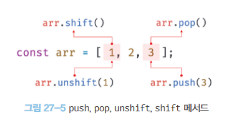

# 배열의 메서드

## Array.prototype.unshift
- 인수로 전달받은 모든 값을 원본 배열의 `선두`에 요소로 추가하고 변경된 `length` 프로퍼티 값을 반환.
- 이 역시도 성능이 좋지 않고 부수 효과까지 발생한다. 따라서 push와 동일하게 spread 문법으로 대체하는 것이 좋겠다.

## Array.prototype.shift
- pop과 달리 `선두`의 요소를 제거한다.

## Array.prototype.concat
- 인수로 전달된 값들을 원본 배열의 `마지막 요소`로 추가한 `새로운` 배열을 반환한다.
- 인수로 전달한 값이 배열인 경우 배열을 `해체`하여 새로운 배열의 요소로 추가한다.
```js
const arr1 = [1,2]
const arr2 = [3,4]

let result = arr1.concat(arr2)
console.log(result) // [1,2,3,4]

result = arr1.concat(3)
console.log(result) // [1,2,3]

result = arr1.concat(arr2, 5)
console.log(result) // [1,2,3,4,5]
```  
- concat 메서드로 unshift와 push 메서드를 대체할 수 있다.
```js
const arr2 =  [3,4]

let result = [1,2].concat(arr2)

console.log(result) // [1,2,3,4]

result = result.concoat(5,6)

console.log(result) // [1,2,3,4,5,6]
``` 
- 인수로 전달받은 값이 배열인 경우 push와 unshift 메서드는 해당 배열을 `그대로` 원본 배열의 마지막 / 선두 요소로 추가하지만 concat 메서드는 인수로 전달받은 배열을 `해체`하여 새로운 배열의 마지막 요소로 추가한다. 
- 하지만 concat 메서드 역시 spread 문법으로 대체할 수 있다.
```js
let result = [1,2].concat([3,4])
console.log(result) // [1,2,3,4]

result = [...[1,2], ...[3,4]]
console.log(result) // [1,2,3,4]
```
- 이 또한 일관되게 spread 문법을 사용하는 것이 권장된다. 

## Spread 문법에 대한 깊은 이해
> 스프레드 문법은 항상 새로운 데이터 구조를 생성하며, 원본 객체와의 참조를 유지하지 않습니다. 
- 하지만 위 문장은 depth가 1인 경우에만 유효하며 2 이상의 depth에서는 얕은 복사가 진행됩니다. 

> 엔진 수준에서 최적화가 이루어집니다.
- 요소의 수에 따라 다른 최적화 전략을 적용합니다.
- 10개 미만: 인라인 요소 할당
- 10~100개: 힙 메모리 사전 할당
- 100개 이상: 동적 크기 조정 알고리즘
- 이와 같은 최적화를 통해 Spread 문법은 메서드 호출에 비해 높은 성능을 나타냅니다. 

## Array.prototype.splice
> 세 개의 인자를 받습니다.
- start: 원본 배열의 요소를 제거하기 시작할 인덱스다. start가 음수인 경우 배열의 끝에서의 인덱스를 나타낸다. 
- deleteCount: start 부터 몇 개의 요소를 제거할지
- items: 제거한 위치에 삽입할 요소들의 목록. 
```js
const arr = [1,2,3,4]

const result = arr.splice(1,2,20,30)

console.log(result) // [2,3] 제거한 요소가 배열로 반환된다

console.log(arr) // [1,2,20,30]
```
- 배열에서 특정 요소를 제거하려면 indexOf 메서드를 통해 특정 요소의 인덱스를 취득한 다음 splice 메서드를 사용한다. 
```js
const arr = [1,2,3,1,2]

function remove(array,item) {
  const index = array.indexOf(item)

  if (index !== -1) array.splice(index, 1)
  
  return array
}

console.log(remove(arr,2)) // [1,3,1,2]
console.log(remove(arr,10)) // [1,3,1,2]
```
- filter 메서드를 사용하여 특정 중복 요소 전부를 제거할 수도 있다.
```js
const arr = [1,2,3,1,2]

function removeAll(array, item) {
  return array.filter(v => v !== item)
}
console.log(removeAll(arr,2))
```

## Array.prototype.slice
- 인자로 전달된 범위의 요소들을 복사하여 배열로 반환한다. 원본 배열은 변경되지 않는다. 
- 인자를 모두 생략하면 원본 배열의 복사본을 생성하여 반환한다.
```js
const arr = [1,2,3]

const copy = arr.slice()

console.log(copy) // [1,2,3]

console.log(copy === arr) // false

console.log(arr[0] === copy[0]) // true
```
- 위 코드에서 arr와 copy는 다른 객체다. 하지만 내부 요소의 값에 대한 참조는 동일하다.