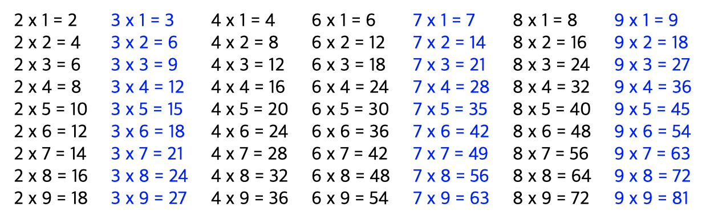
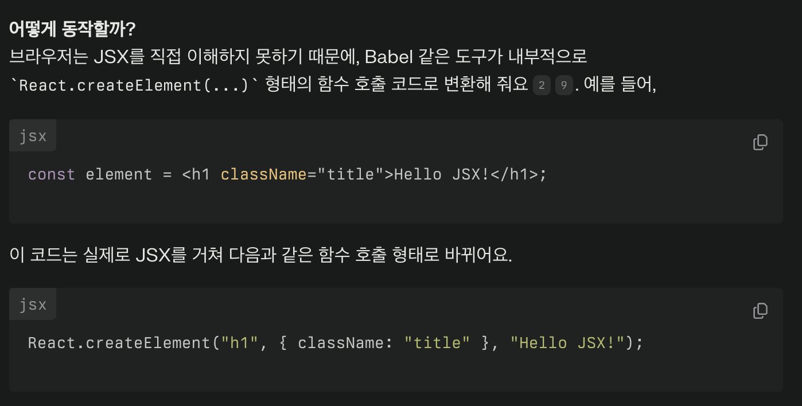

# study

## JSX란?
- JS + HTML
- 태그를 명시적으로 닫아줘야 하고 반드시 하나의 태그로 감싸져 있어야 동작한다. 
```js
import ReactDOM from 'react-dom';
// JSX의 문법 형식
const element = <h1>Hello, world!</h1>;

ReactDOM.render(
// 첫번째 인자를 두번째 인자의 요소에 렌더링하겠다.
  element,
  document.getElementById('root')
);
```

## JSX를 JS에서 사용하기
```js
let text = 'Hello, world!';
const num = 15;
const obj = { key: 0, a: 1, b: 2 };
const arr = ['a', 'b', 'c'];
const imageUrl =
  'https://dst6jalxvbuf5.cloudfront.net/static/img/logo/logo.svg';

const element = (
  <div>
    <h1>변수 넣기</h1>
    <ul>
    {/* 이런 방식으로 {}를 활용해 사용 */}
      <li>{text}</li>
      <li>{text + 'test'}</li>
    </ul>
    <h1>숫자 및 계산식 넣기</h1>
    <ul>
      <li>{num}</li>
      <li>{num + 15}</li>
    </ul>
```
- Object를 li 태그에 넣게되면 아래의 에러가 발생함. 이 경우에는 array를 사용하도록 하자.
```
Objects are not valid as a React child (found: object with keys {key, a, b}). If you meant to render a collection of children, use an array instead.
```
- JSX에는 IF문이 없다! 함수를 정의한 후 활용하는 편임. 

```js
<div className={1 + 1 === 2 && "highlight"}>Hello3</div>
```
```
1 + 1 === 2는 참(true)이 되고, JavaScript에서 true && 'highlight'와 같은 논리연산은 왼쪽이 true면 오른쪽 값을 그대로 반환해요. 반면 왼쪽이 false면 오른쪽은 평가하지 않고 false를 반환하는 단축 평가(short-circuit evaluation) 방식이에요.
따라서 className={1 + 1 === 2 && 'highlight'}는 1 + 1 === 2 부분이 참이므로 결국 highlight 문자열이 최종 반환되어, 해당 엘리먼트가 class="highlight"를 갖게 돼요. 만약 1 + 1 === 3처럼 조건이 거짓이었다면 false가 반환되어 className이 적용되지 않아요.
```

## JSX에서의 반복문
- Key를 설정하는 것이 좋다! 이는 Vue와 동일한 듯.

## JSX에서의 스타일링
- 객체를 미리 객체로 코드블럭화한 후 간편하게 스타일 적용이 가능하다. 이 때 스타일 속성은 camelCase로 작성한다. 
```js
const roundBoxStyle = {
  position: 'absolute',
  top: 50,
  left: 50,
  width: '50%',
  height: '200px',
  padding: 20,
  background: 'rgba(162,216,235,0.6)',
  // 3. 속성은 camelCase
  borderRadius: 50
};
...
<div style={roundBoxStyle}>Hello1</div>
```

## JSX 실습
```js
const num = [1, 2, 3, 4, 5, 6, 7, 8, 9];

const element = (
  <div style={{ display: "flex" }}>
    {/* 여기에 JSX를 활용하여 요구사항에 맞게 구구단을 완성시켜보세요! */}
    {num.map((n) => {
      return (
        n !== 1 &&
        n !== 5 && (
          <div style={{ padding: 10, color: n % 2 ? "blue" : "black" }}>
            {num.map((m) => {
              return (
                <div>
                  {n} x {m} = {n * m}
                </div>
              );
            })}
          </div>
        )
      );
    })}
  </div>
);

ReactDOM.render(element, document.getElementById("root"));
```


## JSX의 이해
- 자바스크립트 코드 안에서 마치 HTML을 작성하듯 태그 기반 문법을 사용할 수 있게 해주는 확장 문법
- React에서 JSX를 사용하면 UI 구조를 직관적으로 표현할 수 있고, 자바스크립트 로직과 UI를 한 파일에 담을 수 있어 코드 재사용성과 유지보수성을 높여줌
