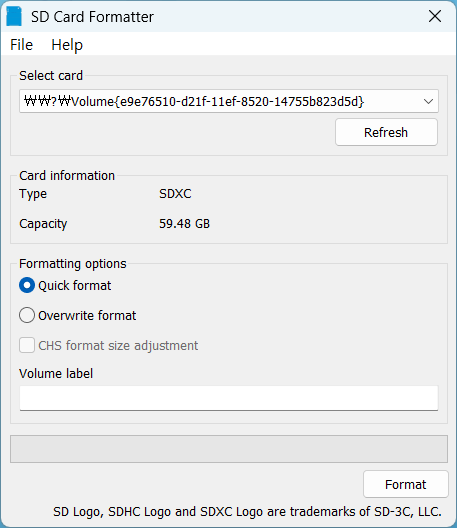
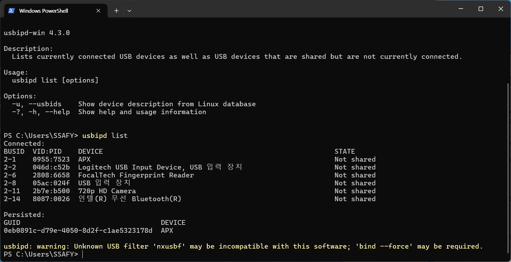
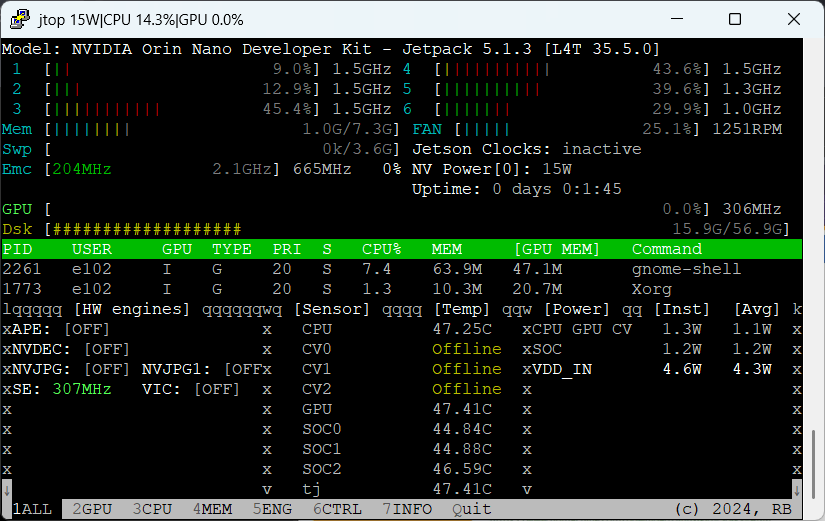

# 젯슨 오린 나노 설정

## 펌웨어 업데이트 
- 미리 설치한 Jetpack 5.1.3을 sd카드에 담기

- Rufus를 활용해 Jetpack 이미지(iso)를 적용하기

- 오린 나노 기기에 sd카드 연결 후 OS 설치 진행

- ubuntu 기반 터미널에서 python3 설치 및 jetpack 업데이트 진행


## 부팅 오류 발생 후 조치
1. 윈도우 WSL2 활용 UBUNTU를 구동, 젯슨 복구모드로 연결하여 VIDIA SDKmanager 실행
2. 위 과정 중 가장 힘들었던 부분은 WSL2 기반 UBUNTU 에서 젯슨의 연결이 인식되지 않았던 부분.
- 깃헙 usbipd-win 다운
- WSL2 ubuntu에 연결을 위한 패키지 설치
```ubuntu
sudo apt update
sudo apt install linux-tools-generic hwdata
sudo update-alternatives --install /usr/local/bin/usbip usbip /usr/lib/linux-tools/*/usbip 20

# 설치 후 windows에 연결된 usb 리스트 확인
usbipd list
# 
# id 확인 및 연결
usbipd attach --wsl --busid <busid>
# ubuntu에서 연결 확인

# 젯슨의 경우 APX의 ID 확인 후 연결
# sdkmanager ubuntu 환경에서 실행
sdkmanager
```


## SSH를 통한 원격 GUI 접근(Nomachine)

1. windows 환경에 nomachine 설치
2. orin 환경에서 `ifconfig` 명령어로 `wlan0`(무선)의 ip주소 확인
3. windows 환경에서 Putty 프로그램 실행(SSH 설정)
4. Putty 에서 연결 후 name 입력 시 e102 입력 / 비번 ssafy123!
- Putty 설정을 완료하면 orin에 따로 외장모니터를 연결하지 않더라도 터미널 환경을 원격으로 제어할 수 있음.
5. 완료 후 json tool package 설치

`jtop` 명령어로 실행 상황을 파악할 수 있음.
6. 이후의 작업은 `https://www.youtube.com/watch?v=vBMHS6FXBM4` 을 참고하여 진행