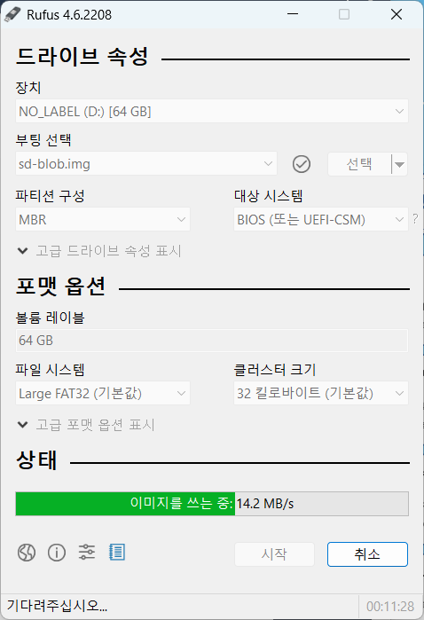

# 젯슨 오린 나노 설정

## 펌웨어 업데이트 
- 미리 설치한 Jetpack 5.1.3을 sd카드에 담기

- Rufus를 활용해 Jetpack 이미지(iso)를 적용하기

- 오린 나노 기기에 sd카드 연결 후 OS 설치 진행

- ubuntu 기반 터미널에서 python3 설치 및 jetpack 업데이트 진행


## SSH를 통한 원격 GUI 접근(Nomachine)

1. windows 환경에 nomachine 설치
2. orin 환경에 nomachine 설치
```
1. wget https://www.nomachine.com/free/arm/v8/deb -O nomachine.deb
2. sudo dpkg -i nomachine.deb -> 52초 정도 소요
```
3. 모니터 없이 곧바로 호스트 PC에서 원격 컨트롤이 가능하도록 명령어 입력
```
1. sudo systemctl set-default multi-user.target
2. sudo /usr/NX/bin/nxserver --restart
```