# 240712 TIL

## 첫 번째 실습
   1. 새로운 폴더 생성 후 로컬 저장소 설정
      
      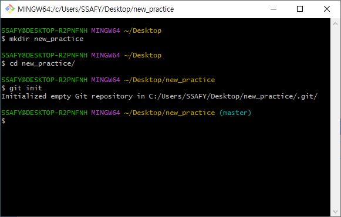
   2. `commit` 목록 생성

      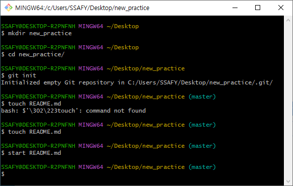
      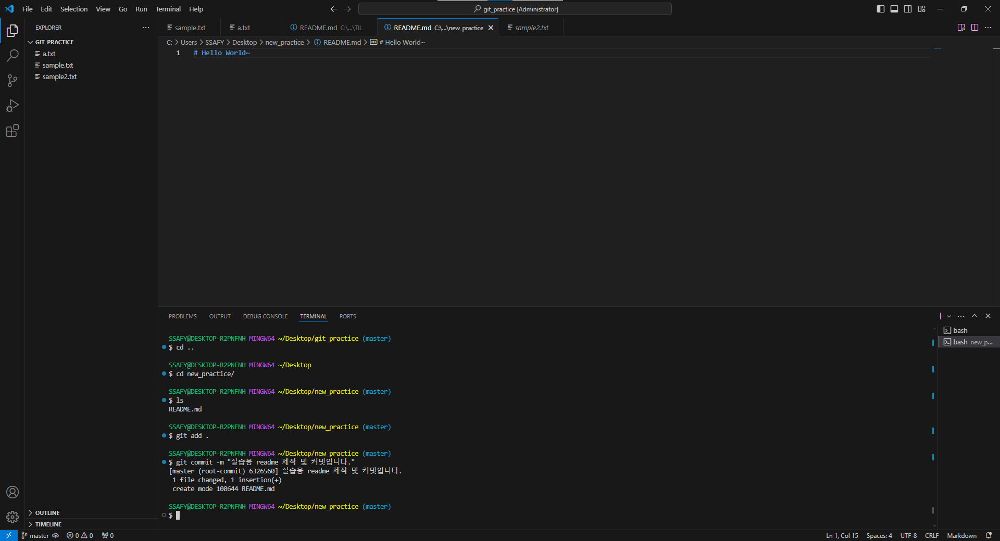
   3. 새로운 Github repository 생성
   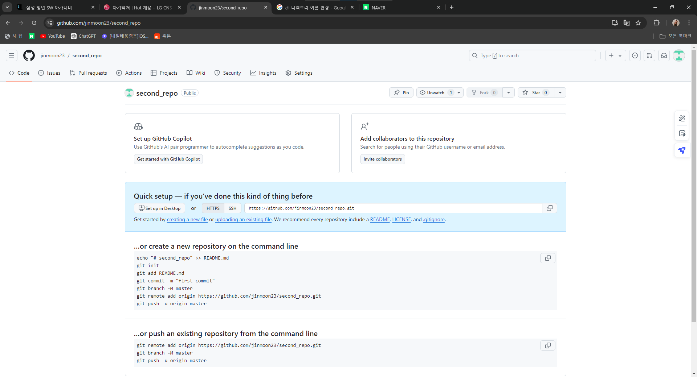
   4. 원격 저장소 추가
   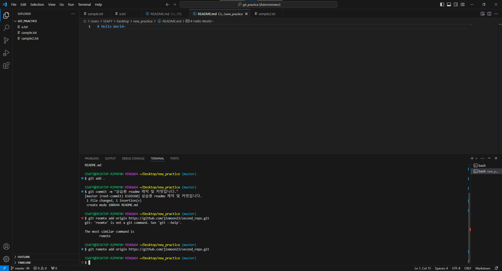
   5. `commit` 목록 `push`
   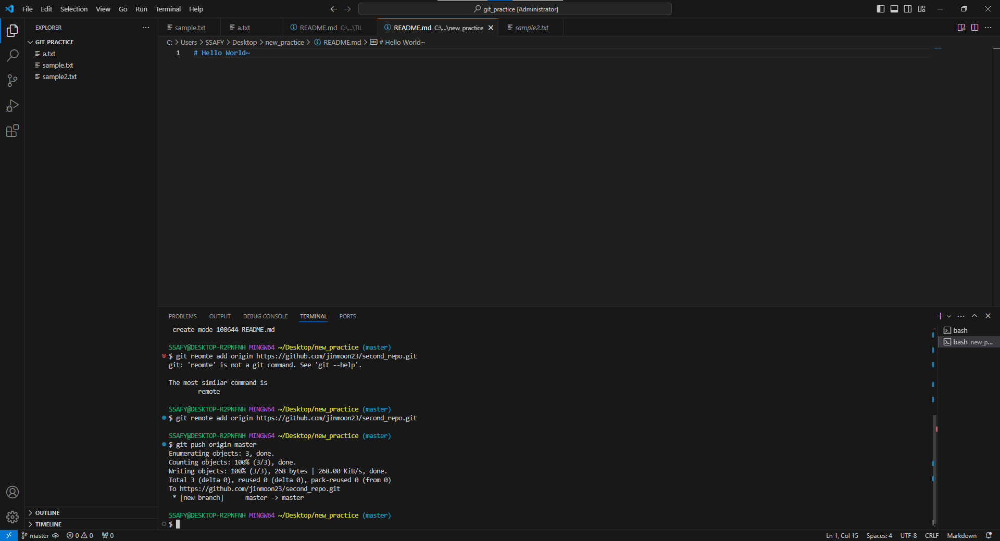
   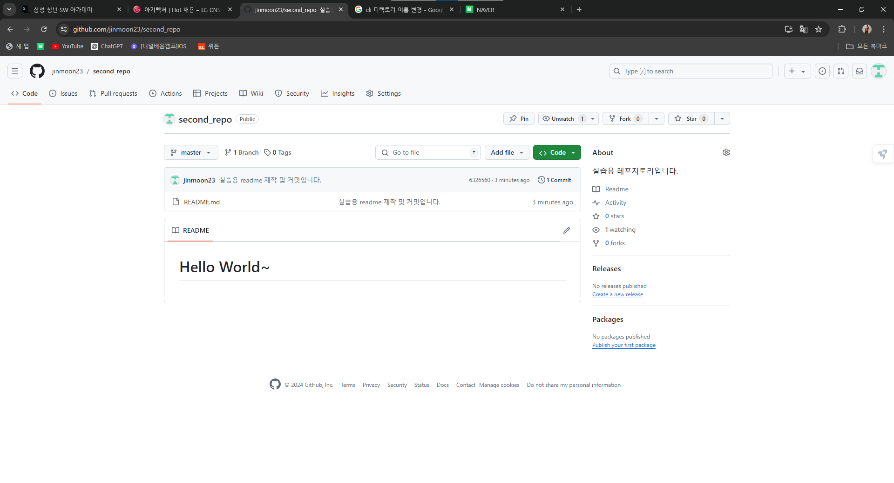

## 두 번째 실습
1. 기존에 이미 origin을 지정한 로컬 저장소에 이어서 진행함
2. 새로운 Github repo 생성
   
3. origin이 아닌 다른 이름(prime)으로 원격 저장소 추가
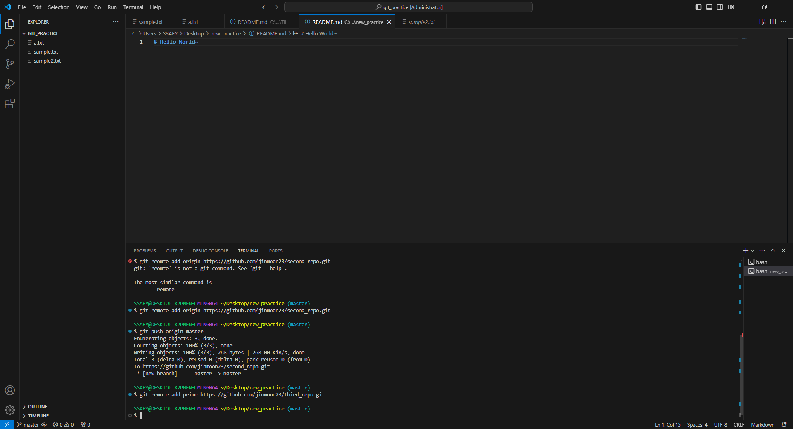
4. `commit` 목록 생성
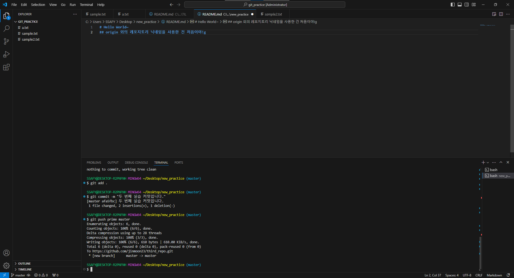

## 세 번째 실습(끝말잇기)
1. 게임을 위한 repo 생성 및 `README.md` 초기 설정
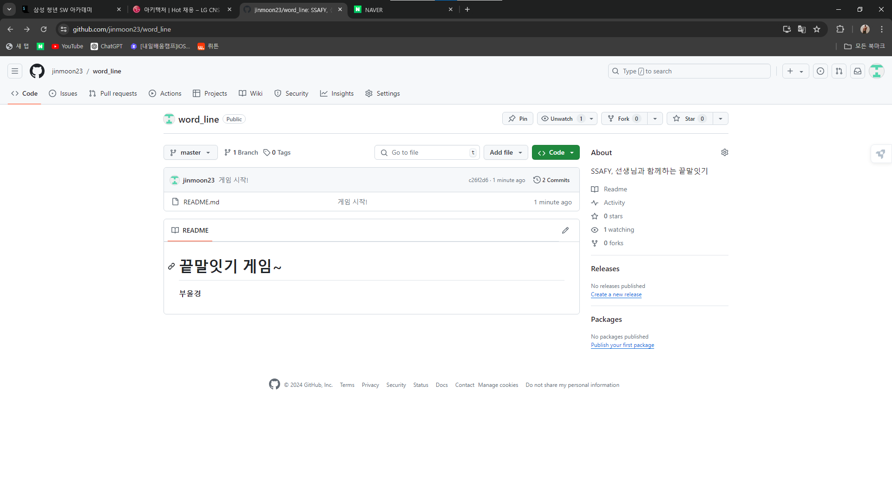
2. 게임의 상대방인 선생님이 2번째 응답을 입력하고 push 하려 하였으나 permission 관련 오류가 발생함!
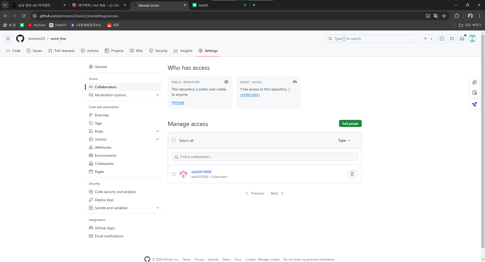
이 처럼 Collaborator를 설정해주면 push가 가능해짐!
3. 게임을 진행하는 과정
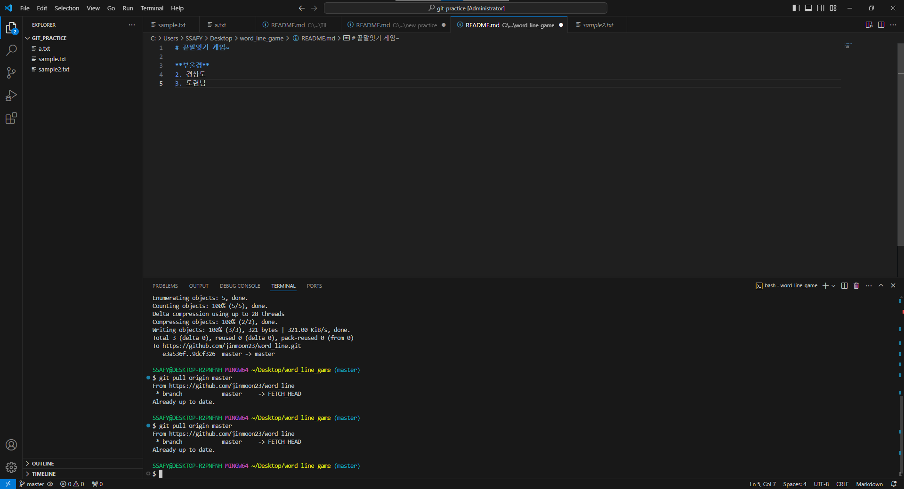

## 네 번째 실습(.gitignore)
1. .gitignore 파일 생성
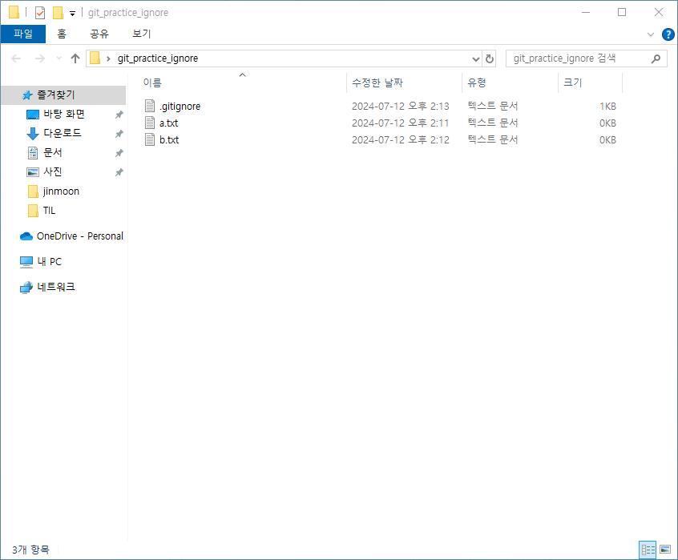
2. .gitignore 파일에 a.txt 파일 기입해서 항상 add의 대상이 되지 않도록 함
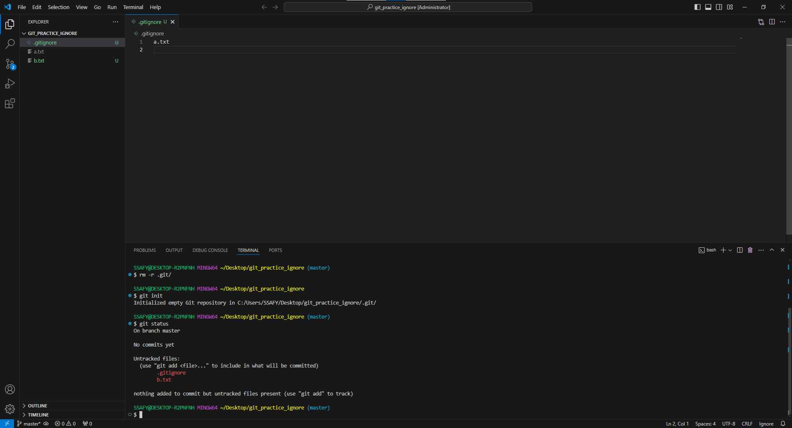
## 이외의 추가적인 git 명령어
- `git revert` : 과거 commit의 삭제 및 삭제했다는 사실을 커밋하는 명령어
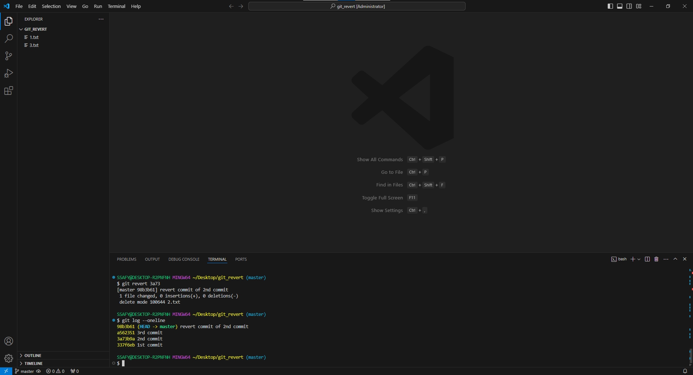
- `git reset` : **쓰지말자**
- `git reflog` : 이미 삭제한 `commit` 으로 다시 돌아간다. 이건 유용하겠는데? 더 찾아보자. 
- `git restore` : 파일 수정 후 수정사항을 모두 취소하고 **원래대로** 되돌리는 작업. `git add` 하기도 전의 작업임!