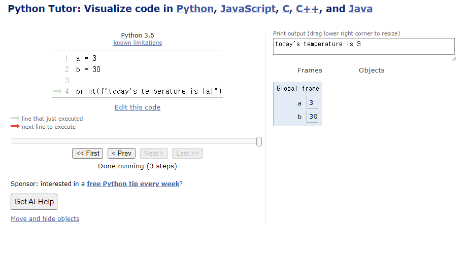

# Syntax 1일차

## 프로그래밍
- 핵심: 연산을 정의하고 조합해 유용한 작업을 수행 -> 문제를 해결

## 인터프리터
- 한 번에 한 명령어씩 실행

## 표현식과 값
```python
# 3+5는 표현식이고 8은 값이다.
3+5 = 8  
```

## 타입
변수나 값이 **가질 수 있는** 데이터의 종류
```python
# 3은 피연산자, +는 연산자이며 둘 모두 타입이다. 
3+5 = 8  
```
- 숫자형, 시퀀스타입, 텍스트시퀀스타입, 넌시퀀스타입, 기타
- 타입의 중요성: 타입에 맞는 연산만 가능하기 때문
- 연산자 중 내게 낯선것들: / -> 나눗셈, // -> 몫, ** -> 지수(거듭제곱)
  
```실습
16 / -16 / 16

-2 ** 4 여기서 논란이 있었다! 

(2**4)를 실행 후 -(음수부호) 연산자를 적용함. 
```

## 변수와 메모리(값이 저장되는 법)

변수: ~~값을 담는 상자~~ 변수에 값을 **할당** 되었다고 보는것이 더 정확함
```python
# 36.5 라는 값을 degree 변수에 할당함
degree = 36.5
# 재할당
degree = 'abc'
```
값은 메모리에 저장되고 메모리는 주소를 가진다. **변수는 메모리의 주소를 알고있다**고 보아야 한다.

즉 degree 변수는 메모리의 주소를 **참조**하는 것.

결론적으로 변수는 **값을 참조**하기 위한 이름이다. 


## 숫자형 타입
- float: 컴퓨터는 실수를 **근삿값**으로 바라본다. 이유는 실수는 무한정할 수 있고 메모리는 한정되기 때문.
- 이 과정에서 예상치 못한 에러가발생 -> 부동소수점 에러

## Sequence Type
**여러개**의 값들을 **순서대로 나열**하여 저장하는 자료형
특징: 순서 / 인덱싱 / 슬라이싱 / 길이 / 반복

## String Type(Text Sequence Type)
문자들의 **순서가 있는 변경 불가능**한 sequence 자료형
파이썬의 권장 방법은 `''`
- Escape Sequence: 파이썬의 일반적인 문법을 **탈출**한다는 의미, \(역슬래시)를 활용
- 가장 많이 쓰는 \n -> 줄 바꿈
- string interpolation: 문자열 내에 변수나 표현식을 삽입하는 방법
  - f-string 표기법: 문자열에 파이썬 표현식의 값을 삽입할 수 있음
```python
# String Interpolation "f-string"
bugs = 'roaches'
counts = 13
area = 'living room'
print(f'Debugging {bugs} {counts} {area}')
#이 print 함수에서 가장 중요한 부분은 f' 임.
```
```python
# 파이썬에선 모두 1개의 문자열
'a'
'apple'
'hello, world' 
```
- 파이썬은 다른 언어와 달리 음수 인덱스를 지원함. 
```python
'hello'
01234
-5-4-3-2-1
# 음의 인덱스 중 -0이 존재하지 않는 이유는 0에 -를 붙일 수 없는것도 맞고 
# 인덱스는 유일해야 한다는 것도 맞음
# 음의인덱스는 매우 긴 문자열에 슬라이싱을 적용할 때 매우 편리함
# [::-1] 을 활용해 'olleh'를 쉽게 추출할 수 있음
```
- 슬라이싱시 유의
```python
my_str = 'hello'
my_str[2:4] #  2<= 값 <4 
```
- 변경 불가능하다? 
```python
my_str = 'hello'
# TypeError: 'str' object does not support item assignment
my_str[1] = 'z'
# hzllo 로 바꾸고 싶으면 재할당이 필요함
```

## Style Guide
- 읽기 편하고 직관적이게 이해하기 위한 개발자들끼리의 약속
- 의미있는 변수명을 짓기 위해 많은 시간을 들이는 경우가 많음. 그 정도로 중요하다 :)

## 구글링 하는 법
- 가능하다면 **영어**로 검색, 문장 보다는 키워드를 잘 뽑을 수 있도록!
- 우선순위: 공식문서 -> 개발자 커뮤니티 -> 한국인 블로그
- 개발자의 가치는 **논리적 사고력**과 **문제해결능력**이 결정함

## python tutor
변수가 어떻게 처리되고 인터프리터의 동작이 어떻게 실행되는지 시각적으로 알 수 있게해주는 유용한 웹
