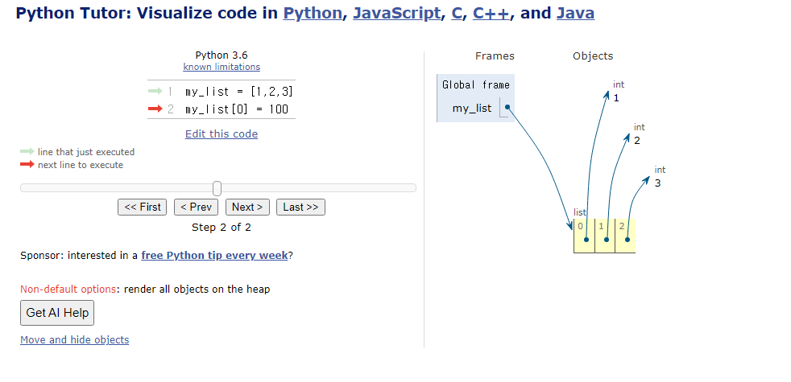
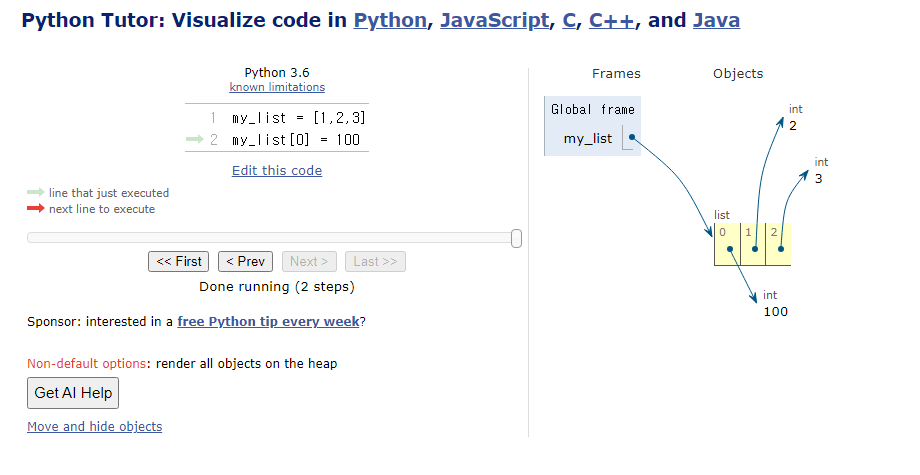
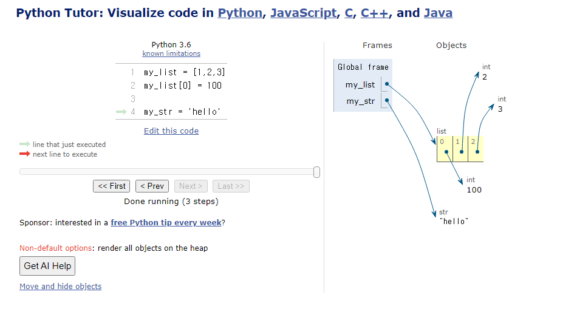
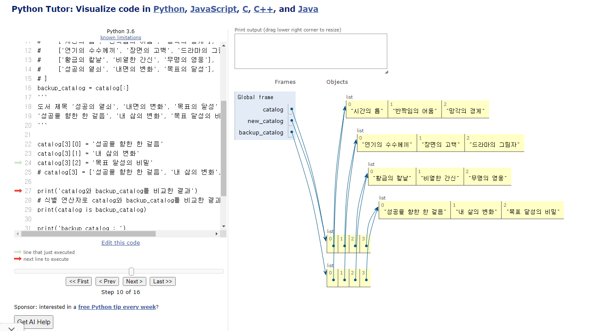
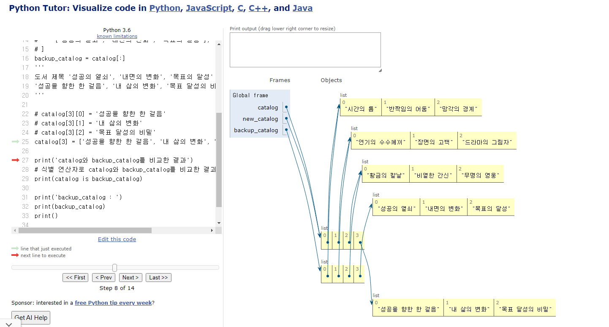

# Syntax Day 2

## list
- 문자열과 큰 차이 -> **변경이 가능**하다!(mutable)
- []로 표기, 내부에는 어떤 데이터타입도 저장할 수 있음. n차원의 리스트 저장하는 것도 가능.
- **리스트 내부에 리스트**를 넣는 것 또한 가능하다. 
```python
my_list = [1,2,3['python',100,'hello']]
``` 
- my_list 내부의 list의 'hello' 에 접근하는 코드
```python
print(my_list[3][2])
```
- my_list 내부의 1 값을 100으로 바꾸는 코드
```python
my_list[0] = 100
```

## tuple
- 리스트와 매우 비슷하지만 **변경이 불가능**하다!(immutable)
- ()로 표기
```python
# 반드시 하나의 값을 튜플로 저장하고 싶을 때 이런 식으로 구성해야 함
my_tuple_2 = (1,) 
```
- 중요하지 않음. 사실상 거의 사용하지 않으며 실질적으로 파이썬 인터프리터 내부에서 자동적으로 사용되는 문법.
```python
x, y = 10, 20
print(x)
print(y)
# 위 코드와 아래 코드는 완전히 동일함. 위 코드를 파이썬 인터프리터가 아래의 과정으로 다중할당하기 때문. 
x, y = (10, 20)
``` 

## range
- **연속**된 *정수* **시퀀스**를 생성하는 **변경 불가능**한 데이터 타입(immutable)
- 다른 타입과 달리 **함수**형태
```python
# 기본값은 range(x,y,z) (start,end,step)
my_range_0 = range(-3, 2)
my_range_1 = range(5)
my_range_2 = range(1, 10)
print(my_range_0) # range(-3, 2)
print(my_range_1)  # range(0, 5)
print(my_range_2)  # range(1, 10)

# 리스트로 형 변환 시 데이터 확인 가능
print(list(my_range_0)) # [-3,-2,-1,0,1]
print(list(my_range_1)) # [0,1,2,3,4]
print(len(my_range_1)) # 5
print(list(my_range_2)) # [1,2,3,4,5,6,7,8,9]
# 주로 반복문과 함께 활용
```

## dict
- 키값쌍 / **순서가 없다!** -> 인덱스가 없음 / **중복이 없다!** / 변경이 가능하다(mutable)
- 키는 무조건 **변경 불가능**한 자료형만 가능(str, int, float, tuple, range)
- 값은 어떤 자료형이든 *무관*
- {}로 표기
- dict 자료형에서의 핵심은 키로 접근해 값을 얻어낸다는 것. 
- **API 호출**에서 핵심적인 데이터타입
- **기출** 순서가 없기 때문에 순서를 물어보는 문제는 **없다**가 맞음 ^_^
```python
my_dict = {'apple': 12, 'list': [1, 2, 3]}
# 주의! 키로 접근할 때는 [] 대괄호를 사용함.
print(my_dict_3['apple'])

#이런 식으로 표현하면 더 가독성이 좋아짐
my_dict_3 = {
    'apple': 12,
    'list': [1, 2, 3]
}
```

## set
- 순서와 중복이 없는 변경 가능한 자료형
- 비중이 높지 않음
- 간단한 중복 제거 시 또는 집합 연산이 필요한 경우에 사용함

# other types

## None
- 값이 **없음**을 표현하는 자료형
- N은 꼭 대문자로 해야함!

## Boolean
- T / F 대문자로 해야함!

## Collection 정리

|     컬렉션    	|     변경 가능 여부    	|     순서 여부    	|          	|
|:-------------:	|:---------------------:	|:----------------:	|:--------:	|
|       str     	|            X          	|         O        	|  시퀀스  	|
|      list     	|            O          	|         O        	|  시퀀스  	|
|      tuple    	|            X          	|         O        	|  시퀀스  	|
|       dict     	|            O          	|         X        	| 비시퀀스 	|
|      set     	|            O          	|         X        	| 비시퀀스 	|

## 불변과 가변의 차이
- 가변의 경우(list)


- 불변의 경우(str)


# 형변환

## 암시적 형변환
- 정수와 실수를 더하면 실수로 변환됨
- boolean과 numeric에서만 가능
```python
print(True+3) ## 4
```

## 명시적 형변환
- str -> integer : 형식에 맞는 숫자만 가능
```python
print(int('1'))  # 1

# ValueError: invalid literal for int() with base 10: '3.5'
print(int('3.5'))

print(int(3.5))  # 3
print(float('3.5'))  # 3.5
```

- integer -> str : 모두 가능
 
```python
print(str(1) + '등')  # 1등
```
# 연산자
- 연산자와 피연산자가 필요
## 복합연산자
- 연산과 할당이 동시에 이루어지는 식
## 비교연산자
- is / is not == == / !=
- is / is not -> 메모리 내에서 같은 객체를 참조하는지 확인 즉, 동일한 메모리 주소를 참조하는지 까지 확인하는 연산자
- 하지만! 실제로 잘 사용하지는 않는다. 
```python
# 비교 연산자print(3 > 6)  
# SyntaxWarning: "is" with a literal. Did you mean "=="?
# ==은 값(데이터)을 비교하는 것이지만 is는 레퍼런스(주소)를 비교하기 때문
# 아래 조건은 항상 False이기 때문에 is 대신 ==를 사용해야 한다는 것을 알림
print(1 is True)  # False
print(1 == True)  # True
print(2 is 2.0)  # False
print(2 == 2.0)  # True
```
## 논리연산자
- and / or / not 
- 논리연산자의 피연산자는 항상 bool값이 온다!
- not 연산자는 하나의 피연산자만 가진다. 
## 단축평가
- 논리 연산에서 두 번째 피연산자를 평가하지 않고 결과를 결정하는 동작
- str -> if '': false else true 여기서 중요! ' '는  true임!
- integer -> if 0: false else true
- 논리연산자는 **true를 찾아간다**고 생각하면 편함
```python
print(('b' or 'a') in vowels) # b가 true네? 끝내 ^_^
```
 
```python
vowels = 'aeiou'

print(('a' and 'b') in vowels)  # false
print(('b' and 'a') in vowels)  # true
print(('b' or 'a') in vowels)  # false b == true 라서 단축평가되어 ('a')가 평가되지 않음

print(3 and 5)  # 5
print(3 and 0)  # 0 3은 true / 0은 false 
print(0 and 3)  # 0 0은 false 따라서 단축평가
print(0 and 0)  # 0 0은 false 따라서 단축평가

print(5 or 3)  # 5 5는 true 따라서 단축평가
print(3 or 0)  # 3 3은 true 따라서 단축평가
print(0 or 3)  # 3 0은 false 3은 true
print(0 or 0)  # 0 앞의 0은 false / 뒤의 0도 false and와 달리 여기서 단축평가되지 않음
```

# 실습 중 인상깊었던 문제

깊은복사와 얕은복사를 다루는 문제.
메모리에 저장된 값과 메모리주소에 대한 이해가 있어야 쉽게 해결이 가능한 것 같다.
- 깊은복사: 값과 메모리 전부를 복사
- 얕은복사: 메모리주소만 복사 -> mutable 데이터의 경우 원본이 수정되는 사고가 일어날 수 있다. 

```python
catalog = [
    ['시간의 틈', '반짝임의 어둠', '망각의 경계'],
    ['연기의 수수께끼', '장면의 고백', '드라마의 그림자'],
    ['황금의 칼날', '비열한 간신', '무명의 영웅'],
    ['성공의 열쇠', '내면의 변화', '목표의 달성'],
]
# 혹시 모를 사태 대비
new_catalog = catalog

# backup_catalog = [
#     ['시간의 틈', '반짝임의 어둠', '망각의 경계'],
#     ['연기의 수수께끼', '장면의 고백', '드라마의 그림자'],
#     ['황금의 칼날', '비열한 간신', '무명의 영웅'],
#     ['성공의 열쇠', '내면의 변화', '목표의 달성'],
# ]
backup_catalog = catalog[:]
''' 
도서 제목 '성공의 열쇠', '내면의 변화', '목표의 달성' 을 각각
'성공을 향한 한 걸음', '내 삶의 변화', '목표 달성의 비밀' 가 되도록 변경하시오.
'''
# 이 부분이 왜 다른걸까?? 아래의 주석처리한 부분으로 동작하면 정상작동하지 않음. 무슨차이가 있는거지?
# 아 추측하기로 catalog list의 내부 list를 수정하는 것과 내부 list의 요소를 수정하는 것은 완전히 다르게 동작하는 것 같음.
# catalog[3][0] = '성공을 향한 한 걸음'
# catalog[3][1] = '내 삶의 변화'
# catalog[3][2] = '목표 달성의 비밀'
catalog[3] = ['성공을 향한 한 걸음', '내 삶의 변화', '목표 달성의 비밀']

print('catalog와 backup_catalog를 비교한 결과')
# 식별 연산자로 catalog와 backup_catalog를 비교한 결과를 출력하시오.
print(catalog is backup_catalog)

print('backup_catalog : ')
print(backup_catalog)
print()

print('catalog : ')
print(catalog)

```

- 이 경우는 내부 list의 요소에 접근한 경우


- 이 경우는 내부 list의 list 자체에 접근한 경우

하지만!! 이것도 결국 얕은복사임. 깊은복사를 위해선 copy 모듈을 사용해야함.