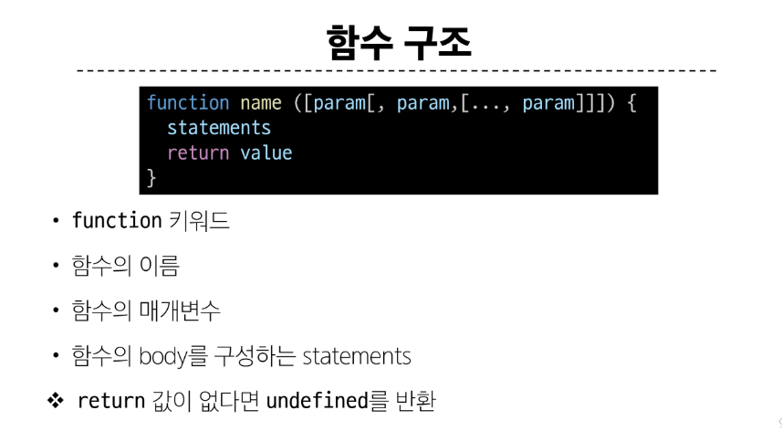
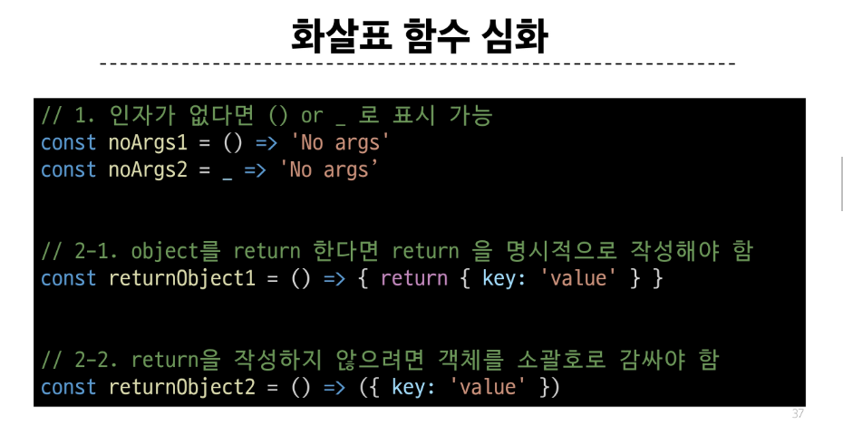

# Day_3, 함수

## 선언식과 표현식
- 선언식: `호이스팅` 되어 구조적으로는 권장되지 않으나 코드의 구조와 가독성 면에서 장점이 있음
- 표현식: 호이스팅되지 않음. 익명으로 함수를 활용할 수 있음
  - 변수의 선언만 호이스팅되고 함수의 할당은 실행 시점에 이루어짐

## 매개변수와 인자의 불일치에 대한 판단
- 매개변수와 인자의 불일치를 인정하고 에러를 발생시키지 않는다.

## Spread Syntax
표기법: `...`
구문의 용도: 배열이나 문자열과 같이 Iterable 항목을 펼침
함수와의 연계 활용
  - `호출` 시 `인자`의 `확장`
  - `선언` 시 `매개변수`의 `압축`

## 화살표 함수
1. 표현식 함수에서 `function` 키워드 제거
2. 매개변수와 중괄호 사이에 `=>` 키워드 추가
  - 만약 매개변수가 1개라면 `()` 생략 가능
3. (중괄호 내부가 1줄이라면)`중괄호`와 `return` 생략 가능

## 화살표 함수 심화
