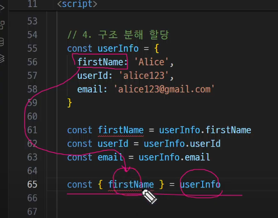

# Day_4

## 객체(Object)
key는 문자열만 / value는 모든 자료형이 가능
위의 키값쌍을 `속성`이라고 부름
key에 []를 사용하면 변수로 사용할 수 있다.(Computed Property)

## method
`this` 키워드를 사용해 객체에 대한 특정한 작업을 수행할 수 있음
`this`: 함수나 메서드를 `호출`한 `객체`를 가리키는 키워드. 함수 내에서 객체의 속성 및 메서드에 접근하기 위해 사용
  - 함수를 `호출하는 방법`에 따라 가리키는 대상이 다르다.
    - 단순 호출: 전역 객체인 `window`
      - 객체 내부에 함수가 존재하는 경우 문제가 발생하는데
      - 화살표 표현 함수를 활용해 해결할 수 있다.
      - 화살표 함수는 `자신만의 this를 가지지 않고` 자신 외부 함수의 this를 `차용해서 사용`함
    - 메서드 호출: 메서드를 호출한 객체

## 구조 분해 할당

## 유용한 객체 메서드
keys & valuse: 파이썬과 동일 
?(optional chaining): 만약 참조 대상이 없는 경우 에러가 발생하는 대신 Undefined를 반환하도록 함. 

## JSON과 객체의 차이
JSON은 전부 `문자열` / 객체는 객체!