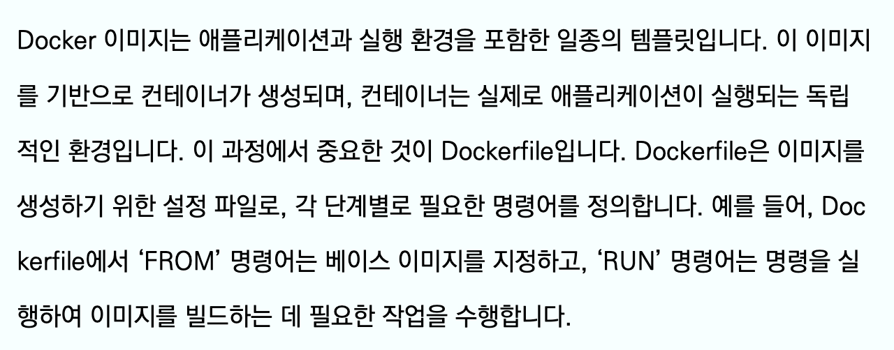
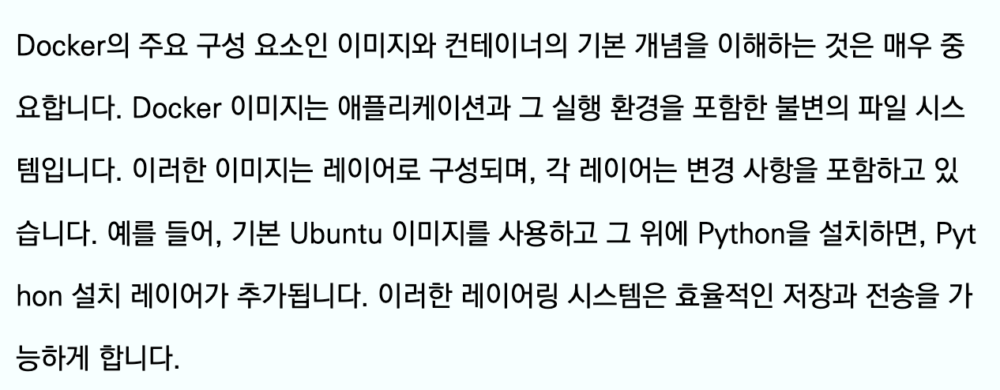
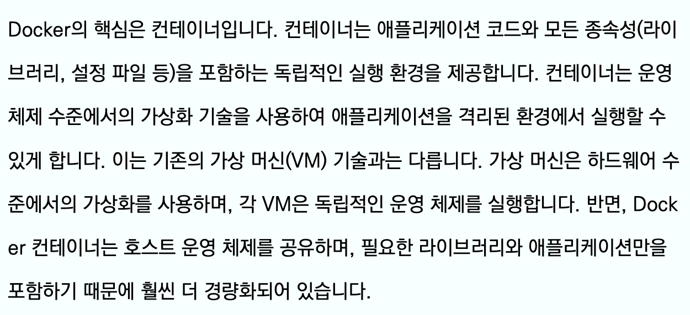
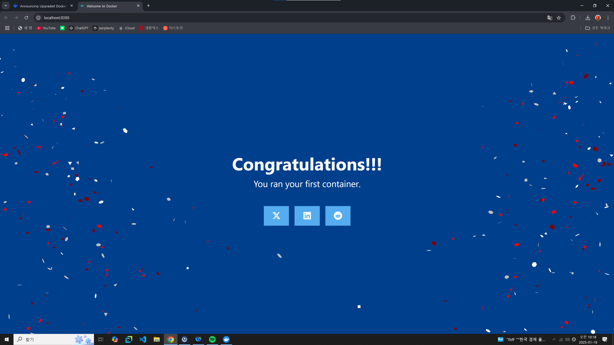
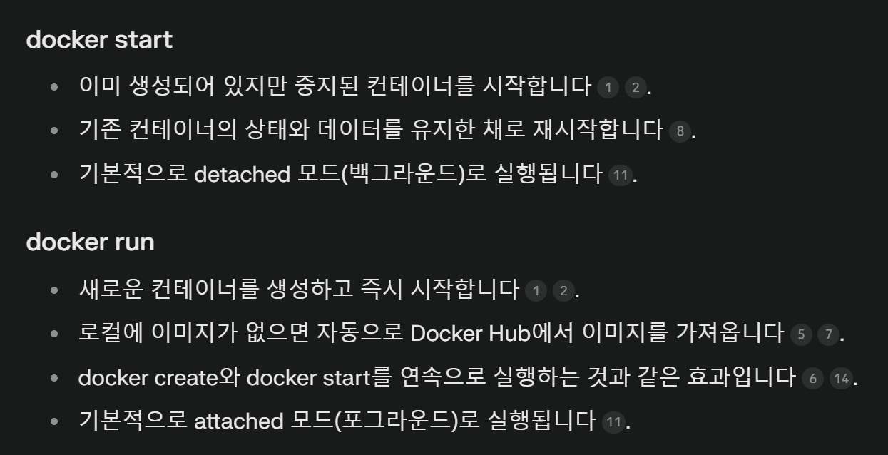
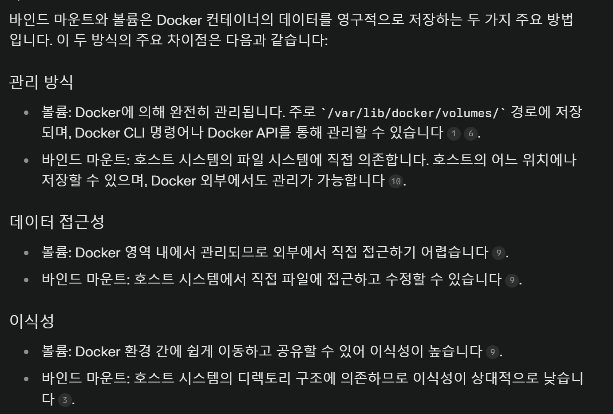
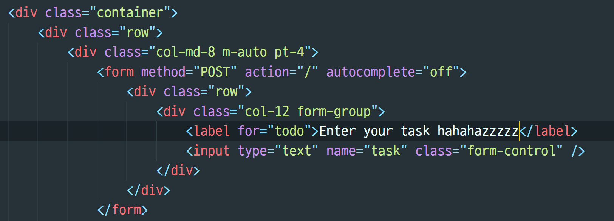
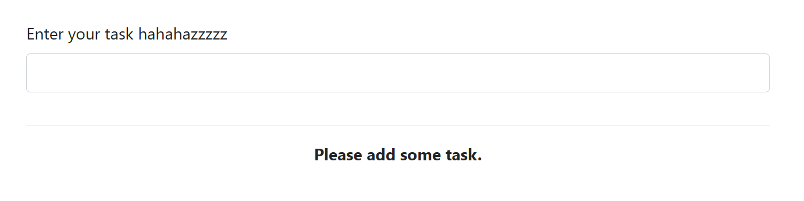
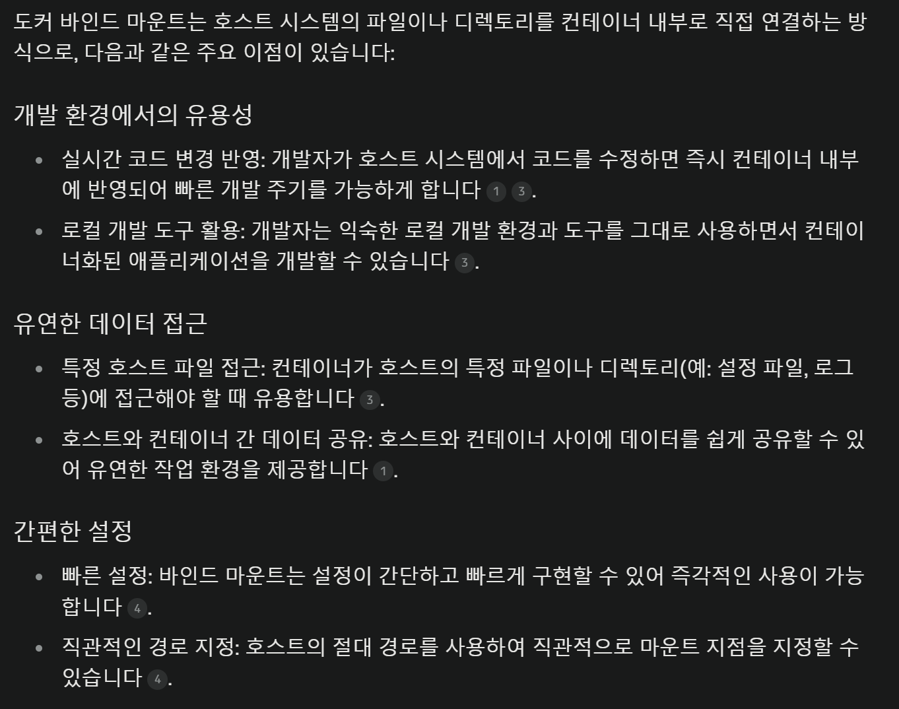
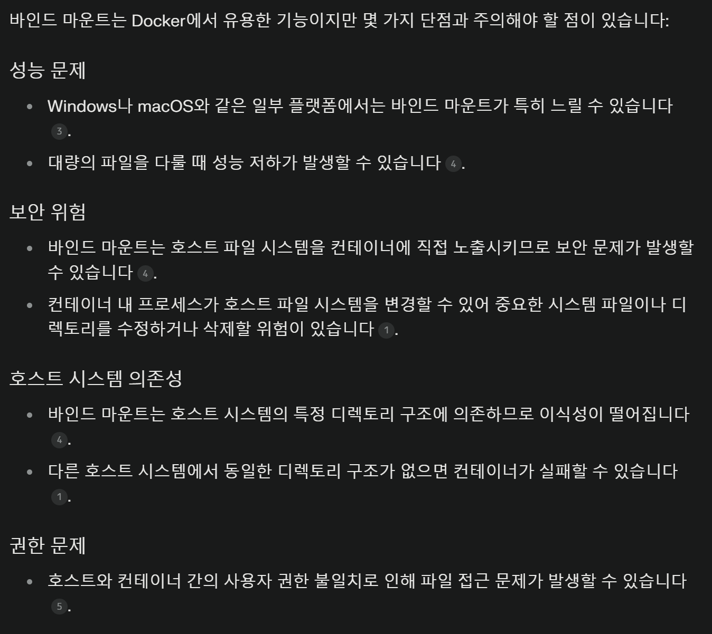

# 1일차







## 바인드 마운트
```yaml
services:
  todo-app:
    build:
      context: ./app
    links:
      - todo-database
    volumes: 
     - ./app:/usr/src/app
     - /usr/src/app/node_modules
    ports:
      - 3001:3001
```
- compose.yaml 파일 내부의 volumes를 위와 같이 설정하고
- docker compose up -d 명령어 사용 후
- 로컬에서 todos.ejs를 수정하면 실시간으로 반영됨



