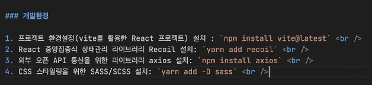
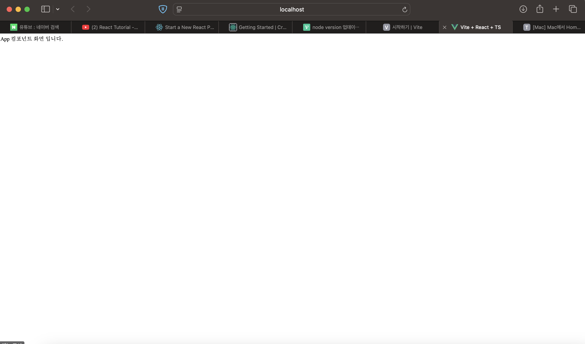

# REACT 시작하기
레퍼런스: https://www.youtube.com/watch?v=Yv5tSNr4h2c

## 실습환경세팅
- vite를 통해 React 환경 설정
  - `npm create vite@latest`
  - `cd my_app`
  - `npm install`
  - `npm install axios`
- yarn 세팅 후 recoil 패키지 설치(Homebrew 활용)
  - `brew install yarn --ignore-dependencies`
  - `yarn add recoil`
  - `yarn add -D sass`
  - `npm install react-router-dom localforage match-sorter sort-by`
  - `npm install @types/node`
  - `npm install react-simple-toasts`

## 초기 세팅 완료
