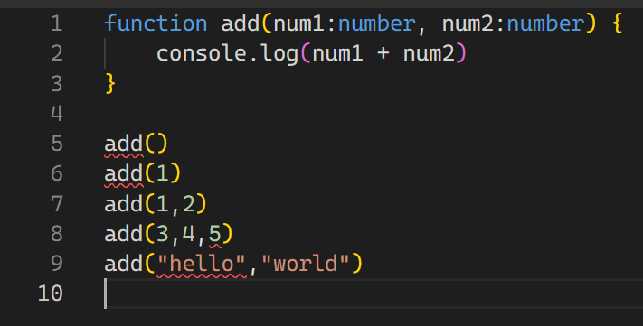

# TypeScript study

## 왜 TypeScript인가?
- `정적타입언어`로 인터프리팅이 아닌 `컴파일`되어 어디서 에러가 발생하는지 손쉽게 파악할 수 있다. 
```ts
function add(num1:number, num2:number) {
    console.log(num1 + num2)
}

add()
add(1)
add(1,2)
add(3,4,5)
add("hello","world")
```
- 위 코드블럭은 TypeScript로 num1과 num2의 데이터 타입을 지정하여 예측하지 못한 오류의 발생 가능성을 낮춘다. 또한 컴파일 과정에서 미리 오류를 파악할 수 있기 때문에 배포 후 발생하는 문제를 미연에 방지할 수 있다. 

```js
function add(num1, num2) {
    console.log(num1 + num2)
}

add()
add(1)
add(1,2)
add(3,4,5)
add("hello","world")
```
- 위 코드블럭은 JavaScript로 num1과 num2의 데이터 타입이 지정되지 않아 예측하지 못한 오류가 발생할 수 있음에도 불구하고 코드는 정상적으로 동작하게 되고 이러한 정상 동작은 유지보수성을 낮춘다. 

## Ts