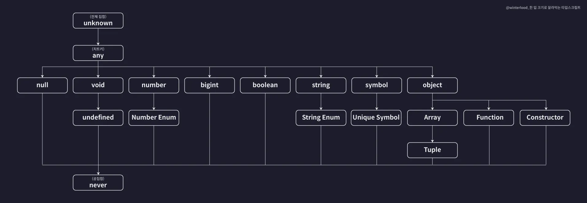

# TypeScript study

## TypeScript 컴파일러 설정 변경
- 타입스크립트는 다른 언어에 비해 컴파일러 옵션을 자유롭게 설정할 수 있다. 덕분에 우리가 진행하는 프로젝트의 성격에 따라 최적화된 설정을 진행할 수 있음.
- `tsconfig.json` 파일을 통해 직접 설정할 수 있다.

## TypeScript의 다양한 Type
- 타입스크립트의 '타입'은 사실 여러개의 값을 포함하는 '집합'입니다.

- number literal type은 number type에 속한다.
- 타입스크립트의 모든 타입들은 집합으로써 서로 포함하고 또 포함되는 이런 관계를 갖습니다. 
- Number 타입처럼 다른 타입을 포함하는 타입을 슈퍼 타입(부모 타입)이라고 부릅니다.

- 이 타입 계층도가 설명해주고 있는 것은 타입스크립트가 제공하는 여러가지 기본 타입들간의 집합으로써의 부모-자식 관계인 것. 

## 타입 호환성이란?
- 타입 호환성이란 예를 들어 A와 B 두개의 타입이 존재할 때 A 타입의 값을 B 타입으로 취급해도 괜찮은지 판단하는 것을 의미합니다.


- 더 큰 타입의 값을 더 작은 타입의 값으로 취급하는 것은 안된다.
- 왜? 집합으로 생각해보면 이해하기 쉽습니다.
- 변수 num1은 Number 타입이므로 10외에도 999나 -123123 같은 다양한 숫자 값을 담을 수 있습니다. 마치 직사각형에는 여러 종류의 사각형이 포함되는 것과 비슷합니다. 그러나 변수 num2는 Number Literal 타입이므로 10외의 다른 값은 절대 담을 수 없습니다.
- 그러므로 num2에 num1의 값을 저장하게 되면 문제가 발생할 가능성이 굉장히 큽니다. 그래서 이렇게는 불가능한 것 입니다.
- 정리: 서브 = 슈퍼 불가능 / 슈퍼 = 서브 가능
- 서브 = 슈퍼 상황을 다운 캐스팅이라고 하고 슈퍼 = 서브 상황을 업 캐스팅이라고 함.

## unknown 타입의 집합성
- unknown 타입은 타입 계층도에서 가장 위에 위치함. 이는 모든 타입의 슈퍼 타입이라는 의미. 전체 집합을 의미한다. 
- 다운캐스트는 예외적인 경우가 아니면 허용되지 않음. 따라서 unknown 타입의 값은 any를 제외한 어떤 타입의 변수에도 할당할 수 없음. 

## any 타입의 집합성
- any는 뭐든지 예외. 일종의 치트키 같은 타입임.

## 타입 추론에서 주의할 부분

### 기본 타입으로의 any
- 변수에 대해 초기화를 진행하지 않으면 기본타입으로 `any` 타입이 지정된다. 
- 위 any 타입은 변수에 값을 할당함에 따라 계속 변화하며 결국 오류를 발생시킬 가능성이 높다.

### const 상수에 대한 타입 추론
- let으로 선언된 변수와 달리 const는 초기화 때 설정한 값을 변경할 수 없기 때문에 특별히 가장 좁은 타입으로 추론됨. 
```ts
const num = 10;
// 10 Number Literal 타입으로 추론

const str = "hello";
// "hello" String Literal 타입으로 추론
```

### 최적 공통 타입 추론
- 다양한 타입의 요소를 담은 배열을 변수의 초기값으로 지정하면 최적의 공통 타입으로 추론됨.
```ts
let arr = [1, "string"];
// (string | number)[] 타입으로 추론
```
