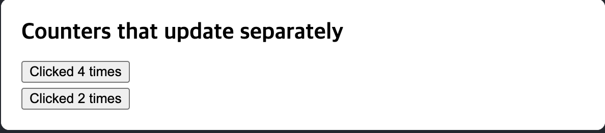

# react 기초
- react는 함수형 프로그래밍을 적용하는 js 라이브러리
- 모듈에서 `export default` 할 수 있는 함수는 하나의 모듈에 하나 뿐임. 
- JSX는 필수적으로 닫는 태그를 명시해아 정상 동작한다.
- 모듈 내의 컴포넌트(함수)는 여러 개의 JSX 태그를 반환할 수 없다. 여래 개의 JSX 태그를 반환하기 위해선 `<>`와 `</>`로 래핑해야 한다.
- html의 `class`는 react에서 `className`으로 사용해야 한다.
- vue와 달리 react에서는 html을 탈출하여 js 문법을 적용시키기 위해 `{}`를 사용한다. 
```js
return (
  <h1>
    {user.name}
  </h1>
);
```
## 지금까지 배운것 정리하는 코드 블럭
```js
const user = {
  name: 'Hedy Lamarr',
  imageUrl: 'https://i.imgur.com/yXOvdOSs.jpg',
  imageSize: 90,
};

export default function Profile() {
  return (
    <>
      <h1>{user.name}</h1>
      
    </>
  );
}
```

## for문과 map을 활용해 배열을 렌더링 하는 코드 블럭
```js
const products = [
  { title: 'Cabbage', isFruit: false, id: 1 },
  { title: 'Garlic', isFruit: false, id: 2 },
  { title: 'Apple', isFruit: true, id: 3 },
];

export default function ShoppingList() {
  const listItems = products.map(product =>
    <li
      key={product.id}
      style={{
        color: product.isFruit ? 'magenta' : 'darkgreen'
      }}
    >
      {product.title}
    </li>
  );

  return (
    <ul>{listItems}</ul>
  );
}
```

## 사용자 상호작용을 구성하기(event handler)
```js
function MyButton() {
  function handleClick() {
    alert('You clicked me!');
  }

  return (
    // 여기서 함수를 호출하는데 ()가 왜 붙지 않는지 궁금?
    // 사용자의 상호작용을 인식하고 react가 알아서 위 함수를 호출해준다.
    <button onClick={handleClick}>
      Click me
    </button>
  );
}
```

## 사용자의 상호작용에 따라 이벤트를 발생시키고 상태 유지하기(use state)
```js
function MyButton() {
  const [count, setCount] = useState(0);

  function handleClick() {
    setCount(count + 1);
  }

  return (
    <button onClick={handleClick}>
      Clicked {count} times
    </button>
  );
}
```
- 만약 동일한 요소를 여러 번 렌더링하는 경우 각각이 자체 상태를 갖게됨. 
```js
import { useState } from 'react';

export default function MyApp() {
  return (
    <div>
      <h1>Counters that update separately</h1>
      <MyButton />
      <MyButton />
    </div>
  );
}

function MyButton() {
  const [count, setCount] = useState(0);

  function handleClick() {
    setCount(count + 1);
  }

  return (
    <button onClick={handleClick}>
      Clicked {count} times
    </button>
  );
}
```

