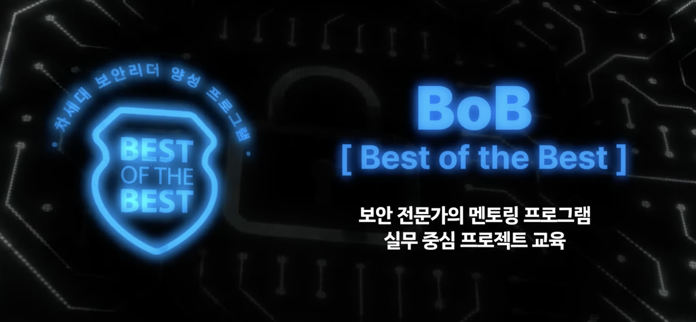
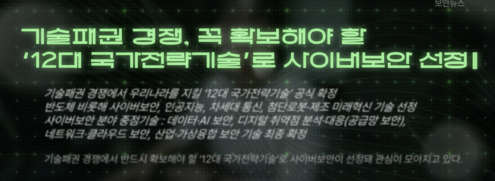

https://www.youtube.com/watch?v=s4P6kn6Dw_c

사이버보안 전문가의 공격과 방어 시뮬레이션 팀 퍼플랩
사내에서 해킹 대회(CTF, 캡처 더 플래그)도 열린다!

- 정부에서 차세대 보안 리더를 양성하기 위한 프로젝트

해당 분야는 엉덩이 싸움이 정말 중요하다. 취약점이 있는지 없는지 알 수 없는 상황에서 계속해서 들여다 봐야하니까,,

이제는 AI로 해킹하는 시대가 왔음. 

- 정부에서 사이버 보안을 국가전략기술로 선정!