# 레퍼런스
https://www.youtube.com/watch?v=C_JIxLObj3w

## Backbone
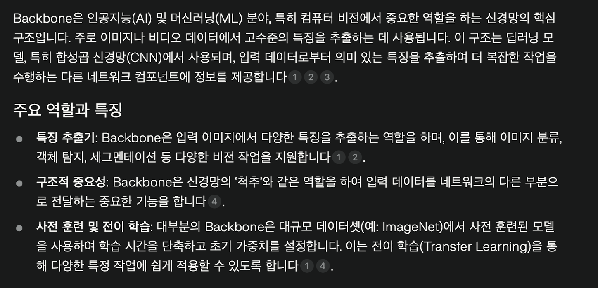
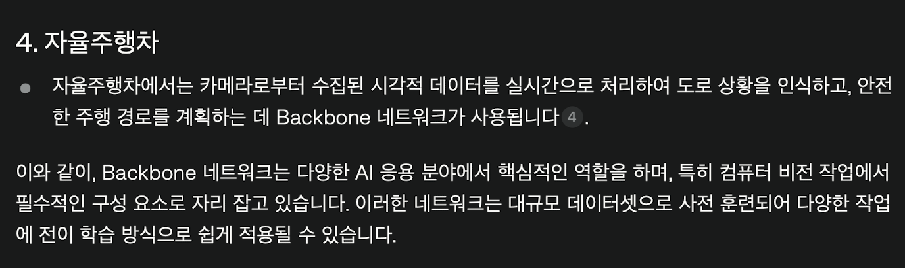
## CNN 과 Backbone(transformer)의 차이

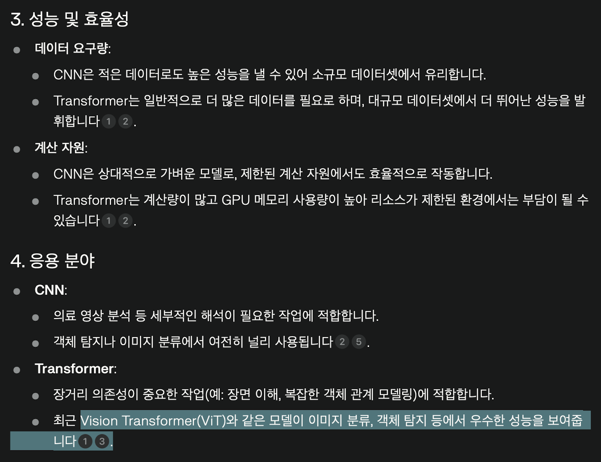
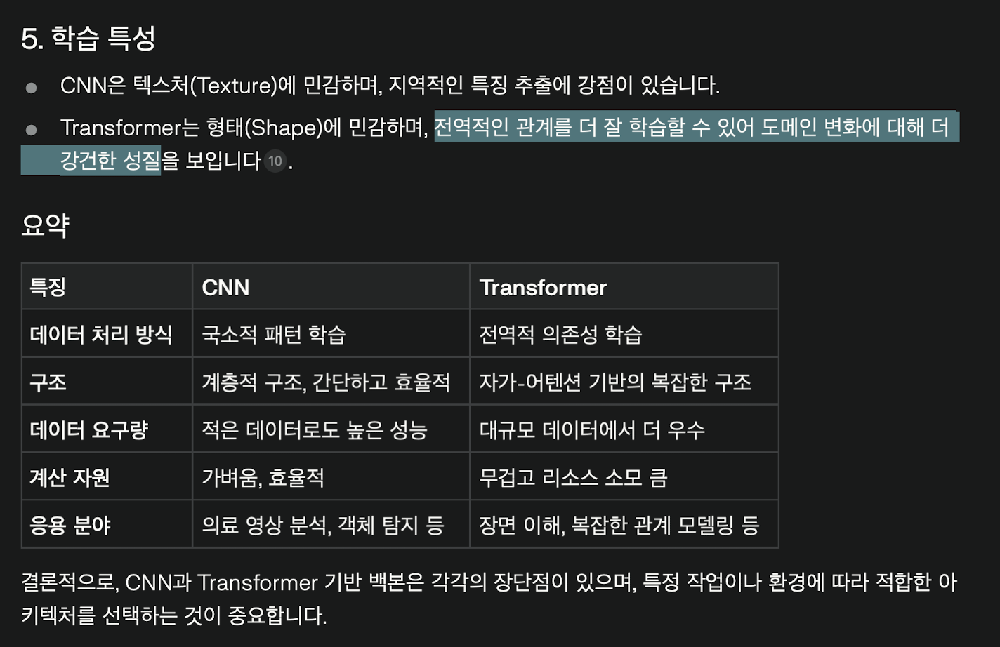
## Occupancy Network
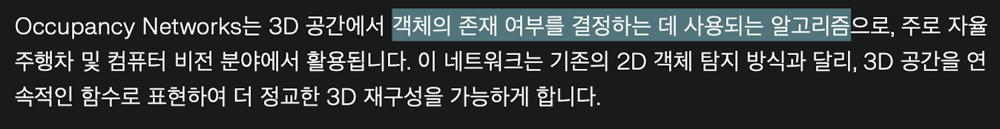
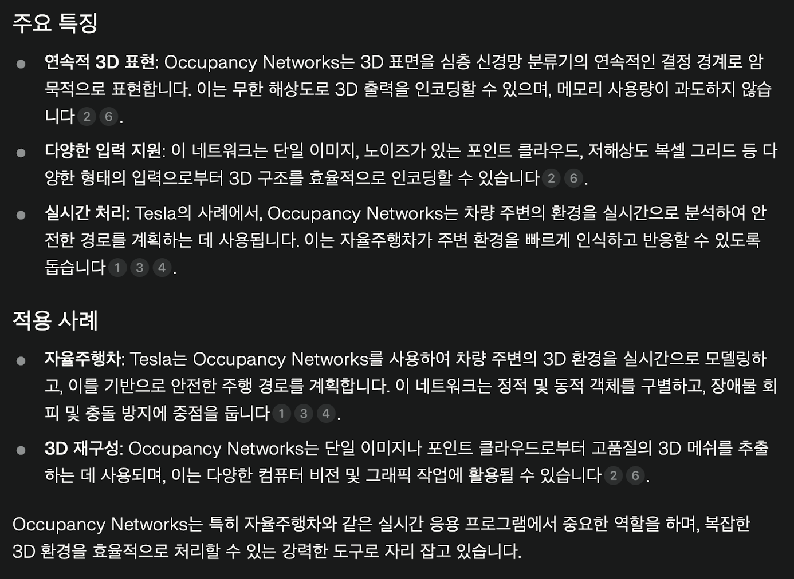
## Attention

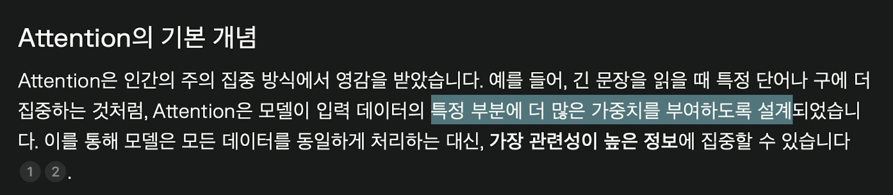
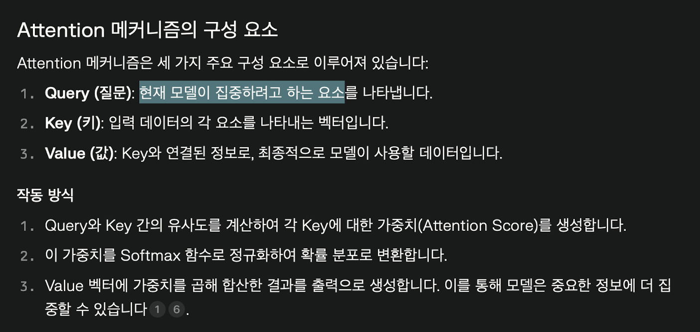
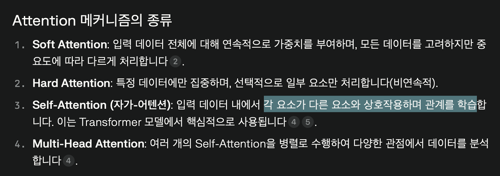
## 자율주행 분야에서의 jerk
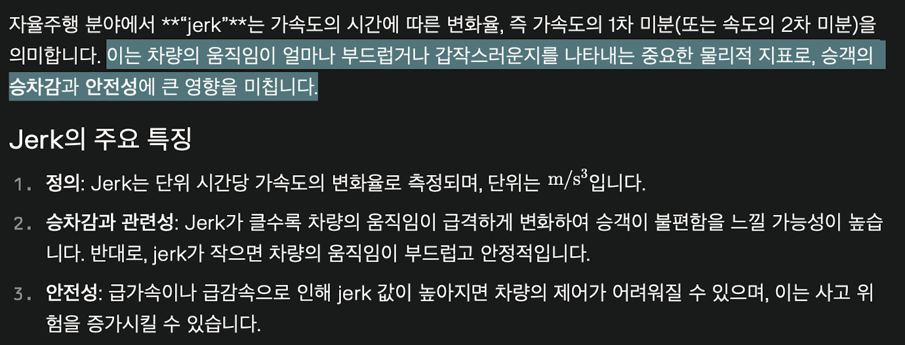
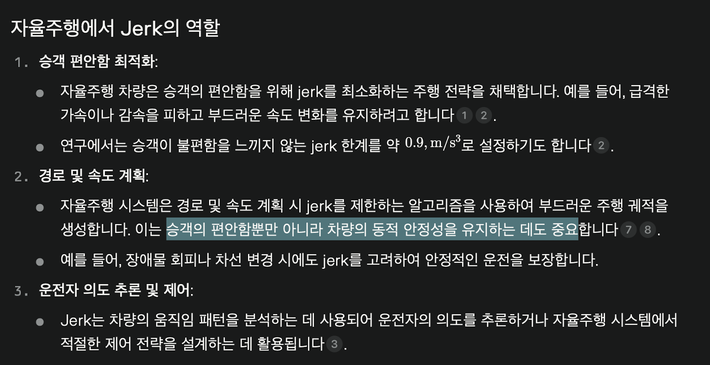
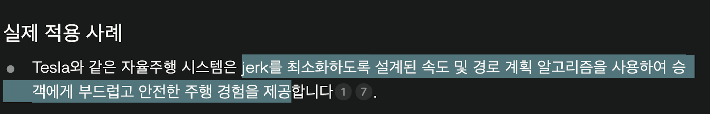
## 자율주행 분야에서의 NeRF(Nural Radiance Fields)

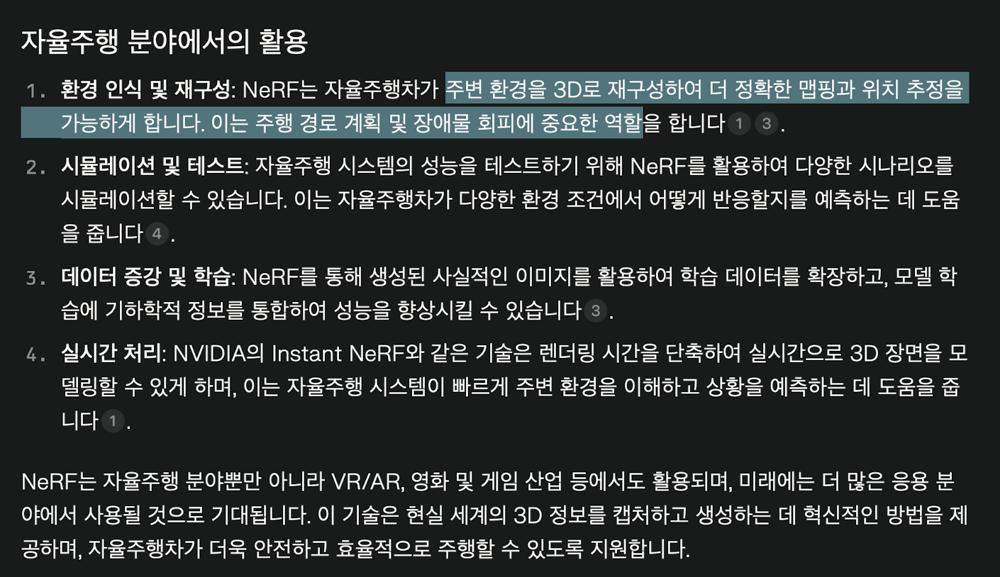
## video training model에서의 텐서
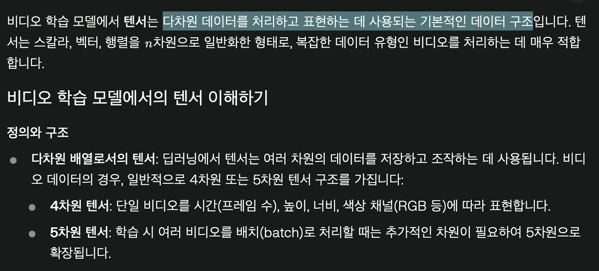
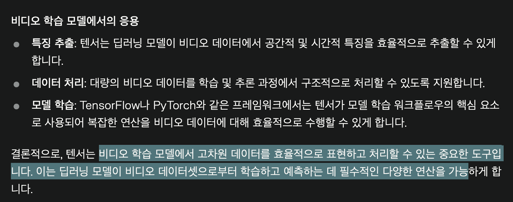
## 내적
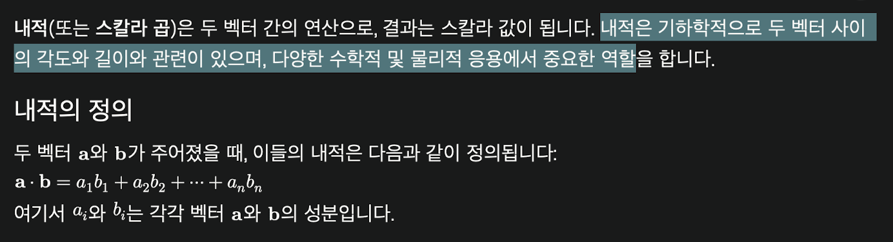
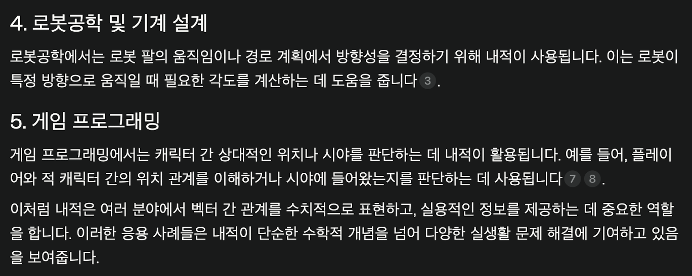
