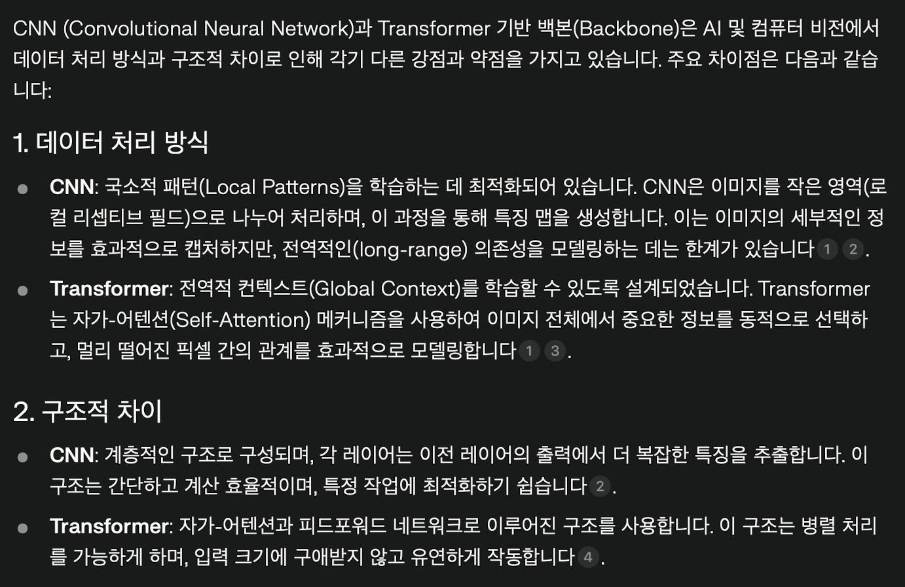
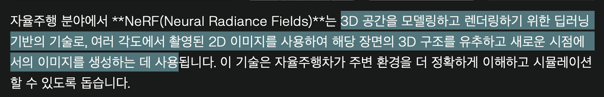

# 레퍼런스
https://www.youtube.com/watch?v=C_JIxLObj3w

## Backbone

## CNN 과 Backbone(transformer)의 차이

## Occupancy Network

## Attention

## 자율주행 분야에서의 jerk

## 자율주행 분야에서의 NeRF(Nural Radiance Fields)

## video training model에서의 텐서

## 내적

