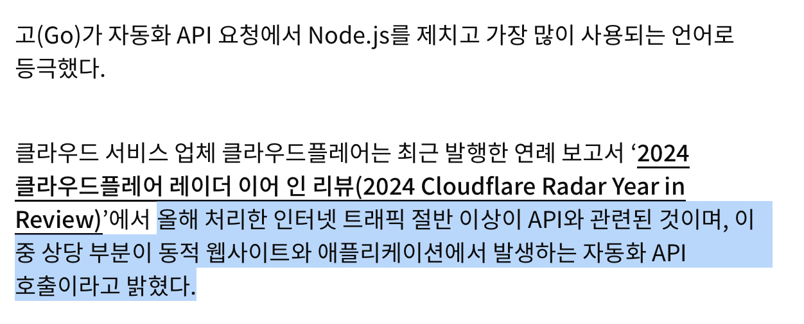
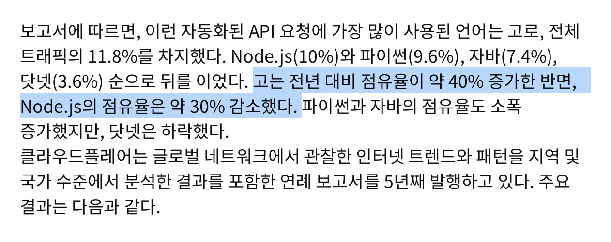
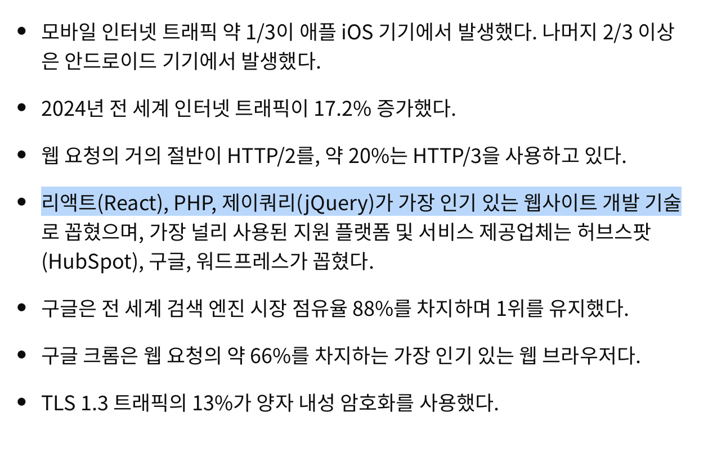
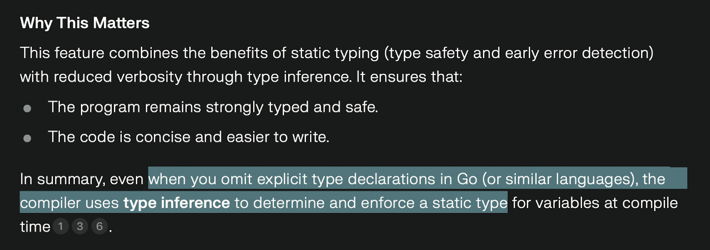

# 레퍼런스
https://www.itworld.co.kr/article/3623969/고-언어-node-js-제치고-자동화-api-요청-점유율-1위-클라.html

## 정리

## 한 줄 평
Go가 뭐길래 그렇게 자주 사용될까?
역시 구글,, AI 검색이 대중화된 시점에서도 여전히 아성을 떨치는 중이다. 

## Go

- 다양한 환경에서 간단하면서도 빠르게 동작하는 언어.
- garbage collector로 메모리 관리를 효율적으로 하며
- 타입 추론과 정적 할당이 가능해 간단하게 사용할 수 있다. 