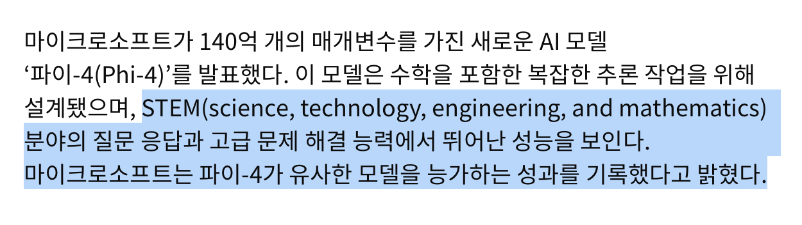
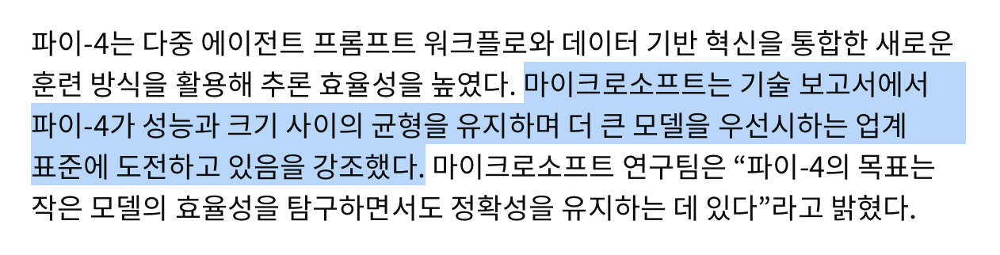
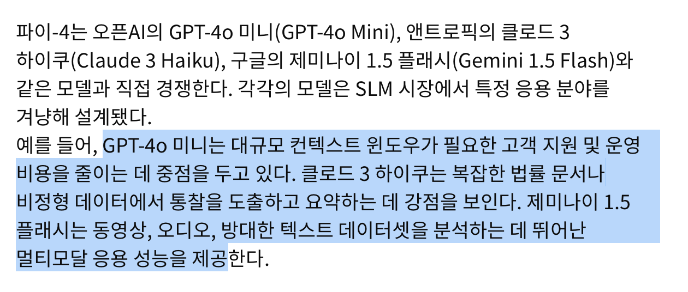

# 레퍼런스
https://www.itworld.co.kr/article/3624758/마이크로소프트-고급-추론-위한-ai-모델-파이-4-공.html

## 정리

## 한 줄 평
open ai의 GPT가 생성형 AI의 지평을 열었다면 경쟁 기업들은 파인튜닝을 통해 세부 분야에 특화된 서비스를 제공하고자 한다. 물론 대형 모델이 아닌 최적화와 보안, 온디바이스에 강점을 가지고 있는 SLM을 통해. 아무튼, 소비자 입장에선 더 편해질 일만 남은 것 같고 개발자 입장에선 다양한 기회의 시대가 아닐까 싶다. 