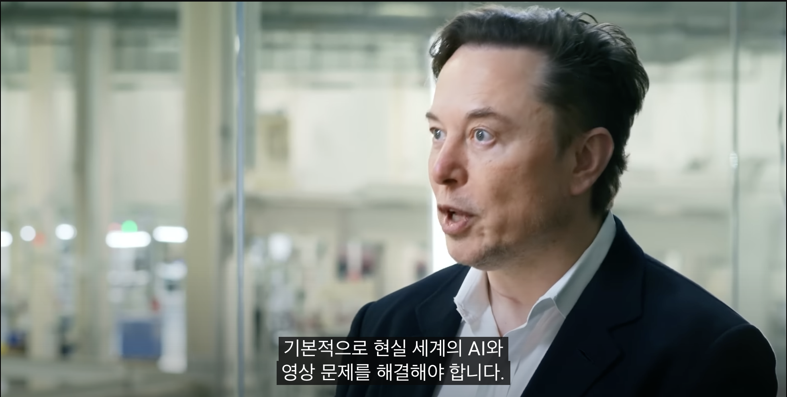
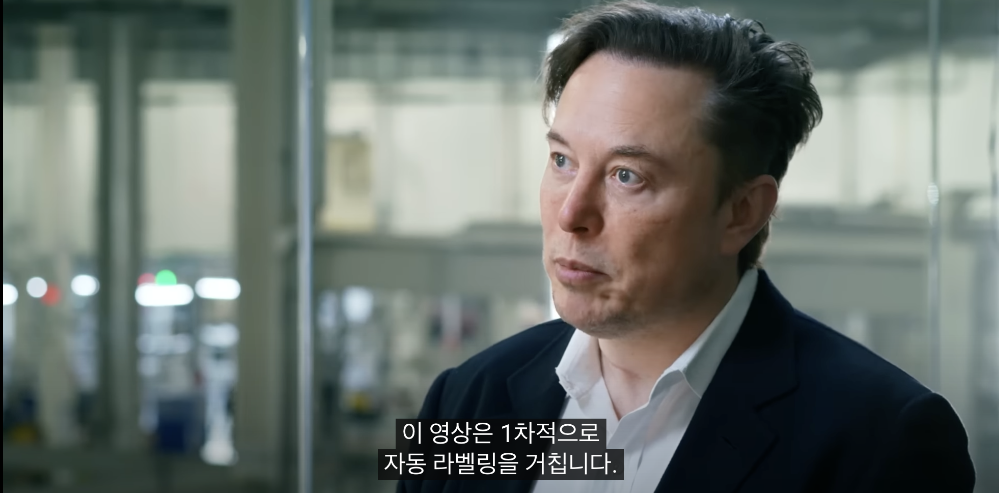
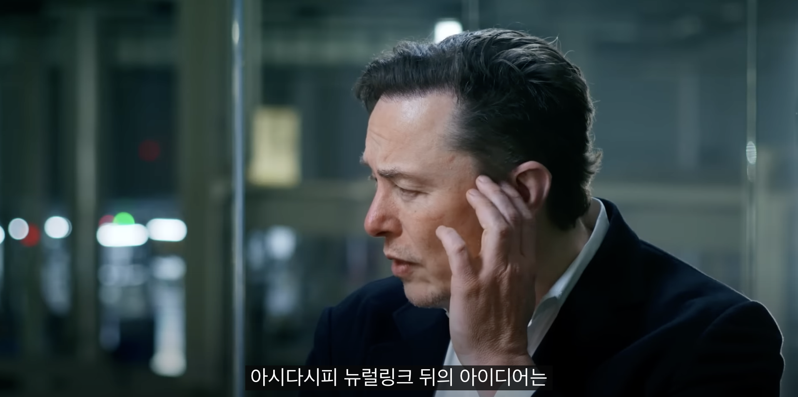

# 레퍼런스
https://www.youtube.com/watch?v=YRvf00NooN8
 
 ## 정리
 
- 자율주행이라는 문제를 해결하기 위해 기존의 도로망이 어떤 것과 상호작용하기 위해 설계되었는지 고려해야 함. 기존의 도로망은 인간의 두뇌와 눈(Vision)을 전제로 설계되었음. 따라서 인공지능을 통해 자율주행이라는 목표에 도달하기 위해선 인간의 두뇌와 눈을 최대한 모방할 수 있어야 함.

- 입력으로 주어지는 영상들에 대한 Auto Labeling은 인공 신경망 학습의 과정에서 매우 중요한 점이었음.
  
- 뉴럴링크의 최종 목표는 인간과 디지털 초지능의 직접적 연결.