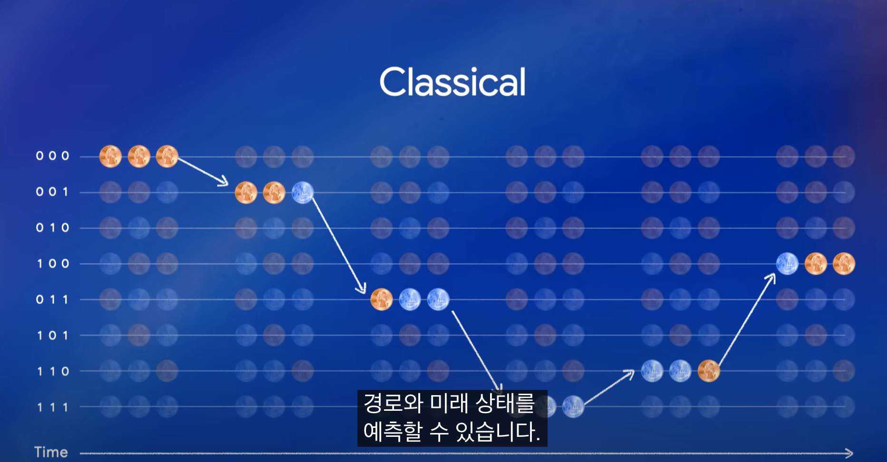
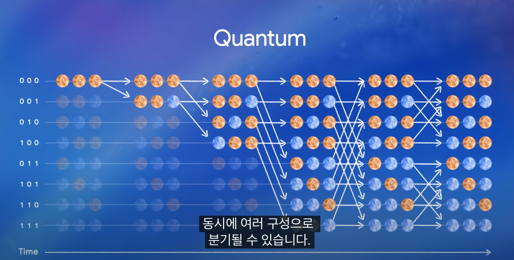

# 레퍼런스
https://www.youtube.com/watch?v=UtDllX_MTbw

## 정리
0:47
- 양자 컴퓨팅은 최초로 우리가 다중우주에 살고 있다는 아이디어를 진지하게 받아들임 == 계산을 평행우주로 분산한다.

1:27
- 고전적인(여전히 현대적인) 예측 방식

1:40
- 양자 컴퓨팅으로 모든 경우를 예측하는 미래의 방식

6:29
- 신호를 분석하여 분자를 탐지하는 수준까지 가게 되면 다양한 소비자 분야에서 응용이 가능함

8:09
- 2023, 두 번째 이정표에 들어섬. 오류율을 1/1000에서 1/10억으로 수정할 수 있었음(논리 큐비트에 물리 큐비트를 결합하여).

10:33
- 인간에 대한 가장 심오하고도 본질적인 물리적, 신경생물학적 질문인 "의식은 어디에서 오는가?"를 해결할 수 있을거라 기대됨

## 한 줄 평
TED의 특성상 최대한 간단하면서도 일반인이 이해할 수 있는 수준으로 강의 내용을 준비한 것 같다. 너무 추상적이라 오히려 이해하기 힘들었음. 여전히 먼 미래(적어도 10년)의 기술일 것 같다고 느꼈다. 