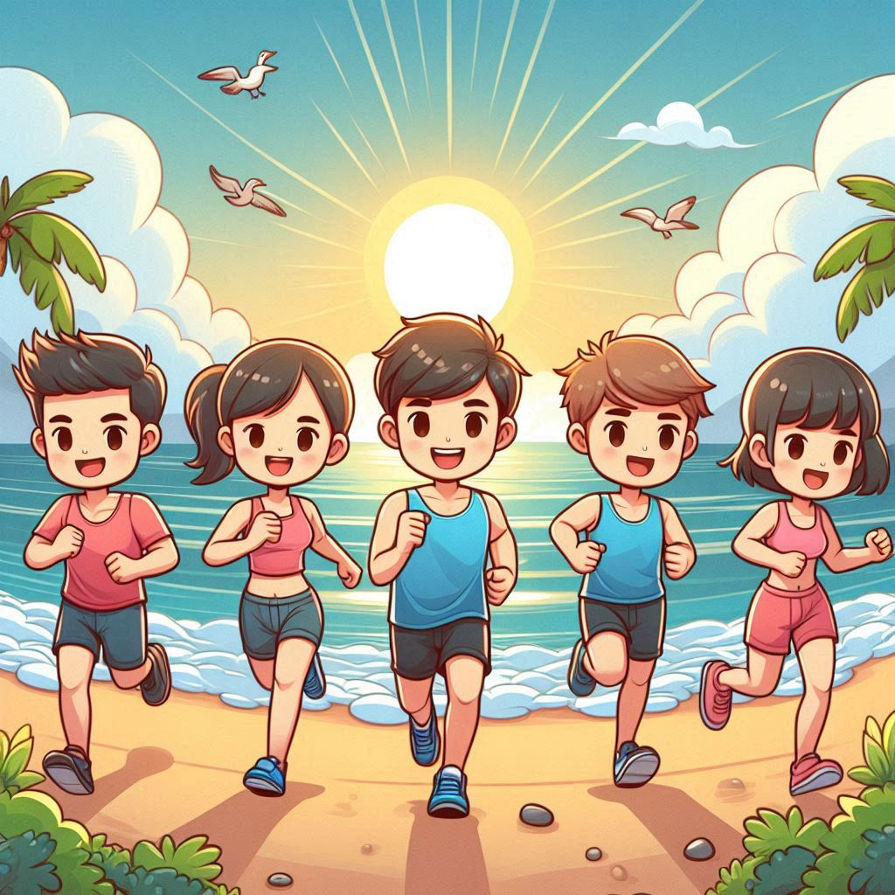

# 건강하고! 지속가능한! 학습환경 조성

건강하고! 지속가능한! 학습환경을 조성하기 위해 
**운동 인증 스터디**를 운영하고자 합니다!

인원: 저 포함 5명 내외

운동: 운동 방식도 시간도 자율

운영방식

1. 각자 **목표** 운동 *횟수*와 *시간*을 설정합니다. ex) 수영 / 06시~07시 / 주5회
2. 운동 **직전과 직후** 타임스탬프 카메라 앱을 활용해 인증사진을 업로드합니다. 
3. 일주일을 기준으로 일요일에 정산을 실시하며 목표를 달성하지 못한 경우 **1회당 500원**의 벌금이 쌓입니다. ex) 목표 주5회 but 3회만 달성 → 1주차 벌금 500원 x 2 적립
4. 한달을 기준으로 쌓인 적립금은 점심시간을 활용해 **카페**에서 사용할 예정입니다.  

신청은 저에게 **개인톡**주세요! 신청이 많을 경우 **선착순**으로 진행할 예정입니다!

240714 15시26분 기준 **6명** 모집완료

---
:muscle: : 오운완! / :pray: : 내일은 꼭!
|7월3주차|최진문|박수민|하건수|김경민|이혜령|이가람|
|:-:|:-:|:-:|:-:|:-:|:-:|:-:|
|월요일|:muscle:|:muscle:|:muscle:|:pray:|:pray:|:muscle:|
|화요일|:muscle:|:muscle:|:muscle:|   |:muscle:|   |
