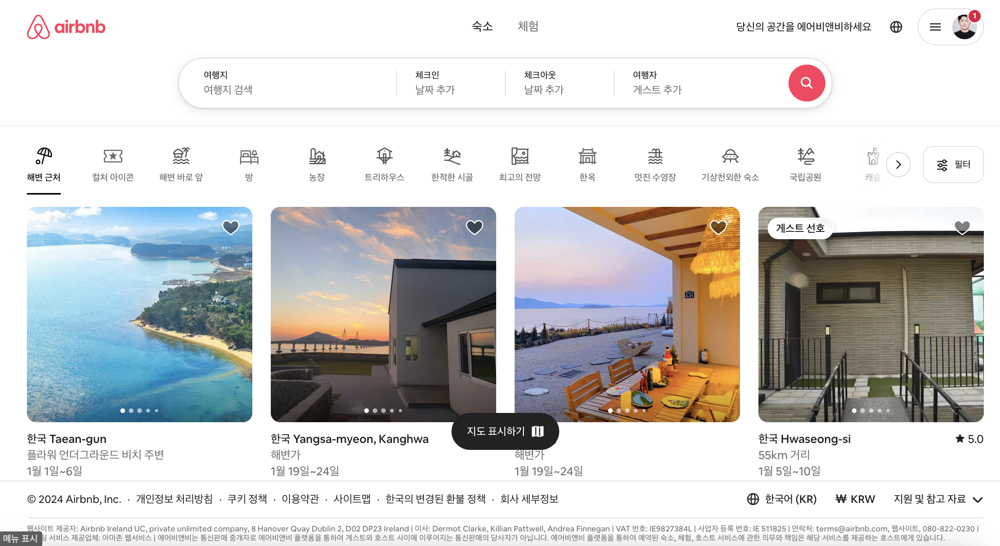

# 1. 주제 선정

Airbnb: 전 세계를 대상으로 서비스하는 숙소 및 경험 공유경제 플랫폼

# 2. 사용자 스토리

## 서술
여행자는 숙소 예약을 위해 숙소의 목록을 볼 수 있다. 

## 대화(세부사항의 결정)
1. 이용가능한 숙소를 보여주기 위해 여행지 / 체크인 날짜 / 체크아웃 날짜 / 여행객 수에 대한 정보가 필요할 것 같다.
2. 일정이 확정되지 않은 여행의 경우일 수 있으므로 약간의 일정 수정으로 예약이 가능한 숙소도 보여주면 좋을 것 같다. 
3. 숙소의 다양한 특성(ex, 수영장 유무, 주차 유무 등)을 기반으로 동작하는 정렬기능이 있으면 좋을 것 같다. 
4. 마음에 드는 숙소를 찾은 경우 북마크 기능이 있으면 좋을 것 같다. 
5. 해외 여행지의 경우 현지 통화를 기반으로 가격을 보여줄 수도 있으면 좋을 것 같다. 
6. 호스트와 직접 연락을 취할 수 있는 다이렉트 메세지 기능이 제공되면 좋을 것 같다. 

## 테스트(세부사항의 문서화 및 스토리의 완료 조건)
1. 4가지 매개변수를 기반으로 DB를 조회해 적절한 숙소를 보여줄 수 있어야 한다. 
2. 유연한 여행 일정에 대처하기 위해 체크인 / 체크아웃 일정을 처리할 수 있는 로직 구성이 필요.
3. 숙소 등록 시 호스트로부터 숙소의 다양한 특성을 입력하도록 요구하여 DB 등록 시 반영할 수 있도록 로직 구성이 필요.
4. 원활한 조회를 위해 유저와 숙소를 연계한 JOIN TABLE을 구성하여야 한다. 
5. 숙소의 가격을 당시의 환율로 매핑하여 보여줄 수 있어야 한다. 
6. 유저간 실시간 메세지 소통 기능을 구성하기 위해 SocketIO 구성이 필요하다. 

# 3. 동료리뷰
1. 독립성(Independent)
- 검색 기능, 정렬 기능, 북마크 기능, 메시지 기능 등이 개별적으로 설계되어 독립성 확보. 
- 다만, 검색 기능과 정렬 기능의 의존성이 있어 정렬 기능을 별도의 API로 분리하여, 검색 API와 독립적으로 관리 가능하도록 개선하면 좋을 것 같음.

2. 협상 가능성(Negotiable)
- 기능별 구현 난이도와 우선순위를 조율하면 좋을 것 같음.
- 핵심 기능인 검색 및 예약을 우선 개발하고, 부가 기능은 후속 스프린트에서 추가하는 방식으로 협상하는 방법도 좋을 것 같다.

3. 가치 제공(Valuable)
- 사용자가 실질적인 가치를 느낄 수 있는 기능들이 포함되어 있어 가치 제공에 적절.
- 특히 북마크 기능과 다이렉트 메시지 기능

4. 추정 가능성(Estimatable)
- 검색 및 예약 기능은 표준적인 CRUD 구조로 추정 가능할 것으로 보임.
- 메시지 기능의 경우 SocketIO 대신 REST API를 통한 비동기 메세지 전달로 대체하여 초기 구현 난이도 감소하면 좋을 것 같음.

5. 작은 크기(Small)
- 일부 기능(유연한 일정 처리, 환율 변환 기능 등)은 단일 스프린트에서 구현하기 어렵게 보임.
- 각 스프린트마다 테스트 계획을 추가하여 독립적 기능 검증 필요할 것으로 보임.

6. 테스트 가능성(Testable)
- 테스트 조건이 명확하게 정의되어 있음.