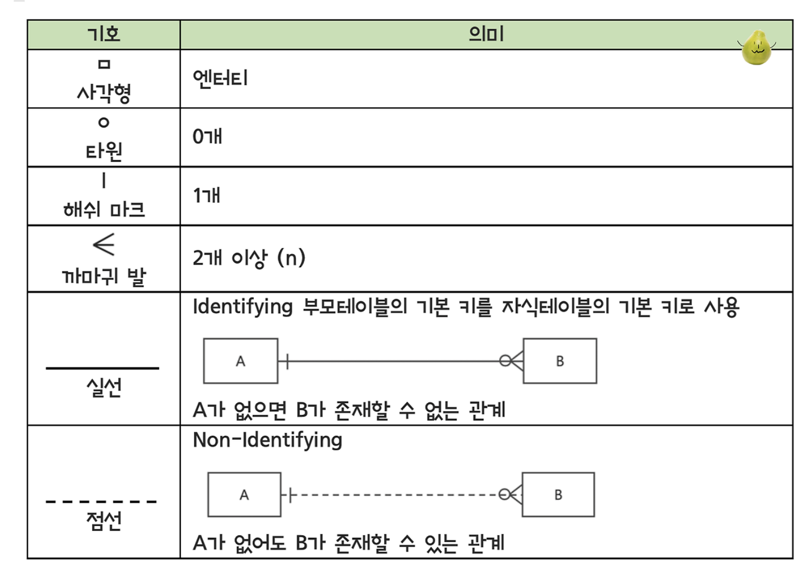
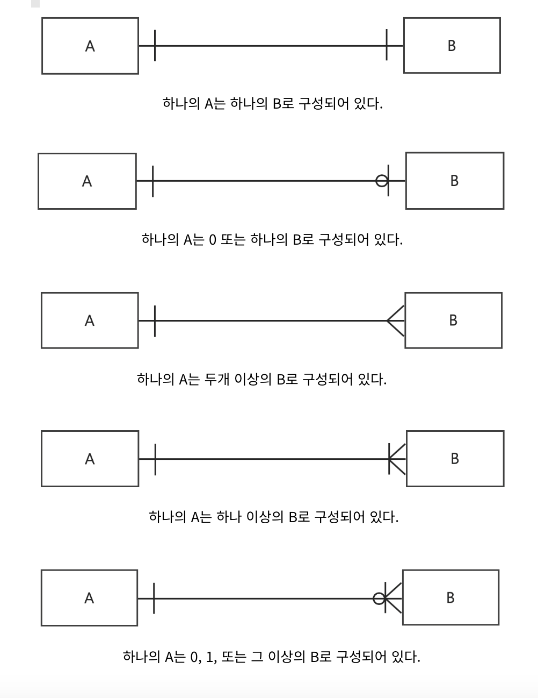

1. 정규화에 대한 설명 중 옳은 것.
  - 데이터의 `무결성을 보장`하기 위해 정규화를 수행한다.
  - 모델링의 마지막 단계에서 `성능을 향상시키는 목적으로는 비정규화`를 함

2. 성능 데이터 모델링을 위한 유의사항 중 바람직한 것
  - 중복 테이블을 추가함으로써 성능을 향상시킬 수 있다.

3. 반정규화 기법 중 옳은 설명
  - 파생 컬럼 추가: 프로세스 수행 시 부하가 염려되는 계산값을 미리 컬럼으로 추가
  - 통계테이블 추가: 성능 향상을 위해 데이터의 통계치를 미리 계산하여 추가
  - 중복 관계 추가: 업무 프로세스상 JOIN이 필요한 경우가 많아 중복 관계를 추가하는 것이 성능 측면에서 유리할 경우 수행.
  - 테이블 분할: 수직분할과 수평분할
    - 수직분할: 열을 잘라서 새로운 엔터티로 만들기
    - 수평분할: 연도 나누기를 떠올리기

4. 트랜잭션에 대한 올바른 설명
  - 데이터를 조작하기 위한 논리적인 작업 단위
  - 데이터 모델로 표현할 수 있다.
  - 데이터는 트랜잭션 범위로 묶일 수 있다.

5. WHERE COL IS NULL 과 WHERE COL = NULL 조건의 차이
  - 전자는 COL 값이 NULL인 행을 반환
  - 후자의 결과는 항상 false이기 때문에 아무 행도 반환하지 않음

6. 부모-자식의 관계를 가지는 엔터티 쌍에 대한 처리
  - 인스턴스 생성 시 하나의 트랜잭션으로 묶여서 동시에 처리되어야 한다. 만약 상품 데이터 생성에 성공한 후 상품가격 데이터 생성에 실패했다면 상품 데이터 생성은 롤백 처리되어야 한다. 

7. 3차 정규화
  - 일반속성이 일반속성에 종속되는 경우 3차 정규화의 대상이 된다. 
  - 이행 함수 종속성을 제거한다.
    - 이행 함수 종속성은 A → B이고 B → C일 때, A → C가 성립하는 관계를 말합니다.
      - 이는 B가 A에 종속되고 C가 B에 종속될 때 C가 A에 종속되는 관계를 말한다. 
    - 이행 종속성을 제거하기 위해 테이블을 분할합니다. 종속성이 있는 속성들을 별도의 테이블로 분리합니다.

8. 슈퍼-서브타입 설계
  - 공통 속성을 조회하는 빈도수가 개별 속성을 조회하는 빈도수보다 높은 경우 공통 속성과 개별 속성을 별도로 관리하는 슈퍼-서브 타입 설계가 적절.
  - 관리직 사원과 생산직 사원에 대한 테이블을 설계하는 경우 사원이라는 슈퍼 타입을 설계하고 서브 타입으로 관리직 사원과 생산직 사원을 각각 생성한다. 
  - 슈퍼타입: 공통 속성을 가진 일반화된 엔티티
  - 서브타입: 슈퍼타입을 상속받고 추가 속성을 가진 특수화된 엔티티

9. 데이터 무결성을 깨뜨릴 염려를 하지 않아도 되는 반정규화 기법
  - 중복 관계 추가 