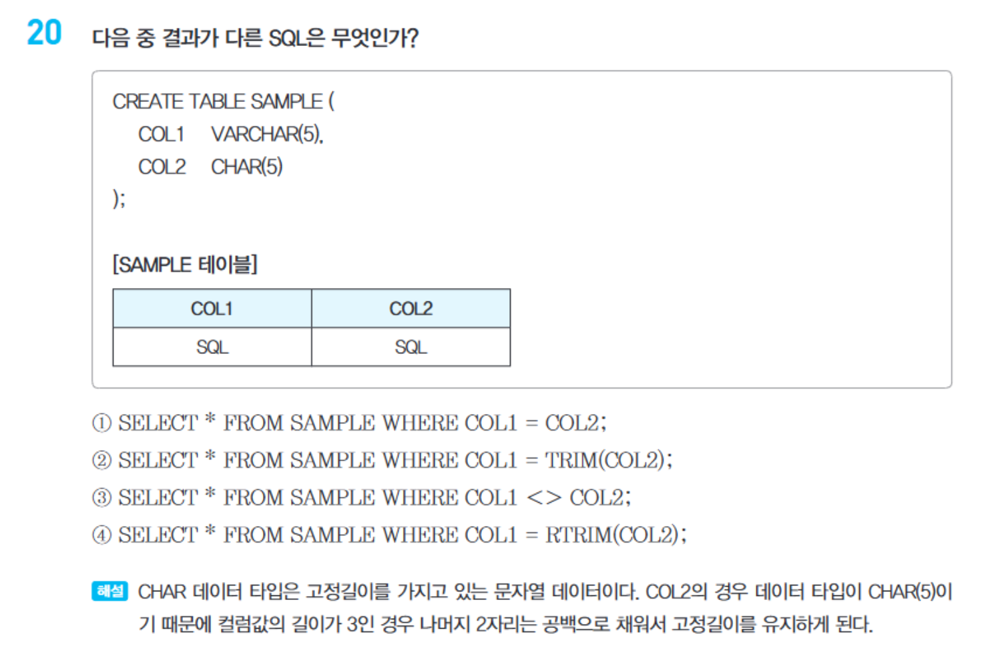
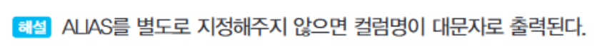

1. 집계함수는 NULL을 제외시킨다.

2. NULL과의 연산 결과는 항상 FALSE이기 때문에 조건절에 해당 연산이 기입된 경우 아무런 값도 반환하지 않는다.

3. NVL함수의 설명과 용례

4. NULLIF 함수의 설명과 용례

  - 위 그림은 잘못된 설명 그림임! NVL함수를 설명한 그림이다.
  - NULLIF는 두 인자가 동일할 경우 NULL을 반환하고 그렇지 않은 경우 첫 번째 인자를 반환하는 함수다. 

5. 쿼리문 실행 순서

  - 주의! 같은 SELECT 절 내에서 ALIAS를 정의했더라도 바로 사용할수는 없다. 

6. WHERE문과 HAVING문의 차이

  - 주의! 집계함수를 조건으로 사용할 때는 WHERE이 아닌 HAVING을 사용해야 한다. 

7. SELECT과 함께 사용하는 DISTINCT

8. SIGN의 용례

9. ISNULL 함수의 용례

10. %이 포함된 문자열을 찾아서 조회하고 싶은 경우 ESCAPE # 뒤에 %를 붙여 검색할 수 있다. 

11. CONCAT 함수

12. SUBSTR 에서 2번째 인자에 음수값이 들어오는 경우 문자열의 뒤에서부터 시작하며 이후 세번째 인자가 양수면 2번째 인자의 값부터 우측으로 세번째인자 갯수의 값을 반환한다. 만약 세 번째 인자(길이인자)의 값이 음수이면 대부분 오류가 발생한다.  

13. VARCHAR과 CHAR의 차이

14. 올림, 반올림, 버림의 값을 반환하는 함수들의 정확한 용례
  - ROUND / TRUNC : 지정된 소수점 자릿수 `까지` 반올림 / 버림
  
  - CEIL / FLOOR : 올림 / 내림
  - TRUNK / FLOOR
  

15. IN 연산자와 OR 연산자

16. 별칭(ALIAS) 설정 시 주의할 점

17. ORDERBY절 특이사항

18. 집계함수는 NULL 값을 제외하고 계산한다. 즉 AVG의 경우 분모로 카운팅하지도 않는다. 

19. HAVING절 사용 상 주의할 점

20. LEFT OUTER JOIN의 다른 표기법(ORACLE)

