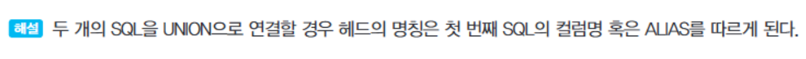

1. 순위를 매기는 함수 중 DENSE_RANK

2. 서브쿼리의 반환값들

3. VIEW에 대한 설명
  - 뷰는 실제 데이터를 저장하지는 않고 해당 데이터를 조회해오는 SELECT 문만 가지고 있는 `가상테이블`이다. 
  - 뷰 사용자는 뷰에서 제공하지 않은 테이블의 컬럼을 사용할 수 없다. 

4. 파티션 윈도우에서 사용하는 함수들

5. UNION 집합 연산자를 사용할 경우 주의할 점

6. 그룹 함수에 대한 설명 중 적절한 것
  - `ROLLUP` 함수는 인자로 주어진 컬럼의 순서에 따라 결과가 달라진다.
  - `CUBE` 함수는 인자로 주어진 컬럼의 순서에 따라 결과가 달라진다.
  - GROUP BY와 UNION ALL을 이용하여 `GROUPING SETS` 함수와 동일한 결과를 출력하도록 SQL 작성이 가능하다. 