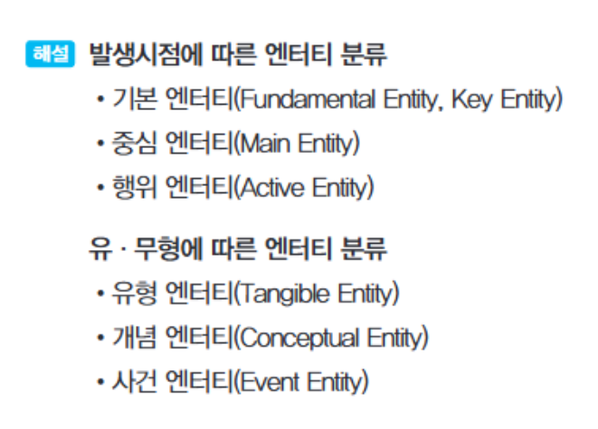
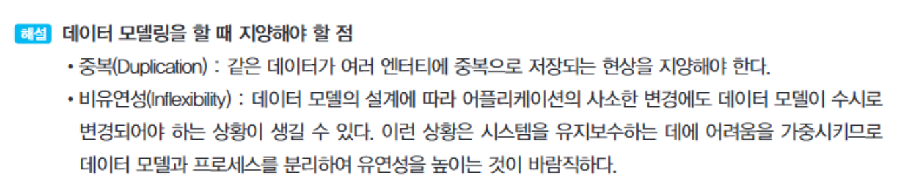
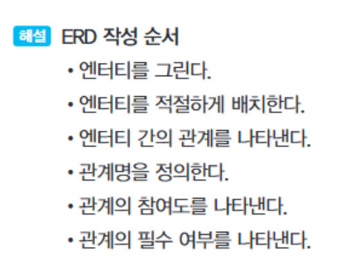
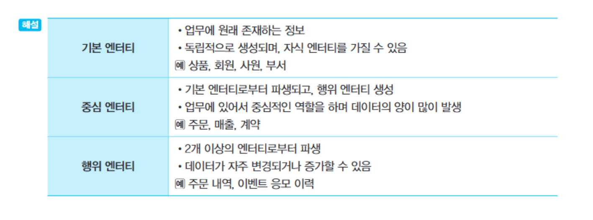
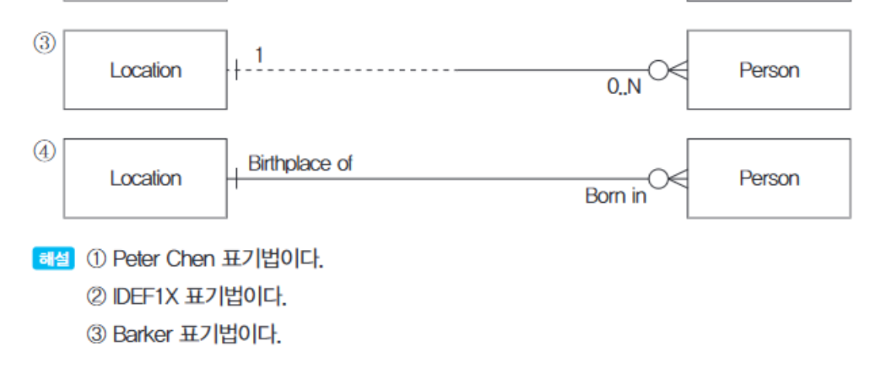
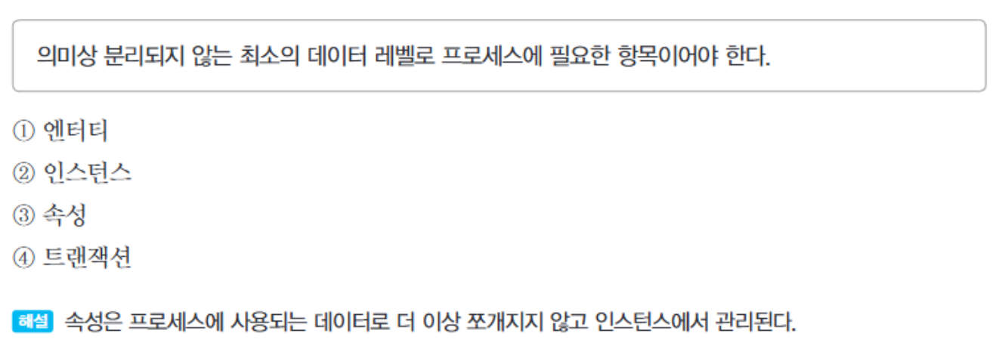
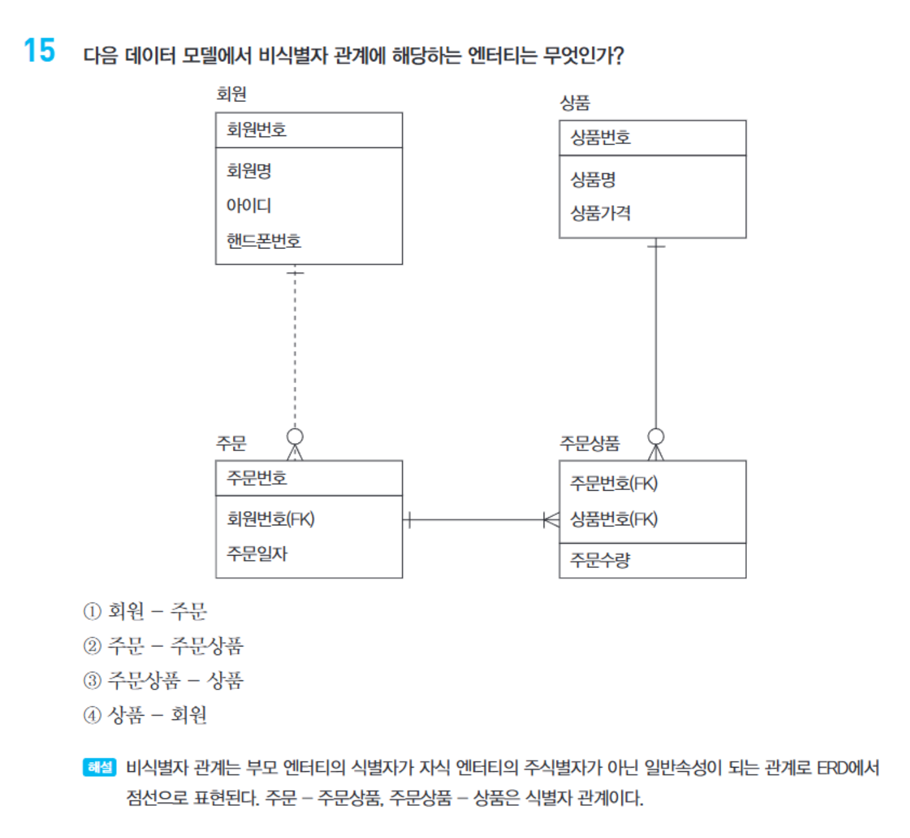
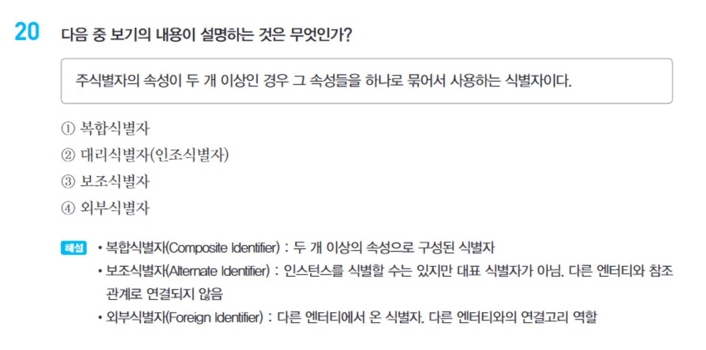
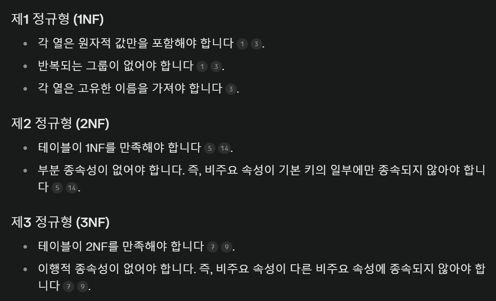
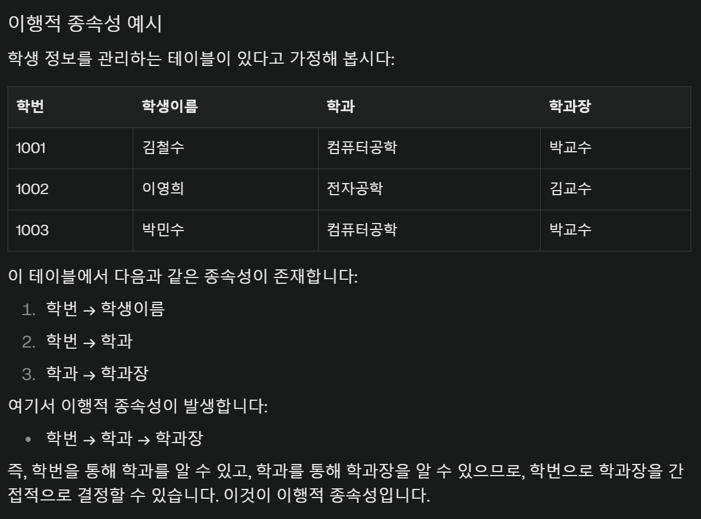

엔터티 간의 관계를 정의할 때 고려해야 할 사항
  - 두 엔터티 사이를 이어주는 동사가 존재해야 한다.
  - 두 엔터티 사이에 조합되는 정보가 존재해야 한다.
  - 두 엔터티 사이에 영향력 있는 관계가 존재해야 한다. 

정규화와 역정규화 간단한 정의
  - 정규화: 데이터의 무결성을 위해 테이블을 분해
  - 역정규화: 쿼리의 성능을 위해 테이블을 조인(결합)

정리
  - 제1 정규형
    - 각 컬럼(속성)은 단일한 값만을 가져야 한다.각 컬럼(속성)은 단일한 값만을 가져야 한다.
    - 비슷한 값을 가지는 컬럼(속성)은 단일화 해야 한다. 즉, 같은 의미의 데이터가 여러 컬럼에 중복되어 저장되어서는 안됨. 예를들어 전화번호1, 전화번호2 ... 등
  - 제2 정규형
    - 제1 정규형을 만족하면서 기본키의 일부에만 종속되어서는 안됨. 즉, 완전 함수 종속성을 가져야 한다. 
  - 제3 정규형
    - A가 B에 종속되고 B가 C에 종속되는 관계를 만들면 안된다. 즉, 이행적 종속성이 없어야 한다.  
    

