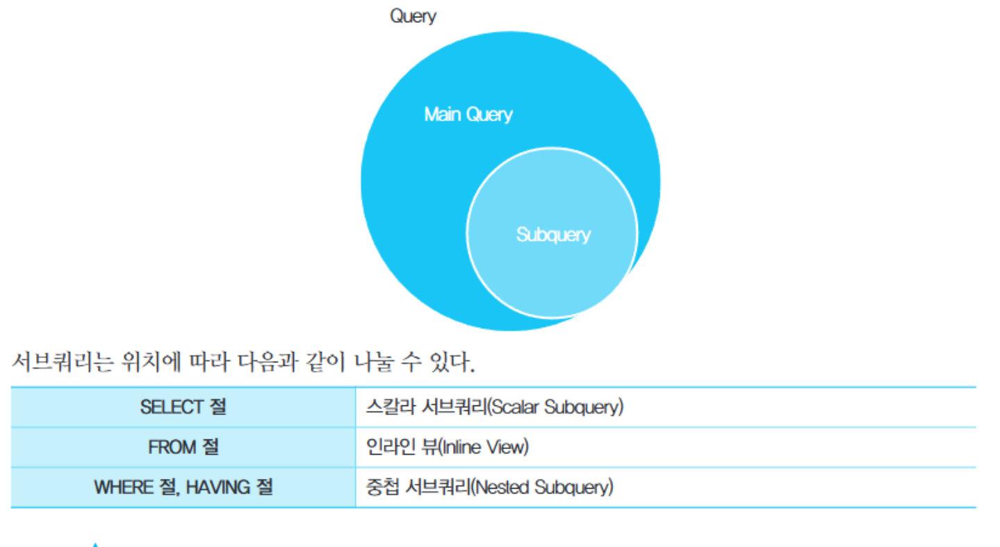
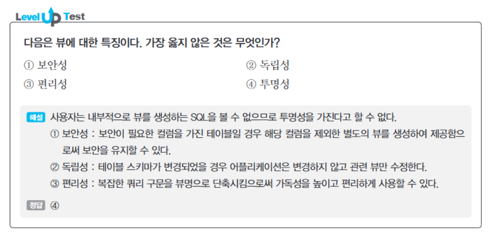
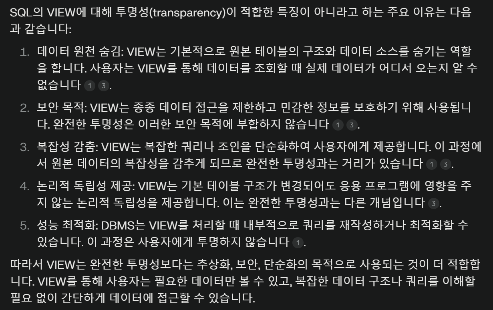
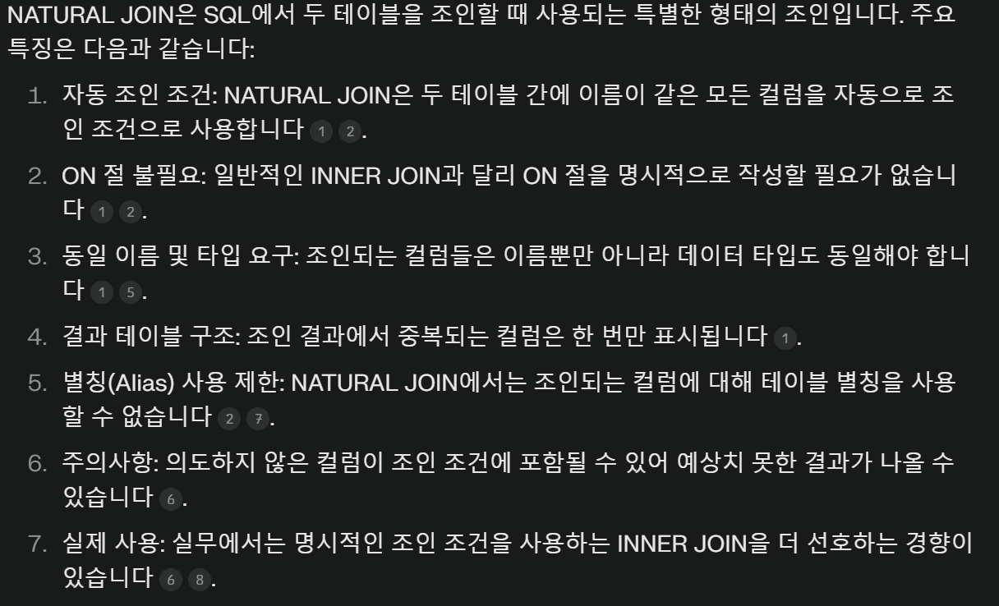

# SQL 활용

## 서브쿼리

### 스칼라 서브쿼리

`주로 SELECT 절에 위치`하지만 컬럼이 올 수 있는 대부분 위치에 사용할 수 있다. `컬럼 대신 사용되므로 반드시 하나의 값만을 반환`해야 한다. 그렇지 않으면 에러를 발생시킴.

### 중첩 서브쿼리

WHERE 절과 HAVING 절에 사용할 수 있다. 메인쿼리와의 관계에 따라 연관 서브쿼리, 비연관 서브쿼리로 나눌 수 있다. 

연관 서브쿼리: 서브쿼리 내에 메인 쿼리의 컬럼이 존재함
비연관 서브쿼리: 서브쿼리 내에 메인 쿼리의 컬럼이 존재하지 않음

### 뷰

특정 SELECT 문에 이름을 붙여서 재사용이 가능하도록 저장해놓은 객체. 테이블처럼 사용할 수 있으며 FROM절의 서브쿼리로 사용되는 인라인 뷰에 작성할 수 있다. 

