# 24년 3회 필기

## CASE(Computer Aided Software Engineering)

- 요구 분석, 설계 검사 및 디버깅 과정 전체 또는 일부를 **자동화**하는 기법

## GoF(Gangs of Four) 디자인 패턴

- 생성패턴: 객체 생성 방식을 추상화하여 유연성과 재사용성을 높임 (예: 싱글턴, 팩토리 메소드, 추상 팩토리, 빌더, 프로토타입)
- 구조패턴: 클래스나 객체를 조합해 더 큰 구조를 만드는 방법을 제시 (예: 어댑터, 브릿지, 컴포지트, 데코레이터, 퍼사드, 플라이웨이트, 프록시)
- 행동패턴: 객체나 클래스 간의 상호작용, 책임 분배, 알고리즘 캡슐화 등에 중점 (예: 책임 연쇄, 커맨드, 인터프리터, 이터레이터, 중재자, 메멘토, 옵저버, 상태, 전략, 템플릿 메소드, 방문자)

## MVC 아키텍처

- Model: 애플리케이션의 핵심 데이터와 비즈니스 로직을 담당합니다. 데이터의 저장, 처리, 검증, 데이터베이스와의 상호작용 등이 여기에 포함됩니다.
- View: 사용자에게 보여지는 UI(화면)를 담당합니다. 모델에서 데이터를 받아 사용자에게 시각적으로 표시하며, 사용자 입력을 감지해 컨트롤러로 전달합니다.
- Controller: 사용자 입력(예: 버튼 클릭, 폼 제출 등)을 받아 이를 해석하고, 적절한 모델의 데이터를 변경하거나 조회합니다. 변경된 데이터는 다시 뷰에 전달되어 화면이 갱신됩니다.
- 동작 흐름 요약

```
1. 사용자가 뷰를 통해 입력(이벤트)를 발생시킵니다.
2. 컨트롤러가 입력을 받아 모델을 업데이트하거나 데이터를 요청합니다.
3. 모델이 데이터를 변경 또는 반환합니다.
4. 변경된 데이터가 뷰에 반영되어 사용자에게 표시됩니다.
```

## 럼바우의 객체지향 분석 기법

- 객체 모델링
  - 시스템의 정적 구조를 표현하며, **클래스 다이어그램**과 **객체 다이어그램**을 사용
- 동적 모델링
  - 시간에 따른 객체의 상태 변화와 상호작용을 상태 다이어그램으로 표현
- 기능 모델링
  - 데이터 처리 과정을 **자료 흐름도(DFD)**로 나타내며, 시스템의 기능적 요구사항을 캡슐화합니다
- 분석 단계 프로세스
  - **객동기**

## UML(Unified Modeling Language)

- 소프트웨어와 시스템 개발에서 구조, 동작, 관계 등을 시각적으로 표현하기 위해 사용되는 표준화된 모델링 언어
- 주로 다이어그램 형태로 시스템의 설계, 명세, 문서화, 구현 과정을 지원하며, 복잡한 소프트웨어 시스템을 효과적으로 이해하고 소통할 수 있게 도와줍니다.

## 분산시스템에서의 미들웨어

- 분산 시스템에서 **애플리케이션과 운영체제(또는 네트워크) 사이**에 위치하는 소프트웨어 계층
- 여러 컴퓨터나 다양한 환경(운영체제, 하드웨어 등)에 분산된 애플리케이션들이 서로 통신하고 데이터를 교환할 수 있도록 지원
- 주요 역할 및 기능
  - 통신 및 데이터 교환 중개: 이기종 시스템 간의 **통신을 표준화된 인터페이스와 API로 제공**하여, 개발자가 네트워크나 하드웨어의 차이를 신경 쓰지 않고 애플리케이션 개발에 집중할 수 있게 합니다.
  - 분산시스템의 투명성 제공: 위치, 접근, 이식성 등 분산 환경의 복잡성을 감추고, 사용자는 시스템이 **분산되어 있음을 인식하지 못하게** 합니다.
- 앱과 사용자뿐만 아니라 클라이언트와 서버, 운영체제와 앱과 같이 두 **시스템 사이에서 다양한 서비스**를 제공합니다.

## 소프트웨어 설계에서의 디자인 패턴

- 자주 발생하는 문제에 대한 일반적이고 반복적인 해결 방법

## 요구사항 모델링 기법

- 애자일
- 유스케이스 다이어그램
- 시퀀스 다이어그램
  - 여러 객체(또는 사람, 시스템 등)가 시간의 흐름에 따라 서로 어떤 메시지를 주고받는지 순서대로 보여주는 그림
    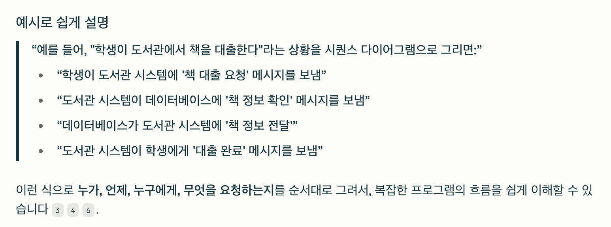

## 대표적인 추상화 기법

- 자료 추상화
  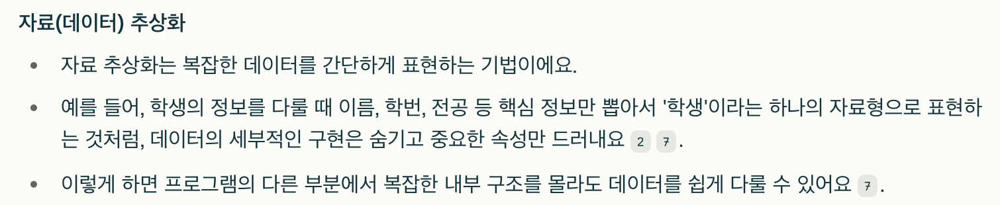
- 제어 추상화
  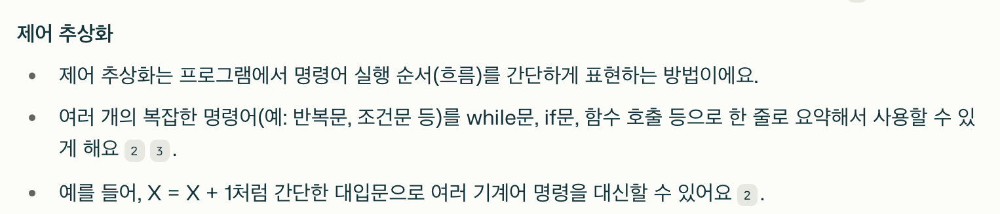
- 과정 추상화
  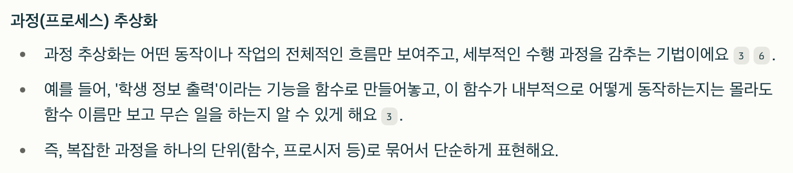
  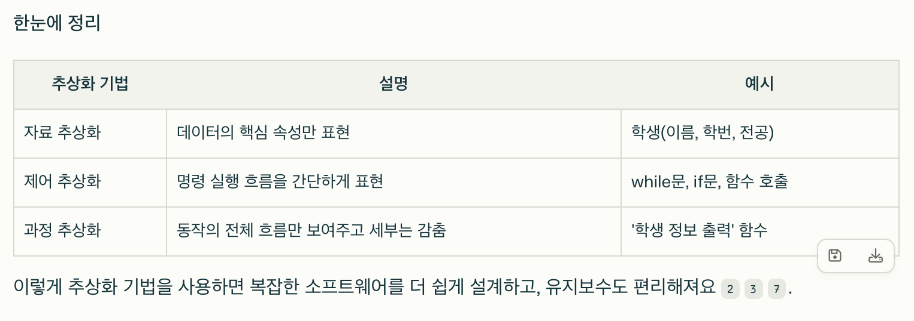

## IPSec(IP Security)

- 네트워크 계층(3계층)에서 IP 패킷을 암호화하고 인증하여 안전하게 통신할 수 있도록 해주는 표준 프로토콜 모음
- 두가지 모드
  - 전송 모드(Transport Mode): IP 패킷의 데이터(페이로드)만 암호화해서, 주로 컴퓨터끼리 직접 통신할 때 사용해요.
  - 터널 모드(Tunnel Mode): IP 패킷 전체를 암호화하고, 새로운 IP 헤더를 씌워서 VPN(가상 사설망)처럼 네트워크끼리 통신할 때 사용해요
- 주요 프로토콜
  - AH(Authentication Header): 데이터의 무결성과 송신자 인증을 담당해요
  - ESP(Encapsulating Security Payload): 데이터 암호화, 무결성, 인증까지 모두 담당해요
    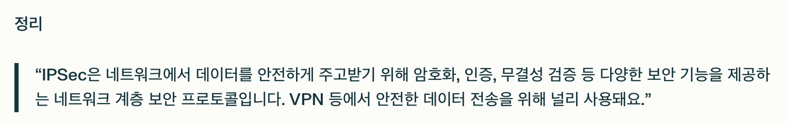

## UML 확장 모델

- UML의 기본 요소만으로 다양한 소프트웨어 구조를 모두 표현하기 어려울 때, 새로운 의미나 역할을 추가해서 모델링을 더 유연하게 할 수 있게 해주는 기능입니다. 즉, UML을 상황에 맞게 '확장'해서 사용하는 방법이에요
- 대표적인 확장 메커니즘: 스테레오타입
  - '<< >>' (길러멧) 기호로 표현합니다.
    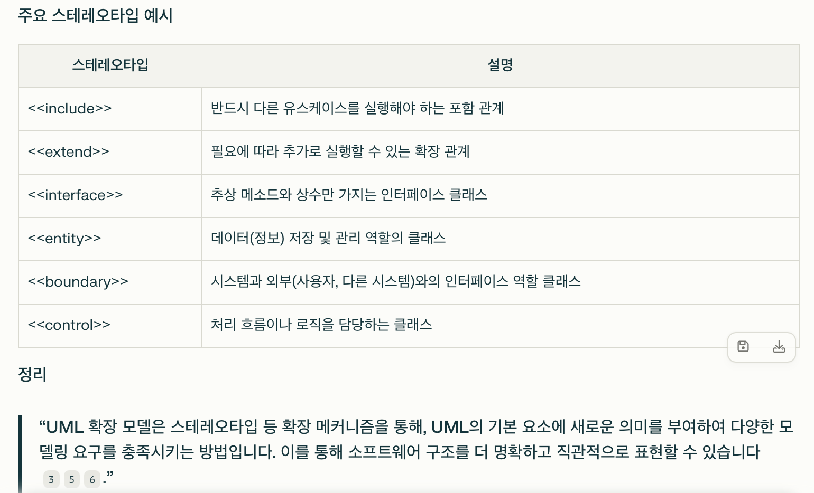

## 파이프 필터 형태의 소프트웨어 아키텍처

- 데이터가 파이프(통로)를 통해 흐르며, **각 단계에서 필터가 특정 작업을 처리하는 구조**예요. 복잡한 데이터 처리 작업을 작은 단위로 분리해 순차적/병렬적으로 실행할 수 있게 해주는 설계 방식입니다
  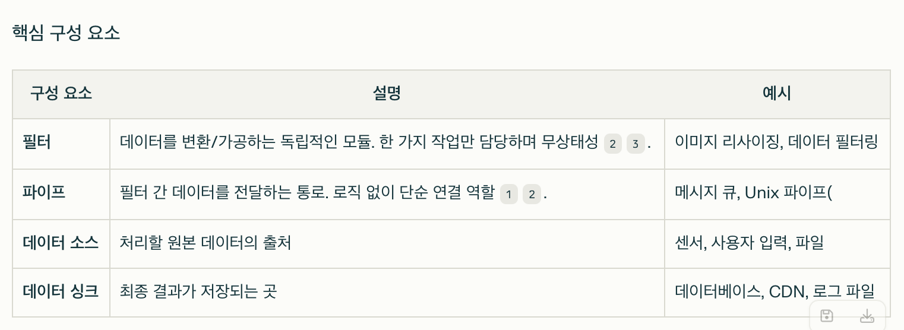
  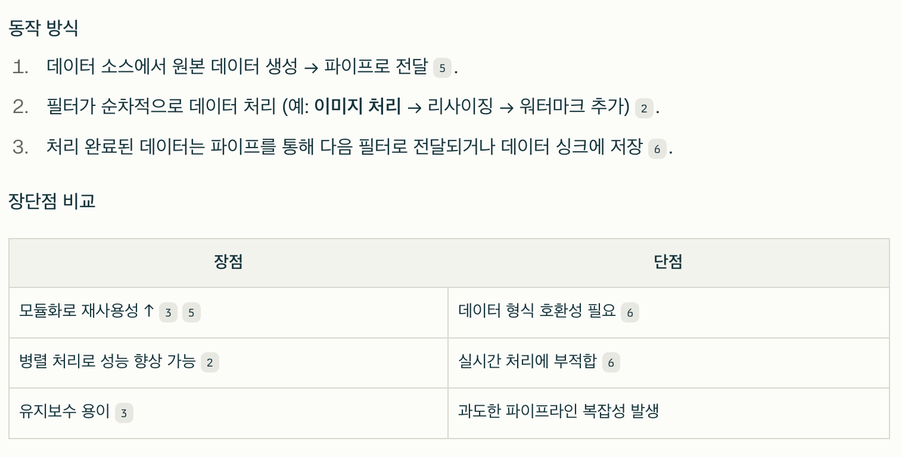

## 스크럼

- 스프린트는 실제 개발 작업을 진행하는 과정으로 보통 1~4주 정도의 기간 내에서 진행함

## 소프트웨어 공학에서의 워크스루(Walkthrough)

- 소프트웨어 공학에서 개발 산출물(요구사항 명세서, 설계서, 코드, 테스트 케이스 등)을 팀원들이 함께 모여 순차적으로 살펴보며, 오류나 개선점을 발견하고 이해도를 높이기 위해 사용하는 비공식적 검토 방법
  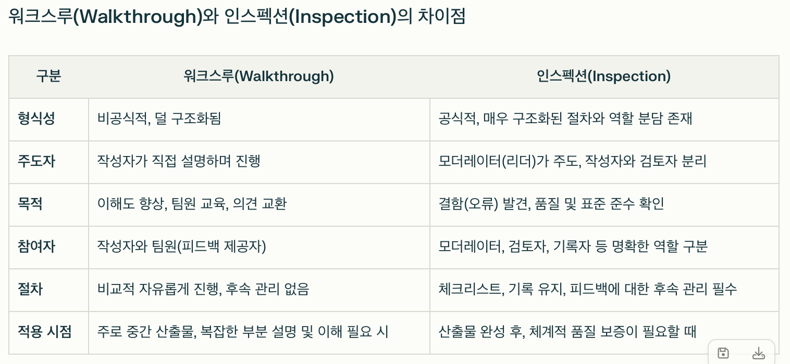

## 인터페이스 구현 검증 도구

- 소프트웨어 시스템에서 서로 다른 컴포넌트나 시스템 간의 데이터 교환(인터페이스)이 제대로 동작하는지 자동으로 테스트하고 검증하는 도구입니다. 이 도구들은 인터페이스의 기능, 동작 상태, 데이터 전달의 정확성 등을 확인하여 오류를 조기에 발견하고 품질을 높이는 데 사용됩니다.
  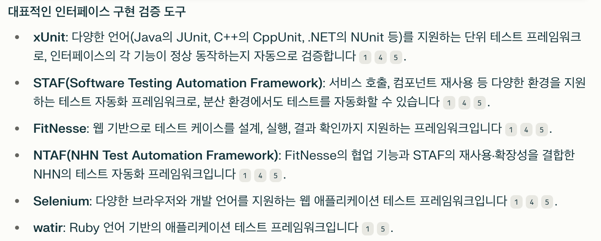

##
